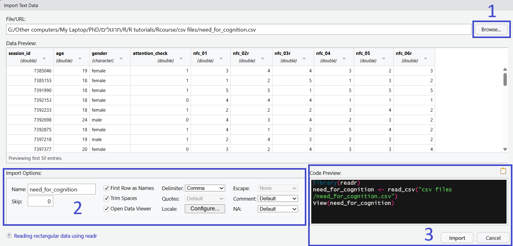

<style>
h1, h2, h3, h4, h5, h6 {
  direction: rtl;
}
p {
  direction: rtl;
}

.text-block1 {
  direction: rtl;       /* Set text direction to right-to-left */
  text-align: right;
  background-color: #e7f3fe; /* Light grey background */
  padding: 10px;
  border-radius: 5px;
  border: 1px solid #ddd; /* Light border */
  margin: 10px 0; /* Space around the block */
}
</style>


```{r setup, include=FALSE}
library(learnr)
library(gradethis)
library(Rcourse)


knitr::opts_chunk$set(error = TRUE)
gradethis::gradethis_setup()


{
exercises_df = data.frame(exercises = c("question1_5", "exercise1_5", "exercise2_5", "exercise3_5",
                                        "slicing1", "slicing4",
                                      "exercise4_5_slicing_multi_index", 
                                      "exercise5_5_dolar_1",
                                      "exercise5_5_dolar_2",
                                      "exercise5_5_dolar",
                                      "question2_5","question3_5","question4_5",
                                      "question5_5","summary_exercise"),
                          hebrew = c("היכרות: שאלה",
                                     "יצירת טבלאות: הוספת עמודה",
                                     "חיתוך מתוך טבלה: שליפת ערך",
                                     "חיתוך מתוך טבלה: שינוי ערך", #
                                     "חיתוך וקטורים ותת טבלאות: באמצעות וקטור",
                                     "חיתוך וקטורים ותת טבלאות: אינדקס ריק",
                                     "חיתוך וקטורים ותת טבלאות: ווקטור תווי",
                                     
                                     "חיתוף באמצעות $: חיתוך עמודה",#
                                     "חיתוף באמצעות $: יצירת עמודה",#
                                     "חיתוף באמצעות $: חישוב עמודה",#

                                     "טעינת טבלאות: שאלה",
                                     "יצוא טבלאות: שאלה",
                                     "בחינה ראשונית של טבלה: מימדי הטבלה",#
                                     "בחינה ראשונית של טבלה: תוכן הטבלה",
                                     "תרגיל מסכם"
                                     ))

check_hash_code   = function(hash){
  library(dplyr)
  
    exercises = exercises_df$exercises
    response_table = learnrhash::decode_obj(hash)
    if (length(response_table)==0){return("Invalid hash code")}
    correct = response_table %>% filter(label %in% exercises, correct) %>% pull(label)
    incorrect = setdiff(exercises, correct)
    if (length(incorrect) == 0){return("Great work! Hash code is valid")}
    else{
      hebrew = exercises_df  %>% filter(exercises %in% incorrect) %>%pull(hebrew)
      print("The following exercises are missing or incorrect:")
      print(hebrew)
    }

} 
}# hash checker

```

```{r prepare-df1}
df1 = data.frame(subject = 1:6,
                city = c("Jerusalem","Haifa","Tel-Aviv","Eilat","Jerusalem","Tel-Aviv"),
                self_efficacy_score = c(2.3, 2.5, 2.1, 3, 2.2, 2.6))
```

## טבלאות - היכרות


בשיעור הנוכחי נלמד לעבוד עם סוג נוסף של אובייקטים שנפוצים מאוד בעבודה
שלנו בR: טבלאות, או באנגלית - Dataframes


הטבלאות מורכבות משורות ועמודות, כמו באקסל, עם ערכים בתוך כל אחת מהמשבצות
של הטבלה. לכל עמודה יש כותרת, המתארת את המידע באותה עמודה. שורות שונות
בדרך כלל יבטאו תצפיות שונות, למשל - נתונים של נבדקים שונים או סבבים
שונים של מטלה עבור אותו הנבדק. לפניכם דוגמה של טבלה המתארת את
הנתונים הדמוגרפיים והציונים במדד תחושת מסוגלות עצמית עבור שישה נבדקים
פיקטיביים.

```{r}
df1 = data.frame(subject = 1:6,
                city = c("Jerusalem","Haifa","Tel-Aviv","Eilat","Jerusalem","Tel-Aviv"),
                self_efficacy_score = c(2.3, 2.5, 2.1, 3, 2.2, 2.6))

print(df1)
```

 

כפי שניתן לראות בשורות הקוד המייצרות את הטבלה הנ"ל, טבלאות (Dataframes)
הן אסופה של מספר וקטורים בעלי אותו האורך - כשלכל וקטור מוצמדת כותרת.
  
במקרה הנ"ל הטבלה מורכבת מ3 וקטורים, כל אחד באורך 6 ערכים. לוקטור הראשון בחרנו את השם "subject" והוא מתאר את המספר הסידורי של כל נבדק, לשני קראנו "city" ובו מתועדת עיר המגורים של הנבדק ולוקטור השלישי הוספנו את הכותרת "self_efficacy_score" , והוא כולל את ציוני הנבדקים במדד תחושת מסוגלות עצמית.  
  
בהתאם לכך
שמדובר בוקטורים - כל עמודה חייבת להכיל סוג אחד של נתונים בלבד- numeric,
character, boolean וכו', אך עמודות שונות באותה טבלה יכולות להכיל סוגים
שונים של מידע.


מעיון בטבלה אפשר לראות כי נבדק 1 גר בירושלים והוא בעל ציון 2.3 במדד תחושת המסוגלות
העצמית. לעומת זאת נבדק 2 גר בחיפה והוא בעל ציון של 2.5 במדד המסוגלות
העצמית.

```{r question1_5, echo = FALSE}

question_text(
  "מהו ציון המסוגלות העצמית של הנבדק הגר באילת?",
  answer("3", correct = TRUE),
  answer("3.0", correct = TRUE),
  allow_retry = TRUE,
    
  correct="נכון מאוד", 
  incorrect = "נסו שוב"
)

```

### יצירת טבלאות

הדרך הכי פשוטה לייצר טבלה היא באמצעות הפקודה `data.frame`, שמאפשרת לנו
לצרף יחד מספר וקטורים לכדי טבלה, כפי שעשינו בדוגמה הקודמת. זו לרוב לא תהיה הדרך בה נייצר את
הטבלאות שאיתן נעבוד, אבל חשוב להכיר גם אותה.

ניתן לייצר את הטבלה באמצעות וקטורים שאנחנו מגדירים בתוך
הפונקציה או להשתמש בוקטורים שהוגדרו
מראש. שימו לב: העמודות חייבות להיות כולן באותו האורך. במידה ונגדיר עמודה חדשה באמצעות וקטור קצר או ארוך יותר,
נקבל הודעת שגיאה.

::: text-block1
המקרה החריג, בו לא נקבל הודעת שגיאה הוא כשנתשמש בוקטור בעל אורך שהוא
בדיוק חצי, שליש, רבע וכו' מאורך שאר העמודות בטבלה. במקרים כאלו התוכנה תשכפל את הוקטור
לפי מספר הפעמים הנדרש כדי להגיע לאורך התואם את מספר השורות.
:::

שורות הקוד הבאות מייצרות טבלה זהה לטבלה הקודמת, אבל מגדירה את כל אחד מהוקטורים בנפרד ורק אח"כ מצרפת אותם לכדי טבלה.


`תרגיל` ערכו את הפונקציה המייצרת את הטבלה כך שתתווסף עמודה רביעית בשם `gender` ומלאו אותה בערכים
לבחירתכם.


```{r exercise1_5, exercise=TRUE, exercise.eval = FALSE }

subjects = 1:6
city_per_subject = c("Jerusalem","Haifa","Tel-Aviv","Eilat","Jerusalem","Tel-Aviv")
self_efficacy_per_subject =  c(2.3, 2.5, 2.1, 3, 2.2, 2.6)

df1 = data.frame(subject = subjects,
                 city =  city_per_subject,
                 self_efficacy_score = self_efficacy_per_subject)

print(df1)
```

```{r exercise1_5-check}
grade_this(
   if (! "gender" %in% names(user_object_get("df1"))){
     fail("לא נמצאה עמודה בשם gender")}
   else {pass("מעולה!")}
   )
```


## חיתוך טבלאות


### חיתוך משבצות בודדות


חיתוך ושליפה של ערכים מתוך טבלה נעשית באופן דומה מאוד לשליפת ערכים מתוך
וקטור - אבל כיוון שלטבלאות יש 2 מימדים (שורות ועמודות) נצטרך להשתמש ב2
אינדקסים כדי להתייחס למשבצת / משבצות שמעניינות אותנו. האינדקס הראשון (בצד השמאלי של הסוגריים) יתייחס לשורות והשני (בצד הימני) יתייחס לעמודות, כשבין שני האינדקסים מפריד
פסיק. למשל: החיתוך `df1[4,3]` מתייחס לשורה 4, עמודה 3 של הטבלה שנקראת `df1`.

בשורות הקוד הבאות אנחנו שולפים את הערך של העיר (עמודה 2) בה גר הנבדק
שבשורה השלישית ומדפיסים אותו.


`תרגיל:` ערכו את הקוד כך שישלוף וידפיס את ציון תחושת המסוגלות של הנבדק שבשורה ה5.

```{r exercise2_5, exercise=TRUE, exercise.eval = FALSE,  exercise.setup = "prepare-df1"}
print(df1)

value_extracted_from_df = df1[3,2]
print(value_extracted_from_df)
```

```{r exercise2_5-check}
grade_result(
  pass_if(~identical(.result, df1[5,3] )),
  
  correct="תשובה נכונה", 
  incorrect = "נסו שוב"
)
```

כשם שאפשר לשלוף ערך מתוך טבלה - אפשר גם לערוך אותו. עריכה נעשית באמצעות השמה אל תוך תא מסוים, שאותו אנחנו מציינים באותו האופן שהיינו שולפים אותו.

למשל: שורות הקוד שבתיבת הקוד הבאה מבצעות השמה מחדש לערך של שורה 4, עמודה 3: ציון תחושת המסוגלות
העצמית של הנבדק בשורה הרביעית. 

הקוד משנה את ערך זה כך שיהיה שווה ל2 ומדפיס את הטבלה המעודכנת. שימו לב שהציון של הנבדק אכן השתנה ל2.


`תרגיל:` שנו את עיר מגוריו של הנבדק בשורה השנייה לDimona.


```{r exercise3_5, exercise=TRUE, exercise.eval = FALSE,  exercise.setup = "prepare-df1"}

df1[4,3] = 2
print(df1)
```

```{r exercise3_5-check}
library(dplyr)
grade_result(
  pass_if(~identical(.result, df1 %>%
                       mutate(city= ifelse(subject == 2,
                                           "Dimona",
                                           city)))),
  
    correct="מצוין", 
  incorrect = "נסו שוב"
)
```

```{r exercise3_5-hint}
כדי לבצע את העריכה תצטרכו לשנות את האינדקסים בסוגריים המרובעים כך שיפנו למקופ בטבלה המפרטת את עיר מגוריו של הנבדק השני (שורה 2, עמודה 2)

ולשנות את הערך שאותו אנחנו משימים מהמספר 2 לערך המפרט את שם העיר דימונה.

שימו לב:

Dimona   
מתייחס לאובייקט בשם זה (שלא קיים - ולכן תוחזר הודאת שגיאה)

ואילו
"Dimona" 
מייצר אובייקט המכיל את התווים שבתוך המרכאות, אותו נוכל לשמור במקום המתאים בטבלה
```


### חיתוך וקטורים ותת-טבלאות

ניתן להשתמש בסוגריים מרובעים גם כדי לחתוך תת-טבלה מתוך הטבלה המקורית.
בחיתוך כזה במקום לתת מספר בודד כאינדקס עבור השורות או העמודות, נשתמש
בוקטור המציין את מספרי כל השורות או העמודות שאנחנו רוצים לחתוך.


למשל, בדוגמה הבאה הקוד מייצר טבלה חדשה המכילה רק את שורות 2, 4 ו6 של עמודות 1 ו2.

`תרגיל`
שנו את הקוד כך שהטבלה שנוצרת תכיל את שורות 3, 4 ו5 של עמודות 2 ו3.

```{r slicing1,  exercise=TRUE, exercise.eval = FALSE, exercise.setup = "prepare-df1"}

# שורות 2,4 ו 6 מעמודות 1 ו 2
df2 = df1[c(2,4,6),1:2] 
print(df2)

```

```{r slicing1-check}

grade_result(
  pass_if(~identical(.result, df1[3:5,2:3]  )),
  
  correct="תשובה נכונה", 
  incorrect = "נסו שוב"
)

```


במידה ונרצה לבצע חיתוך רק על השורות ולשמור את כל העמודות המקוריות, או לבצע חיתוך רק על העמודות ולשמור את כל השורות - נוכל לעשות זאת באמצעות השארת אחד האינדקסים ריק.

למשל, בקטע הקוד הבא אנחנו מבצעים חיתוך של השורה הראשונה של כל העמודות בטבלה.

```{r slicing2,  exercise=TRUE, exercise.eval = FALSE, exercise.setup = "prepare-df1"}

# שורה 1, כל העמודות
row1 = df1[1,] 
print(row1)

```

הקטע הבא מייצר טבלה המכילה את כל השורות של עמודות 2 ו3.
 

```{r slicing3,  exercise=TRUE, exercise.eval = FALSE, exercise.setup = "prepare-df1"}

# כל השורות, עמודה 2 ו3
columns_2_and_3 = df1[,c(2,3)] 
print(columns_2_and_3)
```


`תרגיל`
חתכו מתוך הטבלה תת-טבלה המכילה את שורות 1, 2 ו4 ואת כל העמודות המקוריות

```{r slicing4,  exercise=TRUE, exercise.eval = FALSE, exercise.setup = "prepare-df1"}

rows_1_2_4 = df1[________]
print(rows_1_2_4)
```


```{r slicing4-check}

grade_result(
  pass_if(~identical(.result, df1[c(1,2,4), ]  )),
  
  correct="תשובה נכונה", 
  incorrect = "נסו שוב"
)

```


בנוסף, כשמדובר בעמודות, אפשר לציין את העמודות שברצוננו לחתוך גם באמצעות שמות
העמודות. במקום לשים באינדקס העמודות מספר, נספק את שם העמודה או וקטור של
שמות העמודות אותן נרצה לחתוך.


```{r slicing5,  exercise=TRUE, exercise.eval = FALSE, exercise.setup = "prepare-df1"}

 # עיר המגורים של הנבדקים בשורות 3 ו1
city_subj_3_and_1 = df1[c(3,1),"city"]
print(city_subj_3_and_1)
```


```{r slicing6,  exercise=TRUE, exercise.eval = FALSE, exercise.setup = "prepare-df1"}
# כל השורות - אבל רק את העמודות המכילות את מספפר הנבדק ועיר המגורים
subj_and_self_efficacy = df1[,c("subject","city")]  
print(subj_and_self_efficacy)

```


`תרגיל`

`תרגיל` חתכו מתוך הטבלה `df1` טבלה המכילה את מספר הנבדק וציון המסוגלות העצמית של נבדקים 1 ו5.


```{r exercise4_5_slicing_multi_index, exercise=TRUE, exercise.eval = FALSE,  exercise.setup = "prepare-df1"}
df2 = df1[____, _____]

print(df2)
```

```{r exercise4_5_slicing_multi_index-hint}

# החיתוך נעשה באמצעות סוגריים מרובעים לפי הפורמט:

df1[rows, columns]

# כדי לחתוך רק את המידע של נבדקים 1 ו5 תצטרכו לחתוך את השורות המתאימות באמצעות וקטור מספרי

# כדי לקבל רק את מספר הנבדק וציון המסוגלות העצמית תצטרכו לחתוך את עמודות אלו
# באמעצות וקטור מספרי עם המספרים המתאימים למספר העמודה של כל אחת מעמודות אלו
# או באמצעות וקטור תווי המכיל את שמות העמודות

# שימו לב לציין את חיתוך השורות לפני הפסיק (משמאלו) ואת חיתוך העמודות אחריו

```

```{r exercise4_5_slicing_multi_index-check}
grade_this(
  pass_if({
    user_df = user_object_get("df2")
    target = df1[c(1,5), c(1,3)]
    
    same_cols <- setequal(names(user_df), names(target))
    same_values <- setequal(user_df$subject, target$subject)
    same_cols && same_values
  }),
  correct = "יפה מאוד!",
  incorrect = "נסו שוב"
)

```


## חיתוך עמודות

ניתן לשלוף עמודות גם באמצעות פקד שליפת העמודות המיוצג על ידי התו `$`.

למשל: הקוד `df1$city` ישלוף את עמודת הערים מהטבלה `df1`.

`תרגיל`
שלפו את עמודת מספר הנבדק מתוך הטבלה `df1`


```{r exercise5_5_dolar_1, exercise=TRUE, exercise.eval = FALSE,  exercise.setup = "prepare-df1"}

subj_numb_column = ____________
  
print(subj_numb_column)

```

```{r exercise5_5_dolar_1-check}
grade_result(
  pass_if(~identical(.result,
                     df1$subject)),
  
    correct="נהדר!", 
  incorrect = "נסו שוב"
)
```


כמו בחיתוכים הקודמים, גם כאן נוכל להשתמש בחיתוך גם כדי לערוך את הערכים הקיימים בטבלה:

במידה ונשתמש בפקד כשהוא מלווה בשם של עמודה הקיימת בטבלה - הוקטור שנכניס ידרוס את העמודה ויחליף אותה. במידה ונשתמש בשם של עמודה שלא נמצאת בטבלה - תיווצר עמודה חדשה בשם זה.


```{r df5, exercise=FALSE, exercise.eval = FALSE, exercise.setup = "prepare-df1"}

# יצירת עמודה חדשה המכילה נתוני גיל עבור הנבדקים
df1$age = c(21,35,42,32,24,19)
print(df1)

# דריסת עמודת הערים
df1$city = c("Haifa","Be'er-Sheva","Jerusalem","Be'er-Sheva","Jerusalem","Acre")
print(df1)

```

`תרגיל`
הוסיפו לטבלה `df1`עמודה בשם `gender` המכילה נתונים לבחירתכם.
שימו לב - גם כאן, כמו בתרגיל מתחילת היחידה, הוקטור שנעשה בו שימוש כדי לייצר את העמודה צריך להיות באורך הזהה למספר השורות בטבלה.

```{r exercise5_5_dolar_2, exercise=TRUE, exercise.eval = FALSE,  exercise.setup = "prepare-df1"}

df1$______ = ___________
  
print(df1)

```

```{r exercise5_5_dolar_2-check}
grade_this(
   if (! "gender" %in% names(user_object_get("df1"))){
     fail("לא נמצאה עמודה בשם gender")}
   else {pass("מעולה!")}
   )
```


בנוסף, אפשר גם לייצר עמודות על סמך עמודות קיימות או לבצע תיקונים
בעמודות הקיימות באמצעות שליפת עמודה, ביצוע פעולה על הוקטור שהתקבל והשמה של הוקטור הערוך חזרה לעמודה בטבלה.

לפניכם מספר דוגמאות:

```{r df5_examples, exercise=F, exercise.eval = FALSE,  exercise.setup = "prepare-df1"}

# העברה של ציוני המסוגלות העצמית לסולם 0-4 במקום 1-5, באמצעות החסרת נקודה מכל אחת מהתצפיות
df1$se_scaled_0_to_4 = df1$self_efficacy_score-1 

# עמודה לוגית הבוחנת האם עיר המגורים של הנבדק היא ירושלים
df1$lives_in_Jerusalem = df1$city == "Jerusalem"

# חישוב מספר הנקודות בהן כל נבדק גבוה או נמוך מציון המסוגלות העצמי הממוצע  
df1$se_relative_to_mean = df1$self_efficacy_score  -  mean(df1$self_efficacy_score)  


print(df1)

```


`תרגיל`
הוסיפו לטבלה עמודה בשם `high_self_efficacy` המכילה את הערך `TRUE` אם ציון תחושת המסוגלות העצמית של הנבדק גבוה מ2.5 ו`FALSE` אם הוא נמוך או שווה ל2.5.


```{r exercise5_5_dolar, exercise=TRUE, exercise.eval = FALSE,  exercise.setup = "prepare-df1"}

# הוספת עמודה
        
# הדפסת הטבלה לאחר הוספת העמודה
print(df1)                                 

```

```{r exercise5_5_dolar-hint}
שלפו את ערכי המסוגלות העצמית והשוו אותם ל2.5 באמצעות הפקד
<

את הוקטור הלוגי שהתקבל, המכיל
TRUE או FALSE
עבור כל נבדק, שמרו כעמודה חדשה בטבלה
  
ניתן לבצע את הפעולה בשורת קוד אחת:
df1$new_column = df1$existing_column > number_we_want_to_compare_to

או לשמור את הוקטור הלוגי כמשתנה ואז לבצע את ההשמה:
boolean_vector = df1$existing column > number_we_want_to_compare_to
df1$new_column = boolean_vector
```

```{r exercise5_5_dolar-check}
library(dplyr)

grade_result(
  pass_if(~identical(.result,
                     df1 %>% mutate(high_self_efficacy = self_efficacy_score > 2.5))),
  
    correct="נהדר!", 
  incorrect = "נסו שוב"
)
```


## טעינת טבלאות

עד עכשיו הגדרנו את הטבלאות שלנו בעצמנו. בפועל - רוב הטבלאות איתן נעבוד
בR יכילו נתונים שנאספו על ידי תוכנות אחרות. כדי לנתח אותן בR נצטרך קודם
כל לייבא את הנתונים לסביבת העבודה שלנו.

ישנן מספר פונקציות בR אשר מאפשרות לנו לטעון קבצים מפורמט csv או xlsx (שני הפורמטים הנפוצים לשמירת נתונים המיוצגים בטבלה), אך הדרך הידידותית
ביותר למשתמש נעזרת בכלי של Rstudio שנועד להקל על ייבוא הקבצים.

כדי לגשת לכלי הייבוא, פתחו את Rstudio ובחרו בלשונית "file" שבסרגל הכלים
שבראש החלון של התוכנה. מכאן בחרו ב "Import Dataset" ובאחת מ2 האפשרויות
הראשונות ("From Text") במידה ואתם מעוניינים לטעון קובץ מפורמט csv, או בשלישית במידה והקובץ
שלכם הוא מפורמט xslx בו נשמרים קבצי אקסל.

{width="200"}   

ביחידה זו נתרגל טעינת קובץ מפורמט csv ולכן נבחר באפשרות השנייה - "From
Text (readr)...". גם האופציה הראשונה אפשרית, אבל השנייה נוחה יותר.
כשנבחר באפשרות זו ייפתח לנו חלון שיאפשר לנו לבחור קובץ לייבוא, לשלוט
בכמה אפשרויות בתהליך הייבוא ולצפות בתצוגה מקדימה של הטבלה שאנחנו
מייבאים.

{width="500"}   


תהליך הייבוא קורה בכמה שלבים:

::: text-block1
**1) בחירת הקובץ:**

נלחץ על כפתור ה"Browse..." שבפינה הימנית עליונה של החלון. ייפתח עבורנו
חלון בו נוכל לחפש ולבחור את הקובץ שאנו מעוניינים לייבא.

**2) התאמת אפשרויות הייבוא:**

החלון מאפשר לנו להתאים את הייבוא לאופן בו הנתונים שמורים בקובץ שלנו.
למשל, הוא מאפשר לנו לבחור האם השורה הראשונה בקובץ שאנחנו מייבאים מכילה
את הכותרות של העמודות ולדלג על מספר שורות במידה והקובץ מכיל כמה שורות
שאינן מכילות נתונים בתחילת הקובץ (באמצעות שדה ה`skip`). בנוסף, החלון
מאפשר לנו גם לקבוע מה יהיה שם האובייקט בו נרצה לשמור את הטבלה שאנחנו
מייבאים, באמצעות השדה "Name" ולערוך את סוג הנתונים בכל עמודה.

**3) ייבוא הקובץ:**

את הייבוא עצמו אפשר לבצע ב2 דרכים שונות:

הדרך הראשונה היא באמצעות לחיצה על כפתור "Import" שבתחתית החלון. כפתור זה
יבצע את שורות קוד המתאימות להעדפות שהגדרנו בחלון. ניתן לראות את שורות
קוד אלו בחלונית בתחתית החלון.

לרוב, לא נרצה רק לייבא את הטבלה לסביבת העבודה הנוכחית שלנו, אלא נרצה גם
להעתיק את שורות הקוד שמייבאות את הטבלה לקובץ הסקריפט שלנו, כך שבהרצה
עתידית של הקובץ הקוד ייבא את הטבלה מבלי שנצטרך לחזור על הפעלה בעצמנו. כדי לעשות זאת
נעתיק את שורות הקוד מחלונית הקוד ונדביק אותן בקובץ הסקריפט שלנו - ואז
נריץ אותן מתוך הקובץ.

שורת הקוד הראשונה מייבאת את החבילה שנדרשת לצורך הייבוא, השנייה מבצעת את
הייבוא בפועל והשלישית פותחת עבורנו את הטבלה שייבאנו לצפייה. כשאנו
מעתיקים את הקוד לסקריפט בדרך כלל נעדיף להשמיט את השורה השלישית.
:::


{width="100"}  

`תרגיל:` ייבאו את הקובץ "need_for_cognition.csv" שבאתר המודל של הקורס.
לסביבת העבודה שלכם בRstudio
[(קישור לקובץ במודל)](https://moodle.huji.ac.il/2025-26/mod/resource/view.php?id=32214)

ראשית, הוריד את הקובץ ושמרו אותו בתיקייה לבחירתכם, ואח"כ היעזרו בחלון
הייבוא כדי לייצר את שורות הקוד שיאפשרו ייבוא תקין של הטבלה לסביבת העבודה
שלכם. הריצו את שורות הקוד וודאו שהייבוא התנהל באופן תקין.

קובץ נתונים זה מתאר את ציוניהם של 2466 משתתפים בשאלון המודד "need for
cognition" - מידת הצורך שאנשים מרגישים להבין את העולם סביבם. בהמשך השיעור
נציץ אל תוך טבלה זו ונבין את המבנה שלה.

```{r question2_5, echo = FALSE}
question("מה הגיל של הנבדקת הראשונה בקובץ הראשון שייבאתם?",
         type = "learnr_text",
         answer("19", correct = TRUE),
         allow_retry = TRUE,
           
  correct="מעולה", 
  incorrect = "נסו שוב"
)
```

### ייצוא טבלאות

לפני שנמשיך להצצה אל תוך התוכן של הטבלה, ניגע לרגע בייצוא טבלאות.

ישנם מספר דרכים לייצא נתונים מתוך R, כדי לשתף אותם עם אנשים אחרים או לשמור אותם לטובת ניתוחים עתידיים.  דרך אחת שכזו, המתאימה לשיתוך טבלאות, ממירה את הטבלה שייצרנו בR ושומרת אותו כקובץ csv.

למשל, ייתכן שייבאנו טבלה, ערכנו אותה - ואנחנו רוצים לשתף את הטבלה הערוכה
עם אנשים אחרים. כדי לשתף אותה נשמור אותה חזרה לקובץ csv אותו נוכל לשלוח
למי שנרצה.

:הייצוא נעשה באמצעות הפקודה הבא:

```{r export, eval = FALSE}

write.csv(df1, "export dataframe example.csv")

```

בדוגמה זו ייצאנו את הטבלה df1 שנמצאת בסביבת העבודה שלנו ושמרנו אותה בתור
קובץ CSV בשם "export dataframe example.csv".

הקובץ יישמר בתיקיית העבודה שלכם (working directory- תיקיית ברירת המחדל שאליה תיגש התוכנה כדי לייבא ולשמור קבצים).


ניתן לברר מה היא תיקיית העבודה הנוכחית ולשנות אותה באמצעות הפונקציות הבאות:


```{r getwd, eval = FALSE}

# מציאת כתובת העבודה
working_directory = getwd()
print(working_directory)

# שינוי כתובת העבודה
# כרגע אנחנו מגדירים את התיקייה לפי התיקייה הנוכחית, ולכן היא לא תשתנה. החליפו את  
# "C:\Users\one\Desktop\R files\file directory example"
# בכתובת לתיקייה אחרת כדי לשנות את תיקיית העבודה, במידה ואתם מעוניינים בכך

new_working_directory = "C:\Users\one\Desktop\R files\file directory example"
setwd(new_working_directory)

```

{width="100"}  

`תרגיל:`
ייבאו את הטבלה עם תשובות הנבדקים בשאלון "need for cognition"אל סביבת העבודה שלכם בRstudio, חתכו ממנו תת טבלה המכילה את התצפיות ב10 השורות הראשונות עבור העמודות "session_id" ו"age" וייצאו את הטבלה החדשה כקובץ csv.

פתחו את הקובץ החדש שנוצר, המכיל את הטבלה בת 10 השורות שייצאתם, וודאו שהוא מכיל את הנתונים הנכונים.

```{r question3_5, echo = FALSE}

question(
  "כמה עמודות היו בקובץ שפתחתם?",
  answer("אחת",  message = "תשובה שגויה. נסו שוב"),
  answer("שתיים", 
         message = "הטבלה שיצרתם אמנם הכילה שתי עמודות, אבל בדקו כמה יש בקובץ ששמרתם." ),
  answer("שלוש",
         correct = TRUE,
         message = "תשובה נכונה. תהליך השמירה הוסיף עמודה ללא כותרת המכילה את המספר הסידורי של כל שורה."),
  answer("ארבע",  message = "תשובה שגויה. נסו שוב"),
  allow_retry = TRUE
)

```


## בחינה ראשונית של טבלה


**ייבאנו טבלת נתונים - מה עכשיו?**


בדרך כלל אחרי שנייבא טבלת נתונים נצטרך להזכר במבנה שלה.

בין אם הטבלה מכילה נתונים שאספנו בעצמנו או נתונים שקיבלנו מגורם אחר, לפני שנוכל להתחיל לעבוד עם הנתונים נצטרך לבדוק איך קוראים לעמודות, מה כל עמודה מייצגת, באיזה אופן הנתונים מקודדים, כמה תצפיות הטבלה מכילה וכו'

יש כמה פונקציות בR שיכולות לעזור לנו בכך.


### מימדי הטבלה

המאפיינים הכי בסייסים שיעניינו אותנו נוגעים למימדים של הטבלה - כמה שורות ועמודות היא מכילה.

שורות הקוד הבאות מבררות את מימדי הטבלה. 


```{r}
# מספר השורות והעמודות שבטבלה שייבאנו
dim(need_for_cognition)  

# מספר השורות
nrow(need_for_cognition)

# מספר העמודות
ncol(need_for_cognition)
```

התוצאות יספקו לנו מידע כללי לגבי כמות התצפיות ומספר המדדים השונים שהטבלה מכילה.

```{r question4_5, echo = FALSE}

question_text(
  "כמה תצפיות מכילה הטבלה הראשון שייבאתם?",
  answer("2466", correct = TRUE),
  answer("10", message = ".התשובה אינה נכונה. הזנתם את מספר העמודות בטבלה, במקום את מספר השורות"),
  allow_retry = TRUE,
  
    
  correct="תשובה נכונה", 
  incorrect = "נסו שוב"
)

```

פונקציות אלו שימושיות במיוחד כשאנחנו צריכים להתייחס למימדים אלו בקוד, כך שבמקום לבדוק בעצמנו את אורך הטבלה ולהקליד את המספר המתאים נוכל להשתמש בקוד שיעשה את הבדיקה הזו עבורנו.

למשל, בקטע הבא אנחנו נעזרים בפונקציה `nrow` כדי לייצר וקטור עם המספרים בין 1 למספר השורות שקיים בטבלה שלנו ומשתמשים בו כדי להוסיף לטבלה עמודה עם מספר סידורי עבור כל תצפית.

```{r}
need_for_cognition$subject_index = 1:nrow(need_for_cognition)
```


### צפייה בתמצית הטבלה, שמות העמודות ובשורות הראשונות / אחרונות


לסיום, יש מספר פונקציות שיאפשרו לנו לבצע הצצה ראשונית אל תוך **התוכן** של
הטבלה והעמודות שהיא מכילה. הן מאפשרות לנו להבין באופן גס מה כלול בכל עמודה ולהיזכר בכותרות של העמודות השונות.


האופציה הנגישה ביותר כוללת צפייה בטבלה באמצעות לחיצה על שמה בחלונית הסביבה (Environment) המופיעה בצד הימני של המסך בRstudio. כאשר נלחצת על שם הטבלה תוצג תצוגה מקדימה של הטבלה והעמודות שבה.

במידה ונרצה לצפות רק בתחילתה או סופה של הטבלה נוכל להשתמש בפונקציות הבאות:

```{r}

# שליפת השורות הראשונות בטבלה 
head(need_for_cognition)# ברירת המחדל היא 6 שורות, אך ניתן גם לבקש מספר אחר של שורות
head(need_for_cognition,4)

# שליפת השורות האחרונות בטבלה
tail(need_for_cognition) 

```

בנוסף, ייתכן ונרצה לקבל תקציר על כל עמודה בטבלה, כך שנוכל להבין מה כל עמודה מייצגת ואילו ערכים היא מכילה. כדי לעשות זאת נשתמש בפונקציה `summary` שתחזיר לנו סיכום לכל עמודה בהתאם לסוג הנתונים המיוצגים בה.

``` {r}
# סיכום בסיסי של כל עמודה בטבלה, בהתאם לסוג העמודה
summary(need_for_cognition)

```


הפלט שקיבלנו מספק לנו סיכום של התוכן שבכל עמודה, לפי סוג העמודה. למשל, עבור עמודות עם ערכים מספריים - היא מספקת מדדים שנוגעים לטווח, רבעונים ולממוצע הערכים בעמודה ומפרטת את כמות הערכים החסרים.

 
במידה ונרצה להיזכר רק בשמות העמודות או בצורה הספציפית בה הן מאויתות נוכל להשתמש בפונקציה `names`.

```{r}
# שליפת שמות העמודות 
col_names = names(need_for_cognition)
print(col_names)

```


```{r question5_5, echo = FALSE}

question(
  "<div style='direction: rtl;'> בקובץ הנתונים שטענתם - מה מכילה העמודה attention_check?</div>",
  answer("<div style='direction: rtl;'>את ציון הנבדק במטלת קשב (ציון רציף 1 עד 100)</div>" , message = "בדקו את הערכים שהעמודה מכילה - מה הם יכולים לייצג?"),
  answer("<div style='direction: rtl;'>את סוג מבחן הקשב שהנבחן עבר (רגיל / קל / קשה)</div>" , message = "בדקו את הערכים שהעמודה מכילה - מה הם יכולים לייצג?"),
  answer("<div style='direction: rtl;'>האם הנבחן עבר את מבחני הקשב (1 = עבר, 0 = לא עבר)</div>", correct = TRUE , message = "נכון מאוד"),
  answer("<div style='direction: rtl;'>האם הנבחן עבר את מבחני הקשב TRUE = עבר, FALSE = לא עבר)</div>" , message = "בדקו את הערכים שהעמודה מכילה - מה הם יכולים לייצג?"),
  allow_retry = TRUE
)

```

## תרגיל

{width="100"}   

העתיקו את הקוד הבא לסביבת העבודה שלכם והשלימו אותו בהתאם להערות בגוף הקוד.


בסיום העבודה, העתיקו את הקוד שכתבתם חזרה לחלונית הקוד, למעט שורות הקוד העוסקות בייבוא הנתונים (הטבלה כבר טענה מראש, תחת השם "need_for_cognition").


```{r summary_exercise, exercise=TRUE, exercise.eval = FALSE, exercise.setup = "prepare-df1"}
library(readr)

# הורידו את הקובץ מהמודל וייבוא אותו לסביבת העבודה שלכם
need_for_cognition = ___________________    

# ~~~ מחקו את כל השורות  מעל נקודה זו בהעתקה חזרה לחלונית הקוד   ~~~ 

# הדפיסו את שמות העמודות בטבלה
column_names = ___________________________
print(column_names)


# כעת, צרו טבלה נוספת המכילה את 100 השורות הראשונות
# עבור העמודות המכילות את המספרים הסידוריים של הנבדקים
# ההתשובות שלהם לפריטים השונים בשאלון (עמודה 1 ועמודות ו5 עד 10)
table1 = _____________________________

# וודאו שלטבלה החדשה יש את מספר השורות והעמודות הנדרשות (100 שורות 7 עמודות)
number_of_columns = _____________
number_of_rows = ______________

print(paste("table1 has",number_of_columns,"columns and",number_of_rows,"rows"))

# בטבלה ישנן 2 עמודות המציגות ציונים עבור שאלות שהינן בכיוון ההפוך ביחס לשאר השאלון 
# לפני שנוכל לחשב את המדד המשוכלל עבור השאלון נצטרך להפוך אותן חזרה

# צרו 3 עמודות חדשות עבור שאלות 02, 03 ו 06 שיכילו את הציון ההפוך לציון בעמודות המקוריות
# מאחר וציוני השאלון נעים בין 1 ל5, על מנת להפוך את הציון עלינו להחסיר את הציון המקורי מ6, כלומר
# new column = 6 - old column

# מומלץ להיעזר בפקד ה$ כדי להגדיר את העמודות החדשות ולשלוף את ערכיהן של העמודות הישנות
# קראו לעמודות החדשות לפי שמות העמודות הישנות ללא האות r 
  
table1$nfc_02 = ____________________
table1$nfc_03 = ____________________
table1$nfc_06 = ____________________


#  כעת, צרו עמודה חדשה שתכיל את סכום ששת העמודות עבור כל נבדק
table1$nfc = ___________________________________________________________________

# שלפו את עמודה זו ושמרו אותה באובייקט הבא:
nfc_score_column =  ____________

```


```{r summary_exercise-solution}
# הדפיסו את שמות העמודות בטבלה
column_names = names(need_for_cognition)
print(column_names)

# כעת, צרו טבלה נוספת המכילה את 100 השורות הראשונות של 
# מספרי הנבדקים והתשובות שלהם לשאלון (עמודות 1 ו5 עד 10)
table1 = need_for_cognition[1:100,c(1,5:10)]

# וודאו שלטבל החדשה יש את מספר השורות והעמודות הנדרשות (100 שורות ו7 עמודות)
number_of_columns =  ncol(table1)
number_of_rows = nrow(table1)

print(paste("table1 has",number_of_columns,"columns and",number_of_rows,"rows"))

# בטבלה ישנן 2 עמודות המציגות ציונים עבור שאלות שהינן בכיוון ההפוך ביחס לשאר השאלון 
# לפני שנוכל לחשב את המדד המשוכלל עבור השאלון נצטרך להפוך אותן חזרה

# צרו 3 עמודות חדשות עבור שאלות 02, 03 ו 06 שיכילו את הציון ההפוך לציון בעמודות המקוריות
# מאחר וציוני השאלון נעים בין 1 ל5, על מנת להפוך את הציון עלינו להחסיר את הציון המקורי מ6
# new column = 6 - old column

# מומלץ להיעזר בפקד ה$ כדי להגדיר את העמודות החדשות ולשלוף את ערכיהן של העמודות הישנות
# קראו לעמודות החדשות לפי שמות העמודות הישנות ללא האות r 
  
table1$nfc_02 = 6 - table1$nfc_02r
table1$nfc_03 = 6 - table1$nfc_03r
table1$nfc_06 = 6 - table1$nfc_06r


# כעת, צרו עמודה חדשה שתכיל את סכום ששת העמודות עבור כל נבדק
table1$nfc = table1$nfc_01 +table1$nfc_02 +table1$nfc_03 +table1$nfc_04 +table1$nfc_05 +table1$nfc_06 

# שלפו את עמודה זו ושמרו אותה באובייקט הבא:
nfc_score_column = table1$nfc
```

```{r summary_exercise-check}
grade_this({
  
   if (user_object_get("number_of_columns") != 7){
     fail("מספר העמודות אינו נכון")}
   else if(user_object_get("number_of_rows") != 100) {
     fail("מספר השורות אינו נכון")}
   else if(!identical(user_object_get("nfc_score_column"), solution_object_get("nfc_score_column"))) {
     fail("טעות בחישוב עמודת הציונים או בשליפתה")}
   else {pass("עבודה מצוינת!")}
}
   )
```


## משוב

בחלק זה נבקש את המשוב שלכם על הלומדה. אנא ענו בכנות וביסודיות, על מנת שנוכל להשתפר. התשובות ישמרו בצורה אנונימית ולא ישפיעו על בדיקת התרגיל עצמה.

שימו לב: ברוב השאלות אין אפשרות לשנות את התגובה לאחר לחיצה על כפתור ההגשה.

```{r survey_q1, echo = FALSE}
question(#"כמה קשה הייתה היחידה עבורך?",
          "מה הייתה רמת הקושי של הלומדה עבורך?",
         type="single",
         answer("קלה"        ,correct=TRUE,  message = "תגובתך: קלה"),
         answer("בינונית"    ,correct=TRUE,  message = "תגובתך: בינונית"),
         answer("מאתגרת"     ,correct=TRUE,  message = "תגובתך: מאתגרת"),
         answer("קשה"        ,correct=TRUE,  message = "תגובתך: קשה"),
         answer("קשה מאוד"   ,correct=TRUE,  message = "תגובתך: קשה מאוד"),
         correct = "",
         incorrect = "",
         allow_retry = TRUE
)
```

```{r survey_q2, echo = FALSE}
question(#"עד כמה את/ה מרגיש/ה שהבנת את החומר שנלמד ביחידה?",
        "עד כמה החומר הנלמד ביחידה הועבר בצורה ברורה לדעתך?",
         type="single",
         answer("במידה רבה"      , correct=TRUE,  message = "תגובתך: במידה רבה"),
         answer("במידה סבירה" ,    correct=TRUE,  message = "תגובתך: במידה סבירה"),
         answer("באופן חלקי"  ,    correct=TRUE,  message = "תגובתך: באופן חלקי"),
         answer("במידה מעטה"  ,correct=TRUE,  message = "תגובתך: במידה מעטה"),
         answer("במידה מעטה מאוד",correct=TRUE,  message = "תגובתך: במידה מעטה מאוד"),
         correct = "",
         incorrect = "",
         allow_retry = TRUE
)
```

```{r survey_q3, echo = FALSE}
question("כמה זמן לקח לך לפתור את הלומדה בערך?",
         type="single",
         answer("פחות משעה"      , correct=TRUE,  message = "תגובתך: פחות משעה"),
         answer("שעה" ,    correct=TRUE,  message = "תגובתך: שעה"),
         answer("שעתיים"  ,    correct=TRUE,  message = "תגובתך: שעתיים "),
         answer("שלוש שעות"  ,correct=TRUE,  message = "תגובתך:  שלוש שעות"),
         answer("ארבע שעות ומעלה",correct=TRUE,  message = "תגובתך:  ארבע שעות ומעלה "),
         correct = "",
         incorrect = "",
         allow_retry = TRUE)
```

```{r survey_q4, echo = FALSE}
question("אילו נושאים בלומדה היו קשים במיוחד עבורך?",type="learnr_checkbox",
         answer("חיתוך טבלאות", correct=TRUE),
         answer("חיתוך עמודות", correct=TRUE),
         answer("טעינת טבלאות", correct=TRUE),
         answer("בחינה ראשונית של טבלה", correct=TRUE),

         answer("אף נושא", correct=TRUE),
         
         correct = "תגובתך התקבלה",
         try_again = "תגובתך התקבלה",
         incorrect = "תגובתך התקבלה",
         allow_retry = TRUE
)
```

```{r survey_q5, echo = FALSE}
  question_text(    "מצאת טעות? ספר/י לנו עליה (יש להקפיד ולציין את שם הפרק)",
   # "הערות ספציפיות לגבי חלקי היחידה השונים",
    incorrect = "תגובתך התקבלה",
    correct = "תגובתך התקבלה",
    answer(text = "/'ק/'ק",correct = TRUE),
    rows = 10,
    trim = FALSE
  )
```

```{r survey_q6, echo = FALSE}
  question_text(
        "יש לך עוד משהו לספר לנו? נשמח לשמוע משוב מפורט, הצעות כלליות או ספציפיות לפרק מסוים לגבי יחידה זאת.",
   # "הערות כלליות לגבי היחידה",
    incorrect = "תגובתך התקבלה",
    correct = "תגובתך התקבלה",
    answer(text = "/'ק/'ק",correct = TRUE),
    rows = 10,
    trim = FALSE
  )
```


## הגשה

עברו על הקובץ וודאו שהגשתם את כל התרגילים ועניתם על כל השאלות

במידה וכל התשובות שלכם תקינות יש ללחוץ על הכפתור: Generate, להעתיק את
הטקסט שמופיע בחלון למטה ולהגישו במודל\
בהצלחה!

```{r context="server"}
learnrhash::encoder_logic()
```

```{r encode, echo=FALSE}
learnrhash::encoder_ui()
```


הדביקו את קוד הhash בתוך הגרשיים בפונקצייה הבאה כדי לוודא שעניתם על כל השאלות והתרגילים בלומדה.

```{r hash_check,  exercise = TRUE, exercise.eval = FALSE}
check_hash_code("")

```
