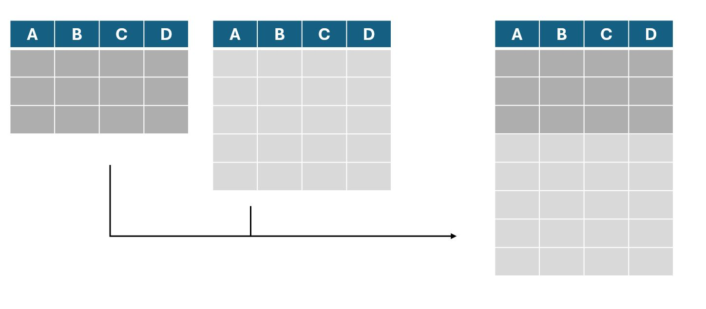
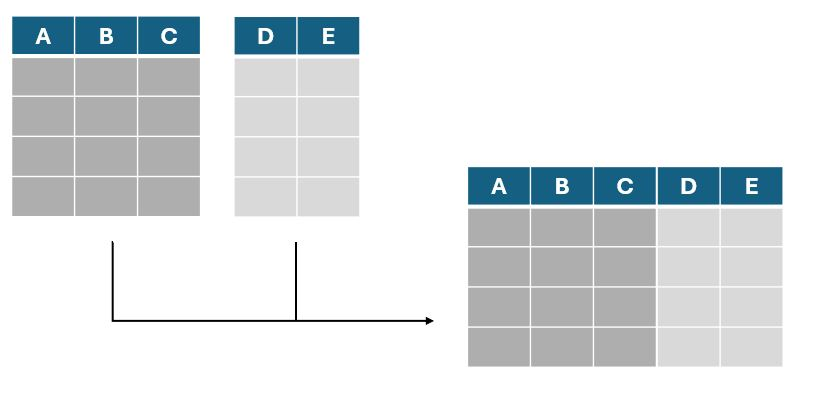
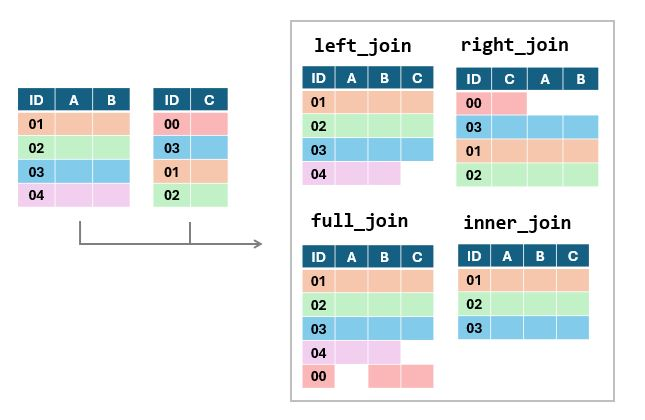

<style>
h1, h2, h3, h4, h5, h6 {
  direction: rtl;
}
p {
  direction: rtl;
}

.text-block1 {
  direction: rtl;       /* Set text direction to right-to-left */
  text-align: right;
  background-color: #e7f3fe; /* Light grey background */
  padding: 10px;
  border-radius: 5px;
  border: 1px solid #ddd; /* Light border */
  margin: 10px 0; /* Space around the block */
}
</style>


```{r setup, include=FALSE}
library(learnr)
library(gradethis)
library(Rcourse)
library(dplyr)
library(tidyr)

filter = dplyr::filter

gradethis::gradethis_setup()
knitr::opts_chunk$set(error = TRUE, warning = FALSE) 


{
exercises_df = data.frame(exercises = c("exercise1_6_piping","q1_5", "exercise2_6_select","exercise3_6_filter",
                                        "q2_5","q3_5","q4_5","q5_5",
                                        "summary_2",
                                        "exercise4_6_summary","exercise5_6_join","exercise6_6_gather"),
                                        
                          hebrew = c("פקד ההעברה: תרגיל",
                                     "בחירת עמודות: שאלה",
                                     "בחירת עמודות: תרגיל",
                                     "סינון שורות: תרגיל", #
                                     "סינון ערכים חסרים: שאלה",
                                     "סיכום נתונים: שאלה 1",
                                     "סיכום נתונים: שאלה 2",
                                     "סיכום נתונים: שאלה 3", #
                                     "סיכום נתונים: סיכום על סמך עמודה אחת (פיצרייה)",
                                     "סיכום נתונים: סיכום על סמך מספר עמודות",
                                     "צירוף נתונים: תרגיל",
                                     "שינוי צורה: תרגיל"
                                     ))

check_hash_code   = function(hash){
    exercises = exercises_df$exercises
    response_table = learnrhash::decode_obj(hash)
    if (length(response_table)==0){return("Invalid hash code")}
    correct = response_table %>% filter(label %in% exercises, correct) %>% pull(label)
    incorrect = setdiff(exercises, correct)
    if (length(incorrect) == 0){return("Great work! Hash code is valid")}
    else{
      hebrew = exercises_df  %>% filter(exercises %in% incorrect) %>%pull(hebrew)
      print("The following exercises are missing or incorrect:")
      print(hebrew)
    }

} 
}# hash checker

```


```{r prepare-rbind}

df_full = data.frame(subject_id = 1:6,
                              age = c(24,26,29,19,41,35),
                     eye_color = c("blue","brown","green","brown","blue","brown"),
                             stylish_socks = c(TRUE,TRUE,FALSE,FALSE,TRUE,FALSE))

# row bind

df_partial1 = df_full[1:4,]
df_partial1_with_dancing = df_partial1 %>% mutate(dancing_abilities = c( "Average","Poor", "Average", "Good"))

df_partial2 = df_full[5:6,]

# column bind

df_first_columns = df_full[1:4,][1:2]
df_last_columns = df_full[1:4,][3:4]
  
```

```{r prepare-table2}
table2 = need_for_cognition %>%
  mutate(nfc_02 = 6 - nfc_02r,  # נהפוך את הקידוד של שלושת העמודות ההפוכות
         nfc_03 = 6 - nfc_03r,
         nfc_06 = 6 - nfc_06r,
         # נחשב את ממוצע ששת השאלות.
         # שימו לב - אפשר להשתמש בעמודות שיצרנו מוקדם יותר בתוך הפונקציה
         nfc    = (nfc_01 + nfc_02 + nfc_03 + nfc_04 + nfc_05 + nfc_06)/6
         )
```

```{r prepare-pizza}
set.seed(12345)
pizza = data.frame(week = rep(1:5, each = 7),
                day = rep(1:7, 5),
                missing = rbinom(35, 1, 0.3),
                pizzas = pmax(0, rnorm(35, 50, 10)) %>% round()) %>%
  mutate(pizzas = ifelse(missing ==1, NA, pizzas)) %>%
  drop_na()
```

```{r prepare-join}
set.seed(111)
results = data.frame(subject = rep(1:3,each = 3),
                     trial = rep(1:3,3),
                     score = rnorm(9,70,20) %>% round())

trial_data = data.frame(subject = rep(1:4,each = 3),
                     trial = rep(1:3,4),
                     condition = c("easy","hard","medium","medium","easy","hard","hard","easy","medium","hard","medium","easy"))

```


```{r prepare-mood}
set.seed(111)
mood_scores = rep(runif(20,2,8), each = 3) + rnorm(60,0,2) + rep(c(-0.5,0,0.5),20)
mood = data.frame(subject = rep(1:20, each = 3),
                                 measurement_time = rep(c("T1","T2","T3"),20),
                                 mood_score = ifelse(mood_scores>10,10,
                                                      ifelse(mood_scores<0,0,mood_scores)) %>% round() )
```


##  מבוא

ביחידה זו נלמד להשתמש במגוון פונקציות הנכללות בחבילות `dplyr` ו-`tidyr`

פונקציות אלו מאוד נפוצות בשימוש בR כיוון שהן מאפשרות לעבד קבצי נתונים
באופן פשוט, מסודר ויעיל.  


חלק מהפונקציות שנכיר יאפשרו לנו לבצע פעולות שכבר למדנו (כמו סינון שורות או עמודות מטבלה), אך באופן שישמור על הקוד שלנו קריא ותמציתי. במקרים אחרים, נפגוש פונקציות המאפשרות עיבודים חדשים.

שימו לב שיחידה זו ארוכה באופן משמעותי מהיחידות הקודמות. מומלץ להקדיש לה זמן וקשב, שכן היא נוגעת בתחומים מרכזיים בניתוח ועיבוד נתונים שמהווים את הבסיס ברוב הניתוחים שנעשים בR. 


### פקד ההעברה

פקד ההעברה (Piping) מיוצג על ידי הסימון `%<%`.ניתן לחשוב עליו כעל 'צינור' המעביר את האובייקט שלפניו לפונקציה שמופיעה אחריו.

לדוגמה, במקום לכתוב `mean(vector1)` נוכל לכתוב `vector1 %>% mean()`. הפקד ייקח את הווקטור `vector1` ויעביר אותו כקלט לפונקציה `mean`.


לפניכם מספר דוגמאות. בכל דוגמה - שתי השורות מבצעות את אותה הפעולה בדיוק.

```{r}
# וקטור הציונים
scores = c(80.2,75.5,60,75.5,75.5,75.5,84,80.2,94)

# סינון כפילויות
unique_scores = unique(scores)
print(unique_scores)
unique_scores = scores %>% unique()
print(unique_scores)

# עיגול הציונים
rounded_scores = round(scores, digits = 0)
print(rounded_scores)
rounded_scores = scores %>% round(digits = 0)
print(rounded_scores)
```

#### למה זה טוב?

כאשר אנו משתמשים בפונקציה אחת בלבד, אין לפקד זה יתרון משמעותי.
היתרון העיקרי בא לידי ביטוי כאשר אנו רוצים להשתמש בכמה פונקציות ברצף. במקרים אלו, הפקד מאפשר לנו לכתוב קוד מסודר וקריא יותר. בנוסף, נוכל לפצל את הקוד לשורות שונות ולהוסיף הערות שיעזרו לנו לזכור את תפקידו של כל שלב בניתוח. 

למשל - נוכל להשתמש בפקד ההעברה כדי לחשב את **מספר** הערכים הייחודיים בוקטור הציונים שלנו:

```{r}
# וקטור הציונים
scores = c(80.2,75.5,60,75.5,75.5,75.5,84,80.2,94)

## ללא פקד העברה
n_unique_scores = length(unique(scores))

## עם פקד העברה
n_unique_scores = scores %>%
  unique() %>%  # סינון כפילויות
  length()      # חישוב אורך הוקטור שקיבלנו 
```


כדוגמה נוספת, נדפיס את ממוצע שורשי הציונים.

```{r}
# וקטור הציונים
scores = c(80.2,75.5,60,75.5,75.5,75.5,84,80.2,94)

# ללא פקד ההעברה
print(round(mean(sqrt(scores)),digits = 1))

# עם פקד ההעברה
scores %>%
  sqrt()%>%                # חישוב שורשי הציונים
  mean()%>%                # חישוב הערך הממוצע מתוך שורשי הציונים
  round(digits = 1) %>%    # עיגול הממוצע שחושב לספרה אחת אחרי הנקודה העשרונית
  print()                  # הדפסה

```


בדוגמה הזו היתרון של כתיבה באמצעות פקדי העברה מעט יותר ברור. במהלך היחידה נראה דוגמאות נוספות ליתרון של שימוש בפקד זה.
  


`תרגיל` כתבו מחדש את הקוד הבא באמצעות פקד העברה:


```{r} 
numbers_as_text = c("12","14","15","7","34","22","17")
mean_number = round(mean(as.numeric(numbers_as_text)),digits = 2)
print(mean_number)
```


```{r exercise1_6_piping,exercise=TRUE, exercise.eval = FALSE}

numbers_as_text = c("12","14","15","7","34","22","17")

mean_number =  
  
print(mean_number)

```

```{r exercise1_6_piping-solution}

numbers_as_text = c("12","14","15","7","34","22","17")

mean_number = numbers_as_text %>%
  as.numeric() %>%
  mean() %>%
  round(digits = 2)

print(mean_number)

```

```{r exercise1_6_piping-check}
grade_this_code(correct="מעולה!", 
  incorrect = "נסו שוב. שימו לב לבצע את הפעולות בדיוק לפי הסדר בו הן מופיעות"
  )
```

::: text-block1
**שימו לב** - כשאנחנו משתמשים בפקדי העברה, תוצרי הביניים של הפונקציות לא נשמרים באופן אוטומטי.
  
התוצר היחיד שיישמר הוא התוצאה הסופית של הפונקציה האחרונה בשרשרת, והוא יישמר תחת שם האובייקט אליו ביצענו את ההשמה.
:::


## בחירת עמודות

הפונקציות הראשונות שנכיר מבצעות פעולות שכבר התנסנו בהן.

למשל, הפונקציה `select` מאפשרת לנו לייצר טבלה חדשה מתוך העמודות של טבלה קיימת. אנחנו יכולים לציין את שמות העמודות
שאנחנו רוצים **לשמור**, או את אלו שאנחנו רוצים
להסיר (בעזרת סימן מינוס).

::: text-block1
כך או כך, הפונקציה מייצרת טבלה **חדשה** מתוך החיתוך שעשינו.  
הפונקציה אינה משנה את הטבלה המקורית, אלא יוצרת עותק חדש ומבצעת את הסינון עליו

אם ברצוננו לעדכן את הטבלה המקורית, נוכל לשמור את העותק המעודכן תחת שמה של הטבלה המקורית, ובכך לדרוס את הגרסה הישנה ולהחליף אותה בחדשה.
:::

הנה כמה דוגמאות:

```{r}

# נשתמש בטבלה שייבאנו בשיעור הקודם, המכילה את נתוני שאלון 
# need for cognition

# נדפיס את שמות העמודות בטבלה המקורית כדי להיזכר במבנה הטבלה
names(need_for_cognition)

# נייצר טבלה המכילה רק את הנתונים הדמוגרפיים
# באמצעות בחירת העמודות המציינות את מספר ההרצה, את מין הנבדק ואת הגיל שלו
demographic_data = need_for_cognition %>% 
  select(session_id, age, gender)

head(demographic_data,3)

```


 
```{r}

# השמטת עמודת בדיקת תשומת הלב
no_attention_check = need_for_cognition %>%
  select(-attention_check)

head(no_attention_check,3)

# נעדכן את הטבלה שיצרנו כך שלא תכיל את נתוני הגיל או המגדר
# ונישאר עם טבלה המכילה רק את מספר הנבדק ואת התגובות שלו לשאלון
no_attention_check = no_attention_check %>% 
  select(-age, -gender) 

head(no_attention_check,3)

```


```{r q1_5, echo = FALSE}
question("<div style='direction: rtl;'>אם היינו מריצים את קטע הקוד האחרון (עדכון הטבלה שיצרנו כך שלא תכיל את נתוני הגיל) פעמיים ברציפות - היינו מקבלים הודעת שגיאה. מדוע?</div>",
         
         answer("כיוון שאי אפשר להריץ את אותו הקוד פעמיים", message = "באופן כללי, אין שום בעיה להריץ את אותו הקוד פעמים"),
         answer("כיוון שהטבלה בה אנו משתמשים כבר לא קיימת" , message = "הטבלה עדיין קיימת"),
         answer("כיוון שהטבלה גדולה מדי", message = "גודל הטבלה אינו גורם לשגיאה"),
         answer("כיוון שאנחנו מנסים להסיר מהטבלה עמודה שכבר לא קיימת בה", correct = TRUE),
         allow_retry = TRUE,
         
         
  correct="תשובה נכונה. בהרצה הראשונה הסרנו את העמודה - ולכן בהרצה השנייה היא כבר לא קיימת ומתקבלת הודעת שגיאה", 
  incorrect = "נסו שוב"
)
```

`תרגיל` צרו טבלה חדשה שכוללת רק את מספרי ההרצה (session_id) ואת תוצאות מבחן תשומת הלב (attention_check)

```{r exercise2_6_select, exercise=TRUE, exercise.eval = FALSE }

session_and_attention = ______________

print(session_and_attention)
```

```{r exercise2_6_select-check}
grade_result(
  pass_if(~identical(.result,
                     session_and_attention %>% 
                       select(session_id, attention_check))),
  
  correct="יפה מאוד", 
  incorrect = "נסו שוב"
)
```


  

### בחירת עמודות המכילות תווים מסוימים

יישום שימושי נוסף של פונקציה זו הוא בחירת עמודות על סמך
התוכן של **שמות** העמודות. באמצעות שימוש בפונקציה `contains` בתוך פונקציית ה`select` נוכל לבחור את
כל העמודות המכילות רצף תווים מסוים. אפשרות זו שימושית כשאנחנו רוצים
לבחור קבוצה של עמודות ששמרנו בשם דומה - למשל תשובות לשאלות שונות באותו
השאלון.

בדוגמה למטה אנחנו חותכים מתוך הטבלה הכללית שלנו תת-טבלה המכילה רק את
התשובות לשאלון ואת המספר המזהה של ההרצה (שמתפקד כמספר מזהה לנבדק).

```{r}

questions_and_session_id = need_for_cognition %>%
  select(session_id,contains("nfc"))

head(questions_and_session_id,3)
                
```


### שליפת עמודה כוקטור

שימו לב - כשנבצע בחירת עמודות באמצעות `select` נקבל חזרה טבלה - גם אם
בחרנו רק עמודה אחת. זה משמעותי כיוון שיש פונקציות שמצפות לקבל וקטור ולא יעבדו אם נעביר להן טבלה - גם אם היא כוללת רק עמודה אחת.

במידה ונרצה לבצע חיתוך של עמודה בודדת **כוקטור** ולא
כטבלה נוכל להיעזר בפקד ה\$, או להשתמש בפקודה `pull` המבצעת פעולה דומה.
בדוגמה הבאה אנו נעזרים בפונקציה זו על מנת לבחון אילו ערכים השונים
קיימים בעמודה gender.


```{r}

need_for_cognition %>% pull(gender) %>% # שליפת העמודה המכילה את נתוני המגדר
  unique() %>%              # פונקציה המשיבה וקטור שמונה את הערכים השונים הקיימים בוקטור
  print()                   # הדפסה

```

ניתן לראות שהעמודה מכילה ערכים המעידים על נבדקים זכרים, נקבות וערכים חסרים כלשהם (NA).


## סינון שורות

כעת, לאחר שבררנו את העמודות הנחוצות לנו, נוכל לעבור לשלב המשלים: סינון שורות.

גם כאן נוכל לשמור או להשמיט שורות לפי המספר הסידורי שלהן, באמצעות הפקודה
`slice` , אך ברוב המקרים סינון השורות שנרצה לבצע יהיה תלוי בתוכן השורות עצמן ולא במספרן הסידורי.

למשל - ייתכן ונרצה לסנן מתוך קובץ הנתונים שלנו את כל הנבדקים שלא סיימו
את הניסוי, נבדקים הנמצאים מחוץ לטווח גילאים מסויים או שחסרים להם נתונים
חשובים.

בשביל פעולות כאלו, שהינן תנאי הכרחי כמעט בכל ניתוח שנערוך, ניעזר
בפונקציה `filter`.

פונקצייה זו מקבלת את הטבלה עליה נרצה לבצע את הסינון (באופן ישיר או
באמצעות פקד ההעברה), ותנאי לוגי שיקבע אילו שורות **יישארו**. תנאי זה יתבסס על
עמודה אחת או יותר מתוך הטבלה.

נמחיש באמצעות מספר דוגמאות:

```{r}
library(dplyr)
# שמירת כל הנבדקים שעמדו במבחן הקשב בניסוי

filtered_table1 = need_for_cognition %>%
  filter(attention_check == 1) 

 # שמירת הנבדקים הגברים בלבד (סינון נשים וערכים חסרים)

filtered_table3 = need_for_cognition %>% 
  filter(gender == "male") 

# שליפת הנתונים של 3 נבדקים ספציפיים, על פי מספר מזהה

filtered_table4 = need_for_cognition %>% 
  filter(session_id %in% c(7392233, 7392875 , 7397497))

```

::: text-block1
הדוגמה האחרונה נעזרת בפעולת השוואה חדשה, הבוחנת האם ערך נמצא בתוך וקטור ערכים כלשהו. היא דומה לפעולה `==` אבל מחזירה ערך חיובי אם הערך שלנו זהה לפחות לאחד מהערכים בוקטור.
:::

יש הרבה מקרים בהם נצטרך להשתמש בכמה תנאים לוגיים יחד כדי לבצע את הסינון הרצוי. למשל, אם נרצה לשמור רק נבדקים בגיל שנמצא בטווח מסויים נוכל לשמור את כל מי שערך הגיל שלו גדול מערך כלשהו אבל גם קטן מערך אחד.

```{r}
# שמירת כל הנבדקים בין גילאי 20 ו30 (כולל)

filtered_table2 = need_for_cognition %>%
  filter(age >= 20 & age <=30)
```

כדוגמה נוספת, בקטע הבא אנחנו שומרים רק נבדקים שעומדים לפחות באחד משני התנאים:

**1)** נשים שעברו את מבחני הקשב

**2)** גברים - בין אם עברו את מבחני הקשב או לא


```{r}
filtered_table = need_for_cognition  %>% 
  filter( (gender == "female" & attention_check==1) | (gender == "male") )

```
 

`תרגיל` : סננו את הקובץ כך שיכיל רק תצפיות של גברים מתחת לגיל 40 שעברו את מבחני הקשב


```{r exercise3_6_filter, exercise=TRUE, exercise.eval = FALSE,}
# גברים מתחת לגיל 40 שעברו את מבחני הקשב 
female_or_male_by_age = need_for_cognition %>%
    filter(___________)
             
```

```{r exercise3_6_filter-check}
grade_result(
  pass_if(~identical(.result,
                     need_for_cognition %>%
                          filter(gender == "male" & age < 40 & attention_check==1)

                     )),
  
           
  correct="!עבודה מצוינת", 
  incorrect = "נסו שוב"
)

```


### ערכים חסרים

בעבודה עם נתונים אמיתיים במקרים רבים אנחנו נתקל
בנתונים חסרים. החוסר יכול לנבוע מכך שנבדק פספס שאלה מסוימת, נפסל באחד
הסבבים של מטלה, או שהייתה בעיה כלשהי בשמירת הנתונים שלו.

כפי שראינו קודם, הנתונים החסרים יסומנו באמצעות הסימן NA.


קיימות מספר דרכים להתמודד עם נתונים חסרים:

::: text-block1

 **1) להשאיר אותם כפי שהם:** במידה ומדובר בנתון שאינו חיוני לרוב הניתוחים שלנו ייתכן ונרצה לשמור את התצפית ולהשאיר את הערכים החסרים כפי שהם. אם בוחרים באפשרות זו, נצטרך לוודא שאנו מתעלמים מהנתונים החסרים בניתוחים הרלוונטיים (למשל, באמצעות `na.rm = TRUE`).
 
 **2) לסנן את השורות הבעייתיות:** במקרים בהם הנתון החסר חשוב או מעיד על בעיה בנתונים ייתכן ונרצה לסנן את התצפיות המכילות ערכים שכאלו. במקרים מסוימים הדבר יוביל לפסילה ומחיקה של כל הנתונים של אותו הנבדק.
 
 **3) להחליף אותם בערכים אחרים:** אפשרות זו תשמש אותנו בעיקר כשהערכים החסרים נובעים מהאופן בו ניהלנו את המידע שלנו ואנחנו יודעים באילו ערכים נרצה להחליף אותם.

:::
 
### סינון ערכים חסרים

במידה ונבחר למחוק את השורות המכילות ערכים חסרים, נוכל לעשות זאת באמצעות הפונקציה `drop_na`.

להלן מספר דוגמאות:

```{r e8}

nrow(need_for_cognition) # מספר התצפיות בטבלה המקורית

# פונקציה זו מקבלת את שמות העמודות שעל בסיסן נרצה להשמיט את התוצאות
# בדוגמה זו השמטנו שורות  בהן הערך בעמודת המגדר היה חסר
table1 =  need_for_cognition %>% drop_na(gender)
nrow(table1) # מספר התצפיות אחרי סינון ערכים חסרים

# באותו האופן, ניתן להשמיט שורות שיש בהן ערך חסר *בעמודה אחת לפחות* מתוך העמודות שצוינו
table2 =  need_for_cognition %>% drop_na(gender, nfc_01, nfc_02r, nfc_03r)
nrow(table2) #מספר התצפיות אחרי סינון ערכים חסרים

# או להשמיט שורות שיש בהן תצפית חסרה כלשהי, בעמודה כלשהי
table3 = need_for_cognition %>% drop_na()
nrow(table3) # מספר התצפיות אחרי סינון ערכים חסרים

```


`תרגיל:` סננו מתוך הטבלה את כל התצפיות המכילות ערך חסר באחת השאלות של השאלון (העמודות שמתחילות ב"nfc")


```{r ex_drop_na, exercise = TRUE, exercise.eval = FALSE}


filtered_table =  ______________


print(paste("Filtered", nrow(need_for_cognition) - nrow(filtered_table),"rows"))
```


```{r q2_5, echo = FALSE}

question_text(
  "<div style='direction: rtl;'>כמה תצפיות סיננתם?</div>",
  answer("66", correct = TRUE),
  allow_retry = TRUE,
  
           
  correct="אליפות!", 
  incorrect = "נסו שוב"
)

```

### החלפת ערכים חסרים

במידה והחלטנו להחליף את הערכים החסרים נצטרך לבחור באחת משתי גישות:

להחליף את הערכים החסרים בערך קבוע כלשהו או
ל"מלא" את הערכים החסרים בערכים מהשורה מעל או מתחת לערך החסר.

בקובץ שלנו ישנם ערכים חסרים בעמודת המגדר. ייתכן ואלו נובעים ממקרים בהם הנבדק בחר שלא למלא את השאלה הרלוונטית. במידה וזה המצב - נוכל להחליף את הערכים החסרים בערך שמבטא את זה שאותם נבדקים בחרו שלא לשתף את המגדר שלהם.

ההחלפה מתבצעת באמצעות הפונקציה `replace_na` השייכת לחבילה `tidyr`.

```{r}
library(tidyr)
table2 = need_for_cognition %>%
  replace_na(list(gender= "Preferred not to say"))
```

שימו לב שאופן השימוש בפונקציה זו קצת שונה מאלו שהתמשנו בהן עד עכשיו. הפונקציה מקבלת רשימה (list, מבנה נתונים שלא נתמקד בו בקורס זה) המפרטת את הערכים בהם נרצה למלא את הערכים החסרים בעמודה / עמודות מסויימות.
 
   
הגישה השנייה, שכוללת מילוי של הערכים החסרים על סמך הערכים הסמוכים אליהם, היא פרקטיקה שנמצאת בשימוש רק במצבים בהם הנתונים שלנו נוצרו באופן שיצדיק זאת. 

למשל - ייתכן ואנחנו מציגים לנבדקים תמונה ואז מבקשים מהם לענות על מספר שאלות לגביה. בגלל האופן בו יצרנו את הניסוי, הזהות של התמונה שהוצגה בכל סבב מופיעה רק בשורה הראשונה של הנתונים ובשאר התגובות מופיע ערך חסר בעמודה המתאימה. במקרים כאלו ייתכן ונרצה להחליף את הערכים החסרים של שאר התצפיות בסבב בערך התקף הראשון שמופיע לפניהם. הפונקציה שתשמש אותנו לשם כך נקראת `fill` והיא יודעת להחליף ערכים חסרים בערכים שמעליהם או מתחתם בטבלה (לבצע השלמה כלפי "מטה" או "מעלה", בהתאמה).

בדוגמה הבאה נמלא את הערכים החסרים בעמודת הגירוי (stimulus) על פי הערך הקודם שהופיע בעמודה:

```{r}

df = data.frame(round = rep(1:2, each = 4), # נייצר נתונים ל2 סבבים, כשכל סבב מכיל 4 תגובות
                response_i = rep(1:4,2), #נחזור פעמיים על הרצף 1 עד 4 כדי לייצר את מספר התגובה עבור כל סבב 
                stimulus = c("Img1",NA,NA,NA,"Img2",NA,NA,NA) )

print(df)

filled_df = df %>% fill(stimulus, .direction = "down")

print(filled_df)
```


### ערכים כפולים

לעיתים, במיוחד כשאנחנו עוסקים במידע שצורף ממספר מקורות שונים, הטבלאות שלנו
עלולות להכיל כפילויות נתונים. לטובת מקרים כאלו קיימת הפקודה `distinct`, שתפקידה
לסנן תצפיות כפולות. הפונקציה תקח את הטבלה שלנו, תעבור על כל השורות ותמחק
שורות המופיעות יותר מפעם אחת.

לפניכם מספר דוגמאות:

```{r e10}
# בקובץ המקורי אין כפילויות, ולכן נייצר טבלה עם מספר כפילויות לצורך ההדגמה
table1 = need_for_cognition %>%
  slice(c(1:1000,36,207,6)) # נחתוך את אלף השורות הראשונות + חזרה כפולה על מספר שורות

nrow(table1) # מספר השורות לפני מחיקת כפילויות

table2 = table1 %>%
  distinct()

nrow(table2) # מספר השורות אחרי מחיקת כפילויות
```


## שינוי שמות וסידור לפי ערכים

#### rename

חבילת dplyr מספקת לנו גם דרך פשוטה לשנות את שמות העמודות שלנו. כמו כל
הפונקציות הקודמות שפגשנו, גם כאן הפונקציה **אינה עורכת** את הטבלה המקורית,
אלא מייצרת עותק ערוך שלה אותו נצטרך לשמור. הפונקציה מקבלת פירוט של השמות
החדשים שנרצה לתת לעמודות בליווי שמן הנוכחי.

```{r e11}
names(need_for_cognition)

table1 = need_for_cognition %>%
  rename(subject  = session_id,
         sex = gender)
        #new_name = old_name

names(table1)
```

#### arrange

פונקציה נוספת העשויה לעזור לנו בסידור הנתונים שלנו היא הפונקציה arrange.
פונקציה זו תחזיר לנו את הטבלה כשהיא מסודרת בסדר עולה או יורד על פי הערכים בעמודה
אחת או יותר.
  
במידה וביקשנו מהפונקציה לסדר לפי עמודה המכילה ערכים מספריים, היא תסדר את הטבלה כך שהערכים של עמודה זו יהיו בסדר עולה. אם העמודה מכילה מחרוזות, הפונקציה תסדר את הטבלה כך שהערכים יהיו מסודרים לפי סדר האלף בית.

```{r e12}
table1 = need_for_cognition %>%
  arrange(age)    # סידור לפי גיל

head(table1)

table2 = need_for_cognition %>% 
  arrange(gender, age)  # סידור לפי מגדר - ואז לפי גיל

head(table2)
```


במידה ונרצה להפוך את סדר המדרג נוכל להכניס את העמודה לפיה אנו מעוניינים לסדר את הטבלה לתוך הפונקציה `desc`, המשמשת בעיקר לטובת פעולה זו:

```{r}
table3 = need_for_cognition%>%
  arrange(desc(age))  # סידור לפי מספר גיל, בסדר יורד

head(table3)

```
 

## עריכת נתונים


### חישוב עמודות - mutate

הפונקציה הנפוצה ביותר בתהליך עיבוד הנתונים היא הפונקציה mutate. פונקציה
זו מאפשרת לנו להגדיר עמודות חדשות או לערוך עמודות קיימות - באופן דומה
לעריכה שעשינו באמצעות פקד ה\$. 

הפונקציה מאפשרת לנו לערוך מספר עמודות בבת אחת, כאשר החישוב של כל עמודה
מופרד בפסיק ממשנהו.

להלן מספר דוגמאות:

```{r e13}

mutated_table = need_for_cognition %>%
  mutate(nfc_02 = 6 - nfc_02r,  # נהפוך את הקידוד של שלושת העמודות ההפוכות
         nfc_03 = 6 - nfc_03r,
         nfc_06 = 6 - nfc_06r,
         # נחשב את ממוצע ששת השאלות.
         # שימו לב - אפשר להשתמש בעמודות שיצרנו מוקדם יותר בתוך אותה הפונקציה
         nfc    = (nfc_01 + nfc_02 + nfc_03 + nfc_04 + nfc_05 + nfc_06)/6
         )
# שימו לב לסוגריים - כל העמודות שיצרנו הוכנסו בתוך פונקצייה אחת, בה הפרדנו את ההתייחסות לכל עמודה בפסיקים.
# ירידת השורה בין עמודה לעמודה נועדה כדי לשמור על הסדר ואינה נדרשת בשביל תקינות הקוד

head(mutated_table)

```

דרך פונקציה זו נוכל גם לעדכן את סוג העמודות (מספרי / תווים / ערכים לוגיים / פקטור). 

```{r e14, exercise=FALSE, exercise.eval = FALSE, exercise.setup = "prepare-table2"}

# בדוגמה זו נערוך את הטבלה המקורית, באמצעות כך שנשמור את הטבלה שהפונקציה מחזירה לנו תחת אותו השם
need_for_cognition = need_for_cognition %>% 
  mutate(gender        = factor(gender),           # הפיכת עמודת המגדר לפקטור 
         age_charecter = as.character(age)         # יצירת עמודה המכילה את גיל הנבדק כמחרוזת
  )

head(need_for_cognition)

```


מספר דוגמאות נוספות, המייצרות עמודות על בסיס השוואה של ערכי העמודות:

```{r}
need_for_cognition = need_for_cognition %>%
  mutate(age_above_18 = age >=18,                    # עמודה לוגית המקודדת האם הנבדק מעל גיל  18
         
                                                     # פונקציה המאפשרת לקבוע ערכים בהתאם לתנאי
         age_above_25 = ifelse(age < 25,             # התנאי
                               "under 25",           # אם כן - הערך עבור תצפיות בהם התנאי מתקיים
                               "25 or older")        # אם לא - הערך עבור מקרים בהם התנאי אינו מתקיים
  )

```


## סיכום נתונים

לאחר שסידרנו וערכנו את הנתונים, נוכל לסכם אותם - לחשב ממוצעים, סטיות תקן וסכומים שיאפשרו לנו להבין איך הנתונים שלנו נראים ברמת הקבוצה.

בשיעורים הקודמים ראינו איך אפשר לסכם ערכים מתוך וקטור מספרים (למשל - על ידי חישוב ממוצע הוקטור), כך שבעיקרון אנחנו יכולים לשלוף את העמודות שאנחנו מעוניינים בהן כוקטור ולבצע עליהם את הסיכומים שנרצה. מנגד, אם נרצה לסכם מספר עמודות בבת אחת נוכל לעשות זאת באמצעות הפונקציה `summarise`. פונקציה זו דומה במבנה שלה ל`mutate` אבל מחזירה סיכומים

למשל, הקוד הבא מחשב מספר מדדי סיכום עבור נתוני הnfc שחישבנו.

```{r summ, exercise=TRUE, exercise.eval = FALSE, exercise.setup = "prepare-table2"}

summary_table = table2 %>%     # נשתמש בטבלה שחישבנו בה את הציון הכללי בשאלון עבור כל נבדק
  summarise(mean_nfc = mean(nfc, na.rm = T),# חישוב ממוצע ציוני המדד
            sd_nfc   = sd(nfc,na.rm = T),   # חישוב סטיית התקן של ציוני המדד
            
            n_observations = n(),           # פונקציה שנועדה רק כדי לספור את מספר התצפיות בסיכום
            
            n_na = sum(is.na(nfc))          # כמות הנבדקים בעלי ערך חסר בעמודת המדד
                                            # הפונקציה הראשונה (is.na) 
                                            # מחזירה ערך לוגי בהתאם להאם הערך חסר או לא
                                            # והסכימה ממירה את ערכי האמת והשקר ל1 ו0 בהתאמה וסופרת כמה ערכי אמת קיבלנו
     )
print(summary_table)

```

כפי שניתן לראות בדוגמה, הפלט של הפונקציה הוא טבלה, המכילה שורה אחת ועמודה עבור כל מדד שחישבנו בפונקציה `summarise`.


### סיכום לפי קבוצות

במקרים רבים לא נרצה לסכם את הטבלה כולה יחד, אלא לייצר סיכום לפי קבוצות. 

כדי לעשות זאת נוכל להשתמש בפונקציה `group_by` לפני שנעביר את הטבלה ל`summarise`. פונקציה זו מחלקת את הטבלה לקבוצות על סמך הערכים באחת העמודות וגורמת לכך שכל פעולה שנעשה על הטבלה לאחר מכן - תיעשה בהתאם לקבוצות אלו.

למשל - אם אנחנו רוצים לסכם את הנתונים בטבלה `df1`בנפרד עבור נשים וגברים, נוכל להשתמש בשורת הקוד `df1_grouped = df1 %>% group_by(gender)`. 

הטבלה שנקבל תהיה זהה לטבלה המקורית שלנו, בלי שום שינוי נראה לעין - אבל כל פעולה שנבצע עליה מעכשיו תתבצע לפי קבוצות. לכן - כשנעביר אותה לפונקציה `summarise`, המדדים שנחשב יחושבו בנפרד לכל קבוצה.

נערוך את הדוגמה הקודמת, כך שהסיכום יעשה לפי קבוצות מגדר:

```{r summary11, exercise=TRUE, exercise.eval = FALSE, exercise.setup = "prepare-table2"}

summary_table_by_group = table2 %>% 
  group_by(gender)%>%                 # הוספנו שורת קוד המחלקת את הטבלה לקבוצות לפני הסיכום
  summarise(mean_nfc = mean(nfc, na.rm = T),
            sd_nfc   = sd(nfc,na.rm = T),
            n_observations = n(),
            n_na = sum(is.na(nfc))          
  )

print(summary_table_by_group)
```

שני דברים השתנו בטבלה שקיבלנו - ראשית, נוספה עמודה המציינת את קבוצות המגדר בנתונים שלנו (במקרה שלנו: גברים, נשים ונבדקים עם ערכים חסרים בעמודה זו) ושנית, הסיכומים נעשו בנפרד לפי כל אחת מקבוצות אלו. כל שורה מבטאת נבדקים השייכים לקבוצת מגדר מסויימת וכל עמודה מציינת את הערך שחושב עבור קבוצה זו במדד הסיכום המתאים.

שימו לב - מאחר ועמודת המגדר שלנו מכילה ערכים חסרים, התוכנה התייחסה אליהם
כאל קבוצה נוספת וחישבה את מדדי הסיכום גם עבורם.


```{r q3_5, echo = FALSE}
question_text(
  "<div style='direction: rtl;'> מה היה ממוצע מדד nfc אצל הנשים במדגם? </div>",
         answer("3.15", correct = TRUE),
         allow_retry = TRUE,
  
           
  correct="מצוין", 
  incorrect = "נסו שוב"
)
```

```{r q4_5, echo = FALSE}
question_text(
  "<div style='direction: rtl;'> כמה תצפיות חסרות היו במדד הnfc אצל גברים? </div>",
         answer("14", correct = TRUE),
         allow_retry = TRUE,
           
  correct="המשיכו כך!", 
  incorrect = "נסו שוב"
)
```

```{r q5_5, echo = FALSE}
question_text(
  "<div style='direction: rtl;'> כמה נבדקים יש בקובץ שערך המגדר שלהם חסר, אבל הציון שלהם במדד nfc תקין? </div>",
         answer("23", correct = TRUE),
         allow_retry = TRUE,
  
           
  correct="נהדר", 
  incorrect = "נסו שוב"
)

```


`תרגיל`  
הטבלה `pizza` מכילה נתונים אודות כמות הפיצות שיוצרו בפיצרייה כל יום משך 5 שבועות. ימים בהם הפיצריה הייתה סגורה לא מופיעים בטבלה.

קבצו את הנתונים לפי מספר השבוע (העמודה `week`) וצרו סיכום המפרט את כמות הפיצות הממוצעת שיוצרו כל יום במהלך שבוע זה ואת כמות הימים בה הפיצרייה הייתה פתוחה באותו שבוע.

בנוסף לעמודת מספרי השבועות, טבלת הסיכום צריכה להכיל שתי עמודות שיקראו `mean_pizzas` ו`days_open`


```{r summary_2, exercise=TRUE, exercise.eval = FALSE, exercise.setup = "prepare-pizza"}

head(pizza)

pizza_summ =  ___________

print(pizza_summ)
```

```{r summary_2-solution}
head(pizza)

pizza_summ = pizza %>%
  group_by(week) %>%
  summarise(mean_pizzas = mean(pizzas, na.rm = T),
            days_open = n())

print(pizza_summ)
```

```{r summary_2-check}
grade_this(
  
   if ( !identical(user_object_get("pizza_summ") %>% pull(mean_pizzas),
                    solution_object_get("pizza_summ") %>% pull(mean_pizzas) )){
     fail("נסו שוב")}
  
   else if( !identical(user_object_get("pizza_summ") %>% pull(days_open),
                        solution_object_get("pizza_summ") %>% pull(days_open) )) {
     fail("ישנה טעות בחישוב מספר הימים בהם הפיצרייה היתה פתוחה. נסו שוב.")}
  
   else {pass("עבודה מצוינת!")}

   )
```


גם בתרגיל וגם בדוגמה הקודמת סיכמנו על סמך עמודה אחת בלבד. במידה ונרצה לייצר תתי
קבוצות ממספר עמודות (למשל - גברים מבוגרים, גברים צעירים, נשים מבוגרות
ונשים צעירות), נוכל להכניס עמודות נוספת לפונקציית ה`group_by`.


`תרגיל:` השלימו את הקוד הבא בהתאם להערות.

הקוד מייצר עמודה נוספת המכילה את קבוצת הגיל של הנבדק (מעל או מתחת לגיל 30), מחלקת את הטבלה לפי מגדר וקבוצת גיל ואז מחשבת שלושה עמודות סיכום לכל תת קבוצה.

העמודות צריכות לכלול את מספר התצפיות בתת הקבוצה, את ממוצע מדד הnfc עבור תת קבוצה זו ואת אחוז הנבדקים שעברו את מבחן הקשב.(כמספר בין 0 ל100)

```{r exercise4_6_summary, exercise=TRUE, exercise.eval = FALSE, exercise.setup = "prepare-table2"}

summary_table2 = table2 %>% 
  # נייצר עמודה נוספת המבחינה בין נבדקים מעל ומתחת לגיל 30
  mutate(over_30 = ifelse(age >30,
                          "over 30",
                          "30 or under")) %>%
  # נחלק את הטבלה גם לפי מגדר וגם לפי קבוצת גיל
  group_by(gender, over_30)%>%
  # נסכם את הנתונים
  summarise(n_observations =                , #  (כולל ערכים חסרים)מספר התצפיות  הכולל בתת הקבוצה
            mean_nfc =                      , #  ממוצע ציון המדד, תוך התעלמות מערכים חסרים
            percent_attention_valid =         #  אחוז הנבדקים שעברו את מבחן הקשב (מקודד כ1). מספר בין 0 ל 100
  )

print(summary_table2)
```

```{r exercise4_6_summary-solution}
summary_table2 = table2 %>% 
  # נייצר עמודה נוספת המבחינה בין נבדקים מעל ומתחת לגיל 30
  mutate(over_30 = ifelse(age >30,"over 30","30 or under")) %>%
  group_by(gender, over_30)%>%
  summarise(n_observations =   n()             , #  (כולל ערכים חסרים)מספר התצפיות  הכולל בתת הקבוצה
            mean_nfc =       mean(nfc,na.rm = T)               , #  ממוצע ציון המדד, תוך התעלמות מערכים חסרים
            percent_attention_valid =  mean(attention_check)*100       # אחוז הנבדקים שעברו את מבחן הקשב (מקודד כ1))
  )

print(summary_table2)
```

```{r exercise4_6_summary-check}
grade_this(
  
   if ( !identical(user_object_get("summary_table2") %>% pull(n_observations),
                    solution_object_get("summary_table2") %>% pull(n_observations) )){
     fail("טעות בחישוב מספר התצפיות בכל תת קבוצה")}
  
   else if( !identical(user_object_get("summary_table2") %>% pull(mean_nfc),
                        solution_object_get("summary_table2") %>% pull(mean_nfc) )) {
     fail("טעות בחישוב ממוצע המדד. שימו לב להתעלם מערכים חסרים")}
  
   else if( !identical(user_object_get("summary_table2") %>% pull(percent_attention_valid),
                         solution_object_get("summary_table2") %>% pull(percent_attention_valid) )) {
     fail("טעות בחישוב אחוז הנבדקים שעברו את מבחן הקשב. שימו לב שהערך עבור כל קבוצה צריך להיות מספר בין 0 ל100")}
  
   else {pass("עבודה מצוינת!")}

   )
```


 
::: text-block1
קיבוץ טבלה באמצעות `group_by` משפיעה על פעולות נוספות, מעבר ל`summary`. מרגע שהטבלה מקובצת, כל פעולה שנבצע עליה תיעשה לפי קבוצות. למשל - אם נייצר עמודה חדשה שמחשבת בכמה נקודות ציון הnfc של נבדק רחוק מהממוצע באמצעות הפקודה הבאה:
`table2 %>% mutate(diff_from_mean = nfc - mean(nfc))`

במידה והטבלה לא הייתה מקובצת - נקבל את ההפרש מהממוצע הכללי, ובמידה והטבלה הייתה מקובצת לפי מגדר, למשל, נקבל את ההפרש של כל נבדק מממוצע המגדר אליו הוא משתייך

כלומר - חשוב שנקח בחשבון את המשתנים לפיהם הטבלה מקובצת כשאנחנו עורכים חישובים כאלו.
כדי לבטל את הקיבוץ אפשר להשתמש בפונקציה `ungroup`
:::


## צירוף נתונים

הנושא הבא שנתעסק בו כולל צירוף של נתונים מכמה טבלאות שונות. לא נדיר
שבמחקר בפסיכולוגיה אנחנו נדרשים לצרף יחד נתונים מכמה מקורות.

למשל -
ייתכן ונריץ ניסוי שבו הנבדקים משתתפים במטלה קוגנטיבית כלשהי ובסופה
ממלאים מספר שאלונים. בניתוח של נתונים כאלו נרצה להפיק לכל נבדק מדדים בהתאם לתשובות שלהם לשאלונים (בדומה למדד הnfc שחישבנו בלומדה זו) וגם ציונים עבור הביצועים שלהם במטלה. כל ניתוח כזה בדרך כלל יערך בנפרד ובסופו של החישוב נרצה לחבר בין טבלה אחת, המכילה את מדדי השאלונים, לטבלה אחרת המכילה את מדדי המטלה.

כדוגמה נוספת - ייתכן והנתונים שלנו מחולקים למספר קבצים נפרדים ולכן כשנטען אותם הם יהיו פזורים על פני מספר טבלאות נפרדות.


ישנם כמה צורות בהן נוכל לחבר טבלאות נתונים:

  **1)**  צירוף "טיפש", לפי שורות או עמודות

  **2)**  הצלבת תצפיות
  
  
    
### צירוף "טיפש"

במידה ויש לנו 2 טבלאות עם אותן עמודות, אך עם תצפיות שונות - נוכל לאחד את
השורות מהטבלאות השונות לכדי טבלה אחת ארוכה. אפשר לחשוב על פעולה זו כאל
הדבקה של השורות מטבלה אחת בסופה של הטבלה השנייה.

{width="500"}

הפונקצייה שתשמש אותנו לשם כך נקראת `bind_rows`.

להלן דוגמה:

```{r e115, exercise=TRUE, exercise.eval = FALSE, exercise.setup = "prepare-rbind"}

print(df_partial1)
print(df_partial2)


full_df =  bind_rows(df_partial1, df_partial2)

print(full_df)

```

במידה וישנן עמודות שקיימות רק באחת מהטבלאות, הפונקצייה תמלא את עמודה זו בערכים חסרים עבור כל התצפיות של הטבלה השנייה


```{r e116, exercise=TRUE, exercise.eval = FALSE, exercise.setup = "prepare-rbind"}
print(df_partial1_with_dancing)
print(df_partial2)


full_df =  bind_rows(df_partial1_with_dancing, df_partial2)

print(full_df)
```


### צירוף עמודות


באופן דומה - ניתן גם לצרף עמודות מטבלאות שונות. הפעם נצטרך שהטבלאות יהיו
באותו האורך (בעלי מספר שורות זהה), והצירוף שלהן "ידביק" אותן זו לצד זו.

{width="500"}

```{r e16, exercise=TRUE, exercise.eval = FALSE , exercise.setup = "prepare-rbind"}

print(df_first_columns)
print(df_last_columns)

full_df =  bind_cols(df_first_columns, df_last_columns)

print(full_df)
```

שימו לב שכדי שחיבור כזה יתנהל בצורה נכונה הטבלאות חייבות להיות מסודרות באופן זהה, כך שסדר השורות זהה בין הטבלאות.

### הצלבת תצפיות

צירוף שורות או עמודות הוא צירוף "טיפש", כלומר - הוא לא לוקח בחשבון את
התוכן של הטבלאות אלא מתבסס על ההנחה שהטבלאות מסודרות באופן זהה.

במקרים רבים נרצה להצליב ולצרף נתונים מטבלאות שאינן בהכרח בעלות מבנה זהה.
ציינו דוגמה שכזו בתחילת הפרק - הצלבה של נתוני שאלונים עם תוצאות במטלה.
בשביל צירוף כזה אנחנו נצטרך לצרף את הנתונים על סמך סימן מזהה כלשהו -
למשל, על סמך מספר נבדק. אנחנו נרצה שהתוכנה תעבור על שתי הטבלאות, תמצא תצפיות
בעלות אותו מספר נבדק ותשלב אותן יחד.

למעשה, יש כמה דרכים שבהן אפשר לבצע את הפעולה הזו.


האפשרויות שלנו הן:


::: text-block1

  **1)**  להשאיר טבלה אחת כפי שהיא, ולצרף אליה את התצפיות המתאימות מהטבלה
    השנייה. כדי לבצע חיבור שכזה נשתמש בפונקציות `left join` או `right_join`.


  **2)**  להשאיר את כל התצפיות משתי הטבלאות ולמלא את הטבלה בערכים חסרים בשורות
    בהן אין התאמה בין הטבלאות. פעולה זו שומרת על כל התצפיות משתי הטבלאות ומתבצעת באמצעות הפונקציה `full_join`


  **3)**  לשמור אך ורק את התצפיות שנמצאות בשתי הטבלאות. במקרה הזה אנחנו לא נוסיף ערכים חסרים לטבלה, אבל נשמיט את כל התצפיות שנמצאות רק בטבלה אחת מתוך השתיים. הפונקציה `inner_join` מבצעת את פעולה זו. 

:::


{width="500"}


הדגמה:

נייצר 2 טבלאות עם נתונים פיקטיביים, המכילים ציונים במטלה ומידע דמוגרפי אודות אותם הנבדקים (שמזוהים לפי מספר הנבדק שלהם).

```{r}

# נייצר נתונים פיקטיביים

df1 = data.frame(subject_id = c(1:5),
                 age = c(22,25,20,31,40),
                 gender = c("M","F","F","M","F"))

df2 = data.frame(subject_id = c(3,2,4,6,5),
                 task_score = c(120,87,113,94,250))

print(df1)
print(df2)
```


נדגים את סוגי הצירוף השונים:

```{r}
# הוספת תוצאות המטלה מהטבלה השנייה לתצפיות בטבלה הראשונה

left_join(df1, df2, by = "subject_id") %>%
  print()


# הוספת נתוני הגיל והמגדר לתצפיות בטבלה השנייה

right_join(df1, df2, by = "subject_id")%>%
  print()

# שילוב מלא של שתי הטבלאות

full_join(df1, df2, by = "subject_id") %>%
  print()

# הצלבה בין התצפיות המופיעות בשתי הטבלאות והשמטת יתר התצפיות

inner_join(df1, df2, by = "subject_id") %>% 
  print()

```


### צירוף על סמך מספר עמודות

ישנם מקרים בהם נרצה לצרף נתונים על סמך יותר מעמודה אחת. למשל, אם יהיו לנו נתונים על מצב הרוח של נבדקים שונים בימים שונים, ייתכן ונרצה לצרף לטבלה את ההישגים של כל נבדק באותו היום. צירוף כזה ידרוש מאיתנו לצרף את הטבלאות על סמך זהות הנבדק והיום הרלוונטי. 

כדי לבצע צירוף כזה נעביר לפונקציה וקטור של שמות העמודות שעל פיהן נרצה שהצירוף יתבצע. עמודות אלו צריכות להיות קיימות בשתי הטבלאות.

למשל:


```{r}

# נייצר נתונים פיקטיביים

df1 = data.frame(subject_id = c(1,1,1,2,2,2,3,3,3),
                 day        = c(1,2,3,1,2,3,1,2,3),
                 score      = c(2,7,5,6,9,8,1,4,5))

df2 = data.frame(subject_id = c(1,1,1,2,2,2,3,3,3),
                 day        = c(1,2,3,1,2,3,1,2,3),
                 mood       = c(1,7,9,3,4,6,2,7,8))

print(df1)
print(df2)
# שילוב מלא של שתי הטבלאות

df_full = full_join(df1, df2, by = c("subject_id","day"))
print(df_full)

```


::: text-block1
**שימו לב:** כדי שהצירוף יתבצע בהצלחה, כל העמודות שאנחנו מעוניינים לבצע על בסיסן את הצירוף חייבות להיות בשתי הטבלאות **ולהיות מאותו הסוג** בשתי הטבלאות.

למשל, אם אחת העמודות תוגדר כעמודה מספרית (numeric) בטבלה אחת והמקבילה שלה בטבלה השנייה תוגדר כעמודה המכילה תווים (character) - כשננסה לבצע את הצירוף נקבל הודעת שגיאה.

במקרים כאלו נצטרך להמיר את העמודה באחת הטבלאות לסוג המתאים (כפי שלמדנו בפרק על עריכת נתונים) לפני שנבצע את הצירוף.

:::


`תרגיל:`

הטבלה `results` כוללת את הישגי הנבדקים בסבבים שונים של מטלה ממוחשבת, אך היא אינה מציינת מה היה התנאי בכל סבב (קל / בינוני / קשה). 

הטבלה `trial_data` מכילה את פירוט התנאים בכל סבב עבור כל נבדק (תחת העמודה `condition`) - וכוללת גם נבדקים שנפסלו, ולכן אינם כלולים בטבלת התוצאות.

צרפו לטבלה `results` עמודה בשם `condition` שתפרט את התנאי של כל סבב. בצעו את הצירוף כך שלא יתווספו לטבלה שורות ריקות עבור הנבדקים שנפסלו.


```{r 5_6_print, exercise=TRUE, exercise.eval = FALSE, exercise.setup = "prepare-join"}
print(results)
print(trial_data)
```

```{r exercise5_6_join, exercise=TRUE, exercise.eval = FALSE, exercise.setup = "prepare-join"}
results_with_condition = ______________________

print(results_with_condition)

```

```{r exercise5_6_join-solution}

results_with_condition = left_join(results,
                                   trial_data,
                                   by = c("subject","trial"))

```


```{r exercise5_6_join-check}
grade_this({
  
    results_with_condition = left_join(results, trial_data, by = c("subject","trial"))
    
    wrong_join = full_join(results, trial_data, by = c("subject","trial"))

  
   if (identical(user_object_get("results_with_condition"),
                 solution_object_get("results_with_condition"))){
     pass("עבודה מצוינת!")
   } else if(identical(user_object_get("results_with_condition"),
                 solution_object_get("wrong_join"))){
    fail("שימו לב לבצע את הצירוף מבלי להוסיף לטבלה את התנאים עבור הנבדקים שנפסלו") 
   } else {
     fail("ישנה טעות בקוד. נסו שוב")
   }

})
```


## שינויי צורה

הנושא האחרון שנעסוק בו בעריכת נתונים הוא שינויים **במבנה** הטבלאות. שינויים אלו לא עורכים את התוכן המוצג בטבלה, אלא רק את האופן בו הנתונים מסודרים.

מקובל להתייחס לשני פורמטים: פורמט רחב ופורמט ארוך

פורמט רחב מכיל עמודות נפרדות המייצגות מדדים שונים. כשיש מספר רב של מדדים - הטבלה תהיה מאוד רחבה  (תכיל הרבה עמודות) ומכאן שם הפורמט. למשל, בטבלה הבאה אנחנו מציגים את התוצאות של ארבעה נבדקים בשתי חזרות שונות של אותה המטלה - בפורמט רחב.

```{r}
print(wide_df)
```

העמודות "first" ו"second" מתארות את הישגי הנבדקים בחזרה הראשונה והשנייה של המטלה. אם היינו מוסיפים נתונים מחזרה שלישית, רביעית וכו' הטבלה הייתה הולכת ונהיית רחבה יותר, בהתאם לכך שהוספנו אליה עוד ועוד עמודות.


בפורמט ארוך אותם נתונים יראו כך:

```{r}
print(long_df)
```


כאן יש לנו עמודה אחת המכילה את הערכים (הציון במטלה) ועמודה נוספת המציינת באיזו חזרה מדובר (ראשונה או שנייה). במידה והיינו מוסיפים נתונים מחזרות נוספות - הטבלה הייתה נהיית **ארוכה** יותר. נהוג לכנות את העמודה המפרטת את סוג המדד (בדוגמה שלנו - מספר החזרה) "עמודת מפתח" (או בלעז - key).


#### מה עדיף?

ובכן, התשובה תלויה בשימוש שאנחנו רוצים לעשות בנתונים. יהיו מקרים בהם פורמט רחב יהיה לנו יותר נח - למשל אם אנחנו רוצים לחשב את ההפרש בביצועים בין החזרה הראשונה והשנייה של המטלה עבור כל נבדק, ויהיו מקרים בהם דווקא פורמט ארוך יהיה עדיף. 

כפועל יוצא מכך, לא נדיר שאנחנו צריכים להמיר את הטבלאות שלנו מפורמט אחד לפורמט האחר. למזלנו - ישנו צמד פונקציות שמאפשר לנו לעשות זאת בקלות יחסית.


### spread - פורמט ארוך לפורמט רחב

הפונקציות בהן נשתמש נקראות `spread` ו`gather` מהחבילה `tidyr`.


השימוש בפונקציות הוא די פשוט. בנוסף לטבלה עצמה (אותה ניתן להעביר לפונקציה באמצעות פקד העברה) הפונקציות צריכות לקבל מאיתנו :

::: text-block1

  **1)key:**
  שם העמודה המכילה את המפתחות - החלוקה לפיה אנחנו מעוניינים להפריד את הערכים למספר עמודות שונות. בדוגמה הקודמת קראנו לעמודה זו "iteration" והיא הכילה את הערכים "first" ו"second".
  
  **2)value:**
  שם עמודה המכילה את הערכים עצמם. בדוגמה הקודמת קראנו לעמודה זו "score".

:::

לדוגמה:

```{r}
library(tidyr)

wide_df = long_df %>%
  spread(key = "iteration", value = "score")

head(wide_df)
```


נתובנן בדוגמה נוספת. הפעם הנתונים (הפיקטיביים) מתארים את ציוני הIQ של בני משפחה שונים.  

```{r}

print(long_df2)


wide_df2 = long_df2 %>%
  spread(key = "familial_role", value = "IQ")

print(wide_df2)

```


שימו לב: מאחר והטבלה הארוכה לא הכילה ייצוג עבור כל תפקיד בכל אחת מהמשפחות - בטבלה בפורמט רחב ישנם ערכים חסרים.


### פורמט רחב לפורמט ארוך


הפונקציה `gather` מבצעת את הפעולה ההופכית לפונקציה שראינו עכשיו. היא מקבלת טבלה בפורמט רחב ומאגדת את חלק מהעמודות שלה יחד לכדי פורמט ארוך.

כמו קודמתה, גם היא מקבלת פירוט של שם עמודת המפתחות (key) ועמודת הערכים (value), אך מאחר ועמודות אלו עוד לא קיימות - הערכים שנזין כאן ישמשו כדי לקבוע את הכותרות עבור עמודות אלו. בנוסף לערכים אלו, הפונקציה צריכה לקבל פירוט של העמודות אותן נרצה לקבץ.

למשל:

```{r}
library(tidyr)

long_df  = wide_df  %>%
  gather(key = "iteration", value = "score", first, second)

```

שורות הקוד האלו הופכות את הטבלה שיצרנו מוקדם יותר חזרה לפורמט רחב. התכנה תיקח את העמודות "first" ו"second" ותייצר מהן עמודה אחת בשם "iteration" המכילה את המפתחות, ועמודה נוספת בשם "score" שתכיל את הערכים עצמם.

במידה ולא היינו מציינים את שמות העמודות שרצינו לאחד - הפונקציה הייתה מקבצת את כל העמודות יחד, ובכלל כך גם את העמודה "subject". כדי למנוע זאת ציינו את העמודות הספציפיות אותן נרצה לקבץ. יכולנו לבצע את אותה הפעולה גם באמצעות הקוד הבא:

```{r}

long_df  = wide_df  %>%
  gather(key = "iteration", value = "score", -subject)

```

הפעם, במקום לציין אלו עמודות לקבץ - ביקשנו שהפונקציה תקבץ את כל העמודות למעט העמודה המכילה את זהות הנבדקים. 

## תרגיל מסכם

{width="100"}   

`תרגיל:`
הורידו מהמודל את הקובץ `mood.csv` וטענו אותו לתוך R [(קישור לקובץ במודל)](https://moodle.huji.ac.il/2025-26/mod/resource/view.php?id=32215).

טבלה זו מכילה מדידות מצב רוח (0 - נמוך, 10 - מרומם) בשלושה זמנים שונים עבור 20 נבדקים.

חשבו את ההפרש במצב הרוח בין T2 לT1 ובין T3 לT2 עבור כל נבדק. היעזרו לשם כך בשינוי פורמט הטבלה כך שכל מדידה תיוצג באמצעות עמודה נפרדת.

לאחר מכן, צרו טבלה חדשה המכילה עבור כל נבדק את מספר הנבדק ואת שתי עמודות ההפרשים שיצרתם והמירו אותה לטבלה בפורמט ארוך (שימו לב לשמור על עמודת מספרי הנבדקים מחוץ לקיבוץ העמודות).

סכמו את הנתונים באמצעות `group_by` ו `summarise` כך שתקבלו את הערך הממוצע של כל אחד מסוגי ההפרשים ושמרו את עמודת ממוצעי ההפרשים (שאמורה להכיל רק 2 ערכים - אחד לכל סוג הפרש) בשם `mood_diff_means`.


מומלץ להעתיק את הקוד לRstudio, לעבוד עליו בסביבת העבודה של התוכנה ולהעתיק חזרה את הקוד הסופי כשהוא מוכן.


```{r exercise6_6_gather, exercise=TRUE, exercise.eval = FALSE, exercise.setup ="prepare-mood"}

## ייבאו את הקובץ
library(readr)
library(tidyr)
library(dplyr)

mood = ____________ 

# ~~~ מחקו את כל השורות  מעל נקודה זו בהעתקה חזרה לחלונית הקוד   ~~~ 

head(mood)

# המירו את הטבלה לפורמט רחב וחשבו את ההפרשים בציוני מצב הרוח
wide_mood = __________________


# חתכו טבלה חדשה המכילה רק את ציוני ההפרשים ואת המספר המזהה של כל נבדק
# והמירו את הטבלה לפורמט ארוך

long_mood_diff = ____________

# סכמו את הנתונים
mood_diff_summary = _____________

# שלפו את עמודת ממוצעי ההפרשים
mood_diff_means = ____________
```

```{r exercise6_6_gather-check}

grade_result(
  pass_if(~identical(sum(.result),
                     
                     mood %>% spread(key = "measurement_time",   # to wide
                value = "mood_score") %>%
  mutate(diff2_1 = T2-T1,              # calc diffs
         diff3_2 = T3-T2) %>%
    
  select(- T1, - T2, - T3) %>%              # select only diff columns
  gather(key = "time", value = "diff", -subject) %>%   # to long 
  
  group_by(time) %>%
  summarise(mn = mean(diff)) %>%
  pull(mn) %>%
    sum()
)),

         
  correct="מעולה!", 
  incorrect = "ישנה טעות בחישוב. נסו שוב"

)

```


## משוב

בחלק זה נבקש את המשוב שלכם על הלומדה. אנא ענו בכנות וביסודיות, על מנת שנוכל להשתפר. התשובות ישמרו בצורה אנונימית ולא ישפיעו על בדיקת התרגיל עצמה.

שימו לב: ברוב השאלות אין אפשרות לשנות את התגובה לאחר לחיצה על כפתור ההגשה.

```{r survey_q1, echo = FALSE}
question(#"כמה קשה הייתה היחידה עבורך?",
          "מה הייתה רמת הקושי של הלומדה עבורך?",
         type="single",
         answer("קלה"        ,correct=TRUE,  message = "תגובתך: קלה"),
         answer("בינונית"    ,correct=TRUE,  message = "תגובתך: בינונית"),
         answer("מאתגרת"     ,correct=TRUE,  message = "תגובתך: מאתגרת"),
         answer("קשה"        ,correct=TRUE,  message = "תגובתך: קשה"),
         answer("קשה מאוד"   ,correct=TRUE,  message = "תגובתך: קשה מאוד"),
         correct = "",
         incorrect = "",
         allow_retry = TRUE
)
```

```{r survey_q2, echo = FALSE}
question(#"עד כמה את/ה מרגיש/ה שהבנת את החומר שנלמד ביחידה?",
        "עד כמה החומר הנלמד ביחידה הועבר בצורה ברורה לדעתך?",
         type="single",
         answer("במידה רבה"      , correct=TRUE,  message = "תגובתך: במידה רבה"),
         answer("במידה סבירה" ,    correct=TRUE,  message = "תגובתך: במידה סבירה"),
         answer("באופן חלקי"  ,    correct=TRUE,  message = "תגובתך: באופן חלקי"),
         answer("במידה מעטה"  ,correct=TRUE,  message = "תגובתך: במידה מעטה"),
         answer("במידה מעטה מאוד",correct=TRUE,  message = "תגובתך: במידה מעטה מאוד"),
         correct = "",
         incorrect = "",
         allow_retry = TRUE
)
```

```{r survey_q3, echo = FALSE}
question("כמה זמן לקח לך לפתור את הלומדה בערך?",
         type="single",
         answer("פחות משעה"      , correct=TRUE,  message = "תגובתך: פחות משעה"),
         answer("שעה" ,    correct=TRUE,  message = "תגובתך: שעה"),
         answer("שעתיים"  ,    correct=TRUE,  message = "תגובתך: שעתיים "),
         answer("שלוש שעות"  ,correct=TRUE,  message = "תגובתך:  שלוש שעות"),
         answer("ארבע שעות ומעלה",correct=TRUE,  message = "תגובתך:  ארבע שעות ומעלה "),
         correct = "",
         incorrect = "",
         allow_retry = TRUE)
```

```{r survey_q4, echo = FALSE}
question("אילו נושאים בלומדה היו קשים במיוחד עבורך?",type="learnr_checkbox",
         answer("פקד ההעברה", correct=TRUE),
         answer("בחירת עמודות", correct=TRUE),
         answer("סינון שורות", correct=TRUE),
         answer("עריכת שמות העמודות וסידור הטבלה לפי ערכים", correct=TRUE),
         answer("עריכת נתונים", correct=TRUE),
         answer("סיכום נתונים", correct=TRUE),
         answer("צירוף נתונים", correct=TRUE),
         answer("שינויי צורה", correct=TRUE),
         answer("תרגיל מסכם", correct=TRUE),
         answer("אף נושא", correct=TRUE),
         
         correct = "תגובתך התקבלה",
         try_again = "תגובתך התקבלה",
         incorrect = "תגובתך התקבלה",
         allow_retry = TRUE
)
```

```{r survey_q5, echo = FALSE}
  question_text(    "מצאת טעות? ספר/י לנו עליה (יש להקפיד ולציין את שם הפרק)",
   # "הערות ספציפיות לגבי חלקי היחידה השונים",
    incorrect = "תגובתך התקבלה",
    correct = "תגובתך התקבלה",
    answer(text = "/'ק/'ק",correct = TRUE),
    rows = 10,
    trim = FALSE
  )
```

```{r survey_q6, echo = FALSE}
  question_text(
        "יש לך עוד משהו לספר לנו? נשמח לשמוע משוב מפורט, הצעות כלליות או ספציפיות לפרק מסוים לגבי יחידה זאת.",
   # "הערות כלליות לגבי היחידה",
    incorrect = "תגובתך התקבלה",
    correct = "תגובתך התקבלה",
    answer(text = "/'ק/'ק",correct = TRUE),
    rows = 10,
    trim = FALSE
  )
```


## הגשה

עברו על הקובץ וודאו שהגשתם את כל התרגילים ועניתם על כל השאלות

במידה וכל התשובות שלכם תקינות יש ללחוץ על הכפתור: Generate, להעתיק את
הטקסט שמופיע בחלון למטה ולהגישו במודל\
בהצלחה!

```{r context="server"}
learnrhash::encoder_logic()
```

```{r encode, echo=FALSE}
learnrhash::encoder_ui()
```


הדביקו את קוד הhash בתוך הגרשיים בפונקצייה הבאה כדי לוודא שעניתם על כל השאלות והתרגילים בלומדה.

```{r hash_check,  exercise = TRUE, exercise.eval = FALSE}
library(dplyr)
check_hash_code("")

```

