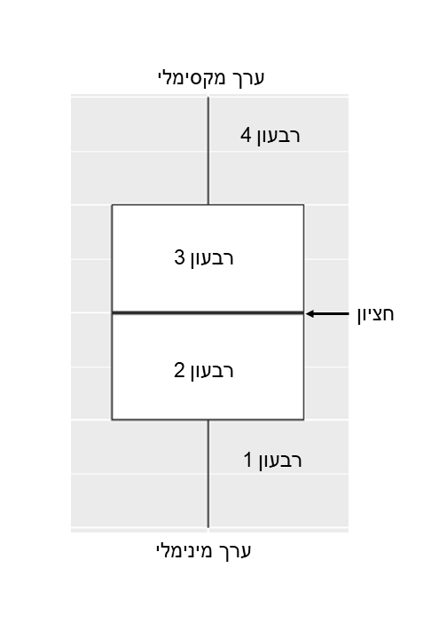
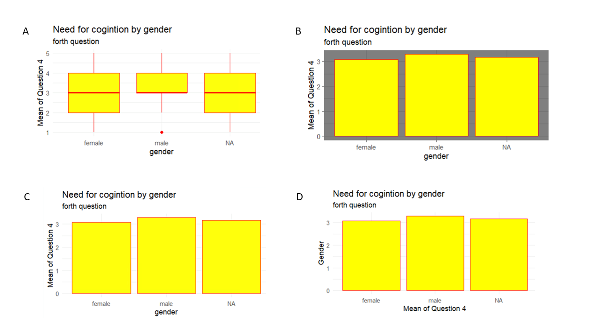
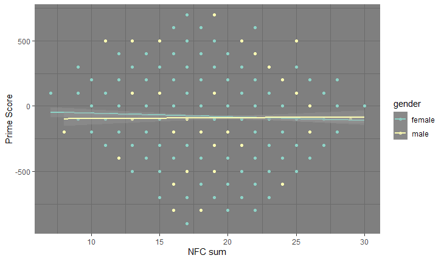
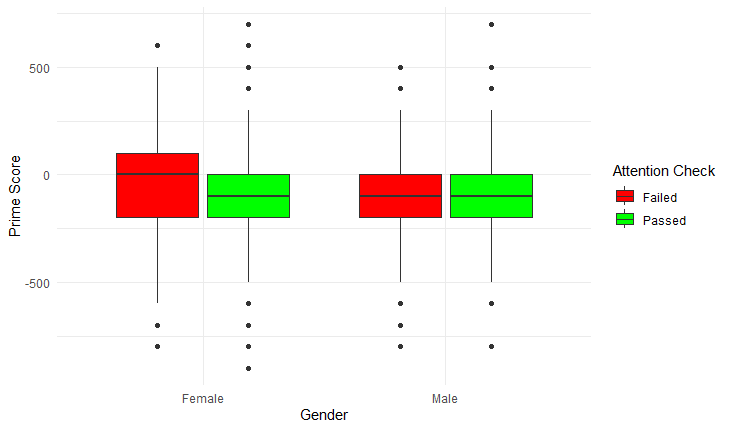

```{=html}
<style>
h1, h2, h3, h4, h5, h6 {
  direction: rtl;
}
p {
  direction: rtl;
}

.text-block1 {
  direction: rtl;       /* Set text direction to right-to-left */
  text-align: right;
  background-color: #e7f3fe; /* Light grey background */
  padding: 10px;
  border-radius: 5px;
  border: 1px solid #ddd; /* Light border */
  margin: 10px 0; /* Space around the block */
}
  

</style>


```


<!-- tutorial options and checking options - TODO set params -->
```{r setup, include=FALSE}
library(learnr)
library(gradethis)
library(ggplot2)
library(Rcourse)
library(dplyr)
library(ggcheck)

need_for_cognition = need_for_cognition %>%
  mutate(nfc_02 = 6 - nfc_02r,  # נהפוך את הקידוד של שלושת העמודות ההפוכות
         nfc_03 = 6 - nfc_03r,
         nfc_06 = 6 - nfc_06r,
         )
need_for_cognition = need_for_cognition %>% select(-nfc_02r, -nfc_03r, -nfc_06r)

##### פונקציה לבדיקה
exercises_df <- data.frame(
  exercises = c("Hist_bins_q", "box_plot_q", "outlier_q", "design_question", "final_ex1_q", "final_ex2_q", "submit_final", "adv_col_ex", "hist_ex", "bar_ex", "smooth_ex", "col_size_scatter_ex", "lim_ex", "basic_col_ex"
  ),
  hebrew = c(
    "שאלת היסטוגרמה",
    "שאלת איור קופסה",
    "שאלת תצפיות קיצוניות",
    "שאלת עיצוב",
    "שאלה תרגיל מסכם 1", 
    " שאלה תרגיל מסכם 2", 
    "הגשת קוד תרגיל מסכם",
    "תרגיל צבע מתקדם", 
    "תרגיל היסטוגרמה", 
    "תרגיל גרף עמודות", 
    "תרגיל קו לינארי", 
    "תרגיל גרף עם שלושה משתנים", 
    "תרגיל גבולות הצירים", 
    "תרגיל צבע בסיסי"
  )
)


check_hash_code   = function(hash){
    exercises = exercises_df$exercises
    response_table = learnrhash::decode_obj(hash)
    if (length(response_table)==0){return("Invalid hash code")}
    correct = response_table %>% filter(label %in% exercises, correct) %>% pull(label)
    incorrect = setdiff(exercises, correct)
    if (length(incorrect) == 0){return("Great work! Hash code is valid")}
    else{
      hebrew = exercises_df  %>% filter(exercises %in% incorrect) %>%pull(hebrew)
      print("The following exercises are missing or incorrect:")
      print(hebrew)
    }

} 

knitr::opts_chunk$set(error = TRUE)
gradethis::gradethis_setup()
```


## הצגה גרפית - מבוא

כאשר ננתח נתונים נוכל להסיק מסקנות מהניתוח הסטטיסטי, אבל כפי שלמדתם ותלמדו עוד בשיעור סטטיסטיקה, המבחנים הסטטיסטיים תמיד נתונים להטיות שונות ולכן בפני עצמם לא יוכלו לתת לנו תמונה מלאה של הנתונים שעבדנו איתם. לכן, במחקר בפסיכולוגיה נהוג להשתמש בהצגה גרפית, גם של התוצאות הסופיות במאמר מדעי וגם כדי להבהיר לעצמינו שאנחנו בדרך הנכונה, בהמון שלבים בדרך. היום נלמד איך לייצר תצוגה גרפית של נתונים בR באמצעות חבילה שנקראת ggplot2.

### מאפייני הגרף

לפני שנלמד להכיר את החבילה הזאת לעומק, יש אופציה פשוטה יותר שמגיעה יחד עם הפונקציות הבסיסיות של R. למשל הפונקציה _plot_.  בדוגמה למטה נגדיר נתונים פשוטים לדוגמה ונלמד על מאפייני הגרף. 
הגרפים הפשוטים ביותר לרוב כוללים שני מימדים, מימד (מעתה נקרא לו ציר אופקי x) ומימד אנכי (מעתה נקרא לו ציר y).  
כלומר, על מנת לייצר גרף נזדקק ברוב המקרים לשני וקטורים לפחות. בשיעור זה לא נלמד איך לייצר גרפים יותר מורכבים משני מימדים (כלומר לא נלמד על גרפים בתלת מימד, למרות בהם בהחלט אפשרות).   
אך אל דאגה, לא נהיה מוגבלים לשני משתנים בלבד בכל גרף. לכן בהמשך גם נלמד איך להוסיף עוד מידע מבלי להגדיל את כמות הצירים.

```{r}
# נגדיר נתונים לדוגמה
x <- c(1, 2, 3, 4, 5)
y <- c(5, 4, 3, 2, 1)
# נשתמש בפונקציה כדי ליצור איור
plot(x, y)
```

הפונקציה plot() מייצרת גרף שנקרא גרף פיזור, נלמד עליו עוד בהמשך. הגרף ממש מציג לנו את הנתונים הגולמיים, כל נקודה מייצגת תצפית בודדת ואת הערך שלה במשתנה x וy. למשל, התצפית הראשונה היא קיבלה ערך של 1 בx וערך של 5 בy וכן הלאה. 


אתם בטח שואלים את עצמכם איך בוחרים משתנה לצירX ולציר Y?  
התשובה היא שנהוג לשים את המשתנה המרכזי שעליו מבוססות השערות המחקר (לרוב נקרא המשתנה התלוי) בציר Y. 
את המשתנה עליו מבוססת המניפולציה המחקרית נגוד לשים בציר X.   
בשיעור סטטיסטיקה תלמדו עוד על המונחים הללו, אבל לטובת השיעור שלנו נגדיר שהתוצא של המשתתפים בשאלון היא המשתנה התלוי בנתונים שנעבוד איתם היום. 

## ggplot2

חבילה זאת היא החבילה הנפוצה ביותר להצגה גרפית בR והיא עובדת בשיטה שנקראית ״Grammar of Graphics״. כלומר, החבילה הזאת מייצרת עבורינו ״שפה״ המתאימה לעבודה עם יצוגים חזותיים של נתונים. כדי לעבוד עם חבילה זאת בסביבה שלכם בR תצטרכו להתקין אותה, לאחר ההתקנה בכל פעם שתרצו להשתמש במה שהיא מציעה תצטרכו לטעון אותה באמצעות הפקודה _library(ggplot2)_. כמו כן, חבילה זאת מתאימה לעבודה עם טבלאות (dataframe) ולא עם וקטורים בודדים כמו שראינו בדוגמה למעלה (אבל אתם כבר יודעים איך לייצר טבלאות מוקטורים ולכן זאת לא תהיה בעיה).   
חבילה זאת עובדת באמצעות ״שכבות״ של קוד שבונות לנו את הגרף.

לטובת השיעור נשתמש בנתונים שהכרנו בשיעור הקודם need for cognition. בשיעור זה הנתונים יהיו קיימים מבלי שתעשו דבר, אך אם תרצו לעבוד עם הנתונים בסביבה שלכם תצטרכו לטעון אותם. כמו כן, השאלות ההפוכות תוקנו ולכן אפשר להתייחס לשאלון כמכיל פריטים חיוביים בלבד.


### שכבה ראשונה - הגדרת הצירים
השכבה הראשונה בסינטקס של `ggplot` היא למעשה שקופה, בה נגדיר בעיקר את טבלת הנתונים איתה נעבוד ואת העמודות שיהיו רלוונטיות לצירים השונים. את שם הטבלה נכניס ראשונה ואחריה נגדיר את הצירים על ידי שימוש בביטוי `aes` (שם קוד למילה ציר באנגלית - axis).  
הגדרת הצירים נעשית לפי התבנית:    
ggplot(name_of_df, aes(x=name_of_x_col, y=name_of_y_col)  

ננסה לשחזר את האיור שפתחנו את השיעור איתו. שימו לב שדרוש פה מעבר לנתונים בצורת טבלה
```{r}
# הנתונים
v1 = c(1, 2, 3, 4, 4)
v2 = c(5, 4, 3, 2, 1)
# איסוף של הנתונים לטבלה
data_frame = data.frame(variable_1=v1, variable_2=v2)
# הגדרת הצירים
ggplot(data_frame, aes(x=variable_1, y=variable_2))
```

אפשר לראות שנפתח איור, אך לא מופיע בו שום דבר, זאת כיוון שההגדרת ההצגה של נתונים עצמם תגיע בשכבות הבאות.


### שכבה שניה - הגדרת סוג האיור
כמו שכבר הבנתם, בשיעור נכסה כמה סוגי גרפים. כלומר אפשר להציג את אותם נתונים בכמה דרכים שונות ובשכבה השניה נדרש לפרט איזה סוג של גרף נרצה לייצר. את זה נעשה באמצעות פונקציות מקבוצת הפונקציות `geom()`.  


קודם כל נכיר את הפונקציה `geom_point()`, פונקציה שתוסיף לנו את הנקודות ותיצור לנו גרף פיזור כמו שראינו עם הפונקציה הבסיסית קודם לכן. יש בעצם לחבר את השכבות באמצעות הסימן `+` כפי שמודגם בקוד למטה.

```{r}
v1 = c(1, 2, 3, 4, 4)
v2 = c(5, 4, 3, 2, 1)
data_frame = data.frame(variable_1=v1, variable_2=v2)

ggplot(data_frame, aes(x=variable_1, y=variable_2))+ 
  geom_point()
```

עכשיו שהבנו את העקרונות הבסיסיים של השפה הגרפית נוכל לצלול לעומק הנושא של ייצוגים גרפים. עכשיו נעבור לעבודה עם הנתונים האמיתיים, כעת נלמד להכיר סוגים שונים של גרפים ובעיקר איזה גרף מתאים לאיזה נתונים

### היסטורגרמה

נתחיל בגרף שמייצג נתונים של משתנה אחד רציף - `ההיסטוגרמה` או _דיאגרמת שכיחות_
היסטוגרמה היא איור יוצא דופן מהבחינה שהוא האיור היחיד שנלמד עליך שניתן לאייר עם משתנה אחד. אך הוא עדיין מורכב משני צירים: ציר שמתאר את ערכי המשתנה המשתנה (X) וציר שמתאר את השכיחות של כל ערך (Y).  
הפונקציה המייצרת איור זה נקראית `geom_histogram()`
נתחיל עם דוגמה פשוטה. בשיעורים הקודמים למדנו להכיר את הנתונים שלנו. נתחיל מלאייר את השכיחות של התשובות לשאלה הראשונה (nfc01).

```{r}
head(need_for_cognition)
# נתחיל בהגדרת השכבה הראשונה עם משתנה בודד ונוסיף את השכבה השניה באמצעות +
ggplot(need_for_cognition, aes(x=nfc_01)) + geom_histogram()


```

אז קיבלנו פה איור ושתי אזהרות.  
האיור מציג לנו על ציר X את כל התשובות האפשריות על שאלה 1 - ערכים בין 1 ל5. בציר Y אנחנו רואים את השכיחות של כל תשובה. למשל אפשר לראות שהתשובות 1 ו5 היו הכי פחות שכיחות והתקבלו כל אחת פחות מ200 פעמים. לעומת זאת התשובה 3 הייתה הכי שכיחה והתקבלה יותר מ750 פעמים.  

עכשיו בואו ננסה להבין את ההזהרות שקיבלנו.   
נתחיל מההזהרה השניה, היא מודיעה לנו שכל הערכים ה"לא סופיים" מוסרים מן הגרף. הכוונה היא בעצם לכל ערך שאיננו מספר וניתן לפירוש על ידי הפונקציה. בנתונים שלנו קיימים ערכים חסרים והם הערכים שאינם מוצגים. כדי להימנע מההזהרה היינו יכולים להסיר אותם לפני האיור (כפי שלמדתם בשיעור הקודם), אבל התוצאה הגרפית תהיה זהה.  

ההזהרה הראשונה מתייחסת לאגומנט שניתן להכניס לפונקציה geom_histogram, בשם bins. הכוונה בbins היא מספר העמודות שמוצגות בהיסטוגרמה והפונקציה מכילה בתוכה ברירת מחדל של 30. כלומר, היא הייתה רוצה להציג 30 עמודות. אבל! יש לנו רק 5 ערכים שהשאלה הייתה יכולה לקבל ולכן היא מעלה שייתכן והתצוגה לא מיטבית. אנחנו יכולים לתקן זאת בקלות על ידי הכנסה של אחד משני ארגומנטים:

`bins` - כמות העמודות שיכללו בהיסטוגרמה   
`binwidth` - רוחב העמודות (בכמות ערכים), כלומר אם נכניס ערך של 1 כל עמודה תשקף ערך 1. בתיבת הקוד מטה תוכלו לנסות אפשרויות שונות וראו כיצד הן משפיעות על התצוגה של הגרף. 
הוסיפו פעם אחת את bins ובדקו טווח רחב של ערכים עבורו. מה קורה אם הוא נמוך מאוד? מה קורה אם גבוה מאוד?  
לאחר מכן בדקו את binwidth בנפרד באותו אופן.  

```{r pass_hist_ex, exercise=TRUE, exercise.eval = FALSE}
ggplot(need_for_cognition, aes(x=nfc_01)) + geom_histogram()

```

אז נדגיש שבחירת הארגומנטים חשובה, ויכולה לשנות את המסקנות שנסיק מהנתונים. אבל לרוב אין בעיה לעשות זאת גם אם בחרנו את הפרמטרים הלא אופטימליים. כעת ננסה להגיע להיסטוגרמה מושלמת.
בעיקרון בהיסטוגרמות העמודות אמורות להיות צמודות ללא רווחים.  
```{r hist_bins_q, echo = FALSE}
question(" איזה ערכים מביאים אותנו למצב בו ההיסטוגרמה רציפה ללא רווחים בין העמודות?",
         answer("bins=5 או binwidth=1", correct = TRUE),
         answer("bins=1 או binwidth=5", message = " כמעט, אבל הפוך, רוחב כל עמודה אמור להיות "),
         answer("bins=5 או binwidth=5", message = "מספר העמודות אכן צריך להיות 5, כמספר התשובות והאמנם גם עם האופציה הזאת נקבל גרף רציף אבל העמודות יתמזגו כיוון שהרוחב של כל עמודה גדול מ1."),
         answer("bins=1 או binwidth=1", message = "רוחב כל עמודה אכן צריך להיות 1, כמו ההפרש בין התשובות השונות אבל הגדרה של מספר העמודות של 1 תביא להצגה של עמודה אחת בלבד "),
         allow_retry = TRUE
)
```

`תרגיל`  
צרו עמודה חדשה שתיקרא nfc_sum.  
בעמודה זאת יאוכסן סכום הציונים של כל נבדק בשאלון.  
הציגו את ההיסטוגמה של העמודה שיצרתם. הגדירו את רוחב העמודות כך שכל עמודה תקבל רוחב של 1.
```{r hist_ex, exercise=TRUE, exercise.eval = FALSE}
# חשבו כאן את הסכום

# צרו כאן את האיור
# רמז - שימו לב לעמודות

```

```{r hist_ex-solution}
need_for_cognition <- need_for_cognition %>% mutate(nfc_sum  = (nfc_01 + nfc_02 + nfc_03 + nfc_04 + nfc_05 + nfc_06))
ggplot(need_for_cognition, aes(x=nfc_sum)) + geom_histogram(binwidth=1)
```

```{r hist_ex-check}
grade_this({
  if (all(ggcheck::uses_mappings(p = .result,aes(x=nfc_sum)))){
    pass("כל הכבוד! האיור שלך מדויק")
  }
  fail("הגרף עוד לא מדויק, שימו לב להגדרת הצירים")
})

#grade_this_code(correct = "כל הכבוד!", incorrect = "האיור עוד לא נכון לגמרי, שימו לב לרוחב העמודות ושכבות האיור.")
```

## גרף עמודות
גרף עמודות (או _bar graph_) היא כנראה דוגמה קלאסית ופשוטה למה שעולה לכם כשאתם חושבים על גרף.  
איור עמודות יכול להיות דרך נוספת לייצר היסטוגרמה אך למשתנים שאינם רציפים. כדי לייצר איור כזה נשתמש בפונקציה `geom_col`.

זאת בעצם הדרך הפשוטה ביותר לייצג שני משתנים שאחד מהם הוא בסולם שמי והשני הוא בסולם סדר ומעלה (כלומר מספרי). אפשר גם כאן לייצג מה שנרצה, אך בדוגמאות אנחנו נתרכז בהצגת ממוצעים. לאחר שנחשב את הממוצע, נצטרך לפרט בעת הגדרת הצירים גם את ציר X וגם את Y.  

למשל נוכל לשאול האם יש הבדלים מגדריים במענה על השאלות? נתחיל את הבירור משאלה 1. בואו נבנה את הגרף יחד.

```{r}
# קודם נחשב סיכום של הממוצעים
gender_ave <- need_for_cognition %>% group_by(gender) %>% summarise(mean_nfc_01=mean(nfc_01, na.rm=TRUE)) 
# שימו לב שדרושה הסרה של ערכים חסרים בשאלונים
ggplot(data=gender_ave, aes(x=gender, y=mean_nfc_01)) + geom_col()


```
קיבלנו גרף עם הבדלים קטנים בין שלושת קבוצות המגדר

מה חסר פה לדעתכם? גרף העמודות בעצם מייצג לנו את הממוצע של תשובות השאלון בתוך כל מגדר, כלומר יש לנו הערכה של הממוצע. אבל כדי שנוכל ממש לקבל אומדן של ההבדלים כדאי להוסיף גם מדד של פיזור הנתונים. לרוב משתמשים בסטיית התקן, שכן היא אומדת את הפיזור ביחידות המקוריות. כדי להוסיף את אומדן זה לגרף נהוג להשתמש בקוי סטיה או _error bars_. את ההוספה הזאת נוכל לעשות באמצעות הוספה של שכבה שלישית עם הפונקציה `geom_errorbar`.  
נכניס לפונקציה זאת שני ארגומנטים:  
1. aes - צירים, אבל הפעם הצירים קצת שונים. הם לא מגדירים את המשתנים שיהוו את ציר X וY. 
הפעם הצירים מגדירים את הערך המינימלי והמקסימלי של קווי השגיאה. הערכים הללו צריכים להיות סביב המדד המרכזי (הממוצע) עם חיסור וחיבור של סטיית תקן אחת בהתאם. אפשר כמובן להציג כל מדד מרכזי עם אומדנים שונים לפיזור.   
2.width - רוחב התוסף. אם לא נגדיר לו רוחב הוא יהיה ברוחב הגרף כולו וזה פחות אסתטי ולכן נוסיף.

נחזור על אותה דוגמה:
```{r}
# נחשב את הממוצע וסטיית התקן לכל קבוצת מגדר
gender_ave <- need_for_cognition %>% group_by(gender) %>% summarise(mean_nfc_01=mean(nfc_01, na.rm=TRUE), sd_nfc_01=sd(nfc_01, na.rm=TRUE))

# נאייר את הגרף
ggplot(data=gender_ave, aes(x=gender, y=mean_nfc_01)) + 
  geom_col() +
  # נוסיף לגרף את סטיית התקן מתוך מבנה הנתונים
geom_errorbar(aes(ymin=mean_nfc_01-sd_nfc_01, ymax=mean_nfc_01+sd_nfc_01), width=.2)

```

עכשיו אנחנו יכולים לראות שהפיזור גדול מההבדלים בין הקבוצות. אנחנו לא נעסוק בהסקה סטטיסטית בשיעור זה, אבל כדי שתוכלו לקבל טעימה מאיך נשתמש בהצגה גרפית בליווי מסקנות סטטיסטית, אפשר להגיד שבהינתן פיזור שגדול מהבדלי הממוצעים הסבירות שיש הבדלים משמעותיים תלויי מגדר בתשובות לשאלה הראשונה נמוכה מאוד.

`תרגיל`  
צרו גרף עמודות עם סטיית תקן המציג את הציון החציוני של שאלה 5 לפי תוצאות בדיקת הקשב בשאלון. כלומר השוו בין החציונים של מי שעבר את בדיקת הקשב (1) ומי שלא (0).   
בונוס: שנו את התוויות של משתנה הקשב

```{r bar_ex, exercise=TRUE, exercise.eval = FALSE}
# יצירת טבלה חדשה עם החציונים
attention_ave <- need_for_cognition %>% 
group_by(_________) %>% 
summarise(med_nfc_05=________, sd_nfc_05=__________)

# בונוס!
# רמז - בדיקת הקשב הוא משתנה שאפשר להגדיר כפקטור
# רמז 2 - levels
  
# צרו כאן את האיור


```

```{r bar_ex-solution}
# יצירת טבלה חדשה עם החציונים
attention_ave <- need_for_cognition %>% 
group_by(attention_check) %>% 
summarise(med_nfc_05=median(nfc_05, na.rm=TRUE), sd_nfc_05=sd(nfc_05, na.rm=TRUE))


# הבונוס!
attention_ave$attention_check <- as.factor(attention_ave$attention_check)
levels(attention_ave$attention_check) <- c("Fail", "Pass")

 
# צרו כאן את האיור
ggplot(data=attention_ave, aes(x=attention_check, y=med_nfc_05)) + geom_bar(stat="identity") +
geom_errorbar(aes(ymin=med_nfc_05-sd, ymax=med_nfc_05+sd), width=.2)

```

```{r bar_ex-check}
grade_this({
  if (all(ggcheck::uses_mappings(p = .result,aes(x=attention_check, y=med_nfc_05)))){
    pass("מעולה!")
  }
  fail("בדקו את הקוד ונסו שוב...")
})
```

## גרף קופסא
נתקדם עכשיו צעד אחד קדימה מעבר להצגה של ממוצעים וסטיות תקן בלבד אל הצגה מלאה יותר של הסטטיסטיקה התיאורית. גרף קופסא או _box plot_ מאפשר לנו להציג מספר רב של מאפיינים בגרף אחד.   
גרף זה גם כן מציג לנו עמודות המחולקות לפי משתנה (לרוב שמי) של משתנה נוסף שהוא מספרי. אבל הפעם עם הרבה יותר מידע.
נתחיל עם להציג גרף כזה באמצעות הפונקציה `geom_boxplot` ואז נלמד את פירושו. נחזור לדוגמה שראינו קודם, בה איירנו את התוצאות של שאלה 1 לפי מגדר.

```{r}
ggplot(data=need_for_cognition, aes(x=gender, y=nfc_01)) + geom_boxplot()

```

כמו ששמתם כל עמודה מורכבת מריבוע שחצוי באמצע ושני זנבות. הקצה של כל זנב מסמן את הערך המינילי (למטה) והמקסימלי (למעלה). גבולות הקופסא מראות לנו את החלוקה לרבעונים. החלק התחתון של הקופסא הוא הטווח של הרבעון השני, כלומר הזנב התחתון כולו הוא הרבעון הראשון. בהתאם הריבוע העליון מייצג את הטווח של הרבעון השלישי והזנב העליון את הרביעי. הקו המודגש באמצע מייצג אם כך את החציון.
ואם אתם מעדיפים תמונה:  
 
{width="250"} 

```{r box_plot_q, echo = FALSE}
question("מה אנחנו יכולים ללמוד מהגרף הקודם על תיאור הנתונים של מי שהחליטו לא לציין את מגדרם?",
         answer("הטווח המקסימלי של משתתפים אלה נמוך יותר ", message="זה נכון, נראה שלא היו משתתפים בקבוצה זאת שדרגו 5, אבל יש תשובה יותר מתאימה"),
         answer("החציון הוא גם הערך המקסימלי של הרבעון השלישי", message = " זה נכון שהגרף מראה לנו שבנתונים אלה אין הפרדה בין הרבעון השלישי והשני (בגלל מיעוט הערכים הייחודיים שקיימים בנתונים), אבל יש תשובה יותר נכונה. "),
         answer("החציון של קבוצה זאת שווה לחציון של שתי הקבוצות האחרות", message = "זה נכון, הערך החציוני הוא 3 בכל הקבוצות, אבל יש תשובה יותר נכונה."),
         answer("כל התשובות נכונות", correct = TRUE),
         allow_retry = TRUE
)
```

אז הצלחתם להבין מה מבחינה תיאורית מבחין בין הגרף של אנשים שלא פרטו את מגדרם לאלה שכן. אבל איזה מסקנה נוכל להסיק?  
הגרף בעיקר מדגים לנו שיש טווח נמוך יותר של ערכים אצל אלה שלא ציינו את מגדרם. זה יכול לעלות לנו שאלה לגבי איך בדיוק נראים נתוניהם.   
נמשיך לגרף הבא שיכול לתת לנו תמונה קצת יותר מדויקת.

## גרף פיזור
עכשיו נחזור לאיור ממנו התחלנו, אשר מתאר את הקשר בין שני משתנים מספריים.  
למדנו כבר לייצר גרף כזה, אך עכשיו אנחנו נלמד איך להוסיף עליו.  
כבר ראינו דוגמה בה נדרשנו להוסיף גם שכבה שלישית לאיור, והאיורים ממש לא מוגבלים ל3 שכבות.  
למטרה זאת יכול להיות שימושי לאכסן את האובייקט רב השכבות של ggplot במשתנה. אכסון של אובייקט הגרף במשתנה יאפשר לנו גמישות, כך שנוכל להוסיף למאפיינים של גרף שכבות נוספות ולבצע עריכות שונות על הגרף. למשל נגדיר גרף שנקרא scatter_plot, אשר יתאר את הקשר שבין סכום כל שאלות המחקר לגיל המשתתפים:

```{r}
# נחשב את הסכום של כל השאלות
# ראיתם קודם דוגמה אחרת בתרגיל ההסטוגרמה
# קודם כל נבודד רק רת משתני השאלון
nfc_only = select(need_for_cognition, contains("nfc"))

# עכשיו נראה דוגמה לחישוב סכום באמצעות פונקציה ייעודית
# ונוסיף את העמודה בחזרה לדאטה המקורי
need_for_cognition$nfc_sum <- rowSums(nfc_only, na.rm = TRUE)

# נגדיר את האיור במשתנה
scatter_plot <- ggplot(need_for_cognition, aes(x=age, y=nfc_sum))+ geom_point()

# כדי להציג את הגרף נצטרך לקרוא למשתנה
scatter_plot
```

### ערכים קיצוניים
נתבונן באיור הקודם.  
יכול להיות שיש לנו כאן בעיה? גם אתם שמתם לב?
רוב הגילאים המדגם הם בין 20-50 אבל יש שני משתתפים שהגילאים שלהן לא הגיוניים. 
הערך הבולט ביותר הוא המשתתף הבודד שהכניס שהגיל שלו הוא 150. כלומר, או שדרקולה הסתנן לנו למחקר או שיש לנו במחקר ערך קיצוני טעותי.  
הערך הפחות בולט אך לא פחות בלתי אפשרי הוא משתתף שהגיל שלו הוא פחות מ0.   
והנה התצוגה הגרפית הצילה אותנו שוב. יש פה בבירור שני משתתפים לפחות שלא הבינו או לא רצו לשתף פעולה עם המחקר. 
בואו נסיר את הערכים הקיצוניים ונציג שוב:

```{r}
# הסרת ערכים קיצוניים
need_for_cognition <- filter(need_for_cognition, age<90 & age>10)

# נגדיר את האיור במשתנה
scatter_plot <- ggplot(need_for_cognition, aes(x=age, y=nfc_sum))+ geom_point()

# כדי להציג את הגרף נצטרך לקרוא למשתנה
scatter_plot
```
אוקיי הרבה יותר טוב.
אבל מה עם הערכים הקיצוניים של סכום השאלות?

```{r outlier_q, echo = FALSE}
question("איזה משורות הקוד הבאות יעזרו לנו לסנן ערכים קיצוניים של סכום השאלות?",
         answer("filter(need_for_cognition, nfc_sum>=6 & nfc_sum<=30)", correct = TRUE, message = "נכון! בשאלון 6 שאלות וטווח התשובות הוא בין 1-5. כלומר הציון המינימלי שאפשר לקבל בשאלון הוא 6 והמקסימלי הוא 30. אפשר ללמוד מהנתונים שאין באמת חריגות כלפי מעלה, אבל עדיין תמיד עדיף לחשוב על כל התרחישים."),
         answer(" filter(need_for_cognition, nfc_sum>0 & nfc_sum<30)", message =
                  "כמעט, אבל חשוב לדייק. הציון 0 אכן לא אפשרי עבור סכום השאלות. אבל כך גם כל הציונים שקטנים מ6. גם אם המשתתף ענה 1 על כל השאלות הסכום עדיין יהיה לפחות 6 (כמספר השאלות). כמו כן הגבול העליון מאוד בכיוון, אך ספציפית הערך 30 כן אפשרי (אם מישהו ענה 5 על כל השאלות)  "
                ),
         answer(" filter(need_for_cognition, nfc_sum>0 & nfc_sum<5).", message =  "לא נכון, שימו לב כי נשאלתם על סכום השאלות. הציון 0 אכן לא אפשרי עבור שאלה בודדת. עבור סכום השאלות הוא כמובן לא אפשרי, אבל כך גם כל הציונים שקטנים מ6. גם אם המשתתף ענה 1 על כל השאלות הסכום עדיין יהיה לפחות 6. הגבול העליון פה מתאים לשאלה בודדת ולא לסכום.  "),
         answer("filter(need_for_cognition, nfc_sum>5 & nfc_sum<=25)", message = "יכול להיות שחשבתם שיש רק 5 שאלות במדגם? יש 6, חשבו מחדש."),
         allow_retry = TRUE
)
```


## מגמות לינאריות
במקרה של גרף פיזור, אחד השימושים הנפוצים יותר הם הצגות של מגמות לינאריות. אולי כבר נחשפתם למושגים כמו רגרסיה לינארית וקורלציה על שם פירסון, או מתאם בין שני משתנים.  
תזכורת - מדובר במדדים לקשר הלינארי בין שני משתנים או יותר המשמעות של המונח לינארי, היא קשר בין שני המשתנים שניתן לייצג על ידי קו ישר. הפונקציה שמחשבת ומוסיפה את הקו הישר שמתאר את הקשר נקראת `geom_smooth()`, שכן היא מייצגת קוים חלקים, אך במקרה זה נצטרך לפרט לה איזה קו שמתאר את הנתונים נרצה להוסיף, כלומר לפרט את השיטה בה יותאם הגרף. עבור קו ישר נבחר בlm שהוא קיצור של linear model. להלן דוגמה:

```{r}
scatter_plot <- ggplot(need_for_cognition, aes(x=age, y=nfc_sum)) + geom_point() 

# כדי להציג את הגרף נצטרך לקרוא למשתנה
scatter_plot + geom_smooth(method="lm")

# אפשר היה גם ככה כמובן
ggplot(need_for_cognition, aes(x=age, y=nfc_sum)) + geom_point() + geom_smooth(method="lm")
```

שימו לב! את השיטה יש להכניס כמחרוזת, כך הפונקציה יכולה לפרש אותה. ארגומנט חשוב נוסף שכדאי להכיר הוא se, הכוונה בse היא בעצם אומדן לסטיית התקן מהקו. אם נגדיר FALSE, יופיע קו ללא סטיית תקן.  

`תרגיל`  
ייצרו את אותו הגרף שראיתם בדוגמה ללא סטיית התקן והציגו אותו. 

```{r smooth_ex, exercise=TRUE, exercise.eval = FALSE}
# נתחיל מאותה נקודת פתיחה
need_for_cognition <- need_for_cognition %>% mutate(nfc_sum  = (nfc_01 + nfc_02 + nfc_03 + nfc_04 + nfc_05 + nfc_06))
need_for_cognition <- filter(need_for_cognition, age<90 & age>10)
need_for_cognition <- filter(need_for_cognition, nfc_sum>0)

# צרו את הגרף כאן

```

```{r smooth_ex-solution}
# נתחיל מאותה נקודת פתיחה
need_for_cognition <- need_for_cognition %>% mutate(nfc_sum  = (nfc_01 + nfc_02 + nfc_03 + nfc_04 + nfc_05 + nfc_06))
need_for_cognition <- filter(need_for_cognition, age<90 & age>10)
need_for_cognition <- filter(need_for_cognition, nfc_sum>0)

# צרו את הגרף כאן

scatter_plot <- ggplot(need_for_cognition, aes(x=age, y=nfc_sum)) + geom_point() + geom_smooth(method="lm", se=FALSE)

scatter_plot

```

```{r smooth_ex-check}
grade_this({
  if (all(ggcheck::uses_geom_param(p = .result,geom ="smooth",list(se=F,method="lm")))){
    pass("מעולה")
  }
  fail("זאת לא התשובה הנכונה.. נסו שוב!")
})

```

## גרפים של שלושה משתנים
אז כמו שהבנתם בהדרכה זאת נישאר מוגבלים לשני צירים, אבל זה לא יגביל אותנו מלהציג יותר מ2 משתנים. ניתן להוסיף משתנה שלישי שיתבטא בצבע. כדי לבצע זאת נוסיף להגדרת הצירים (על ידי הפונקציה aes) את הארגומנט col, בה נכניס את השם של הטור שנרצה שיבטא הצבע. זה יכול להיות משנתה מסוג פקטור, כמו בדוגמה למטה:
```{r}
scatter_plot <- ggplot(need_for_cognition, aes(x=age, y=nfc_sum, col=gender)) + geom_point()
# עכשיו נוכל להציג את הגרף עם כמה הצבעים,    
scatter_plot
# וגם עם שתי מגמות לינאריות
scatter_plot + geom_smooth(method="lm")
```
  

שימו לב! התוכנה מייצרת לנו אוטומטית מקרא, שמסביר לנו איזה צבע מייצג איזה קטגוריה. המקרא הזה נקרא באנגלית legend.

עכשיו ברור לכם למה קיבלנו טווח כל כך קטן של אלה שלא דיווחו על מגדרם? יש ממש מעט כאלה. כנראה שאלה גם סוג של ערכים קיצוניים שעדיף היה להסיר מהניתוחים.

מה יקרה אם נרצה לחלק את הצבעים עם משתנה רציף?
בואו נראה אם יש הבדל במגמה הלינארית של גיל וסכום לפי התשובה הראשונה.

```{r}
scatter_plot <- ggplot(need_for_cognition, aes(x=age, y=nfc_sum, col=nfc_01)) + geom_point()

# וגם עם  מגמה לינאריות
scatter_plot + geom_smooth(method="lm")
```

שמתם לב שכאן המקרא רציף?  
כלומר, כיוון שהתשובות לשאלה הראשונה מוגדרות כמספר רציף התוכנה מציגה לנו את המשתנה הזה כרצף של צבעים.  
כמו כן המגמה הלינארית במקרה זה לא מופרדת לרמות השונות. 

אם היינו רוצים לקבל קטגוריה לכל תשובה אפשרית לשאלה 1, משתנה הצבע צריך להיות פקטור ולא מספרי.
  
למה דווקא צבע?
לא חייבים להשתמש בצבע, אפשר גם להשתמש בגודל (size) או בצורה של העיגולים (shape) או גם וגם. פוטנציאלית אפשר להציג כך אפילו יותר משלושה משתנים.
כלומר בעת הגדרת הצירים ניתן להגדיר גם משתנה לצבע, לצורה ולגודל.

`תרגיל`  
הציגו את הגרף פיזור של גיל וסכום השאלות בו הצבע מסמן את המגדר של המשתתפים (הקפידו להסיר את התצפיות שחסרה להם תשובה לגבי שאלת המגדר) וגודל מסמל את התשובה לשאלה הראשונה.

```{r col_size_scatter_ex, exercise=TRUE, exercise.eval = FALSE}
# נתחיל מאותה נקודת פתיחה
need_for_cognition <- need_for_cognition %>% mutate(nfc_sum  = (nfc_01 + nfc_02 + nfc_03 + nfc_04 + nfc_05 + nfc_06))
need_for_cognition <- filter(need_for_cognition, age<90 & age>10)
need_for_cognition <- filter(need_for_cognition, nfc_sum>0)
# בצעו עריכה כאן

# צרו את הגרף כאן

```

```{r col_size_scatter_ex-solution}
# נתחיל מאותה נקודת פתיחה
need_for_cognition <- need_for_cognition %>% mutate(nfc_sum  = (nfc_01 + nfc_02 + nfc_03 + nfc_04 + nfc_05 + nfc_06))
need_for_cognition <- filter(need_for_cognition, age<90 & age>10)
need_for_cognition <- filter(need_for_cognition, nfc_sum>0)
# בצעו עריכה כאן
need_for_cognition <- filter(need_for_cognition, !is.na(gender))
# צרו את הגרף כאן
scatter_plot <- ggplot(need_for_cognition, aes(x=age, y=nfc_sum, col=gender, size =nfc_01)) + geom_point()
# עכשיו נוכל להציג את הגרף עם כמה הצבעים,    
scatter_plot  

```

```{r col_size_scatter_ex-check}
grade_this({
  if (all(ggcheck::uses_mappings(p = .result,aes(x=age,y=nfc_sum,col=gender,size=nfc_01)))){
    pass("נהדר!")
  }
  fail("נסו שוב...")
})
```

## התאמות ותצוגה 
עכשיו הגענו לחלק שבו נוכל להתחיל לשחק עם הנראות של הגרף.  
זה יכול אולי להישמע שולי, אבל התאמת העיצוב יכולה להיות לפעמים מהותית.   
צבע, צורה ומאפיינים שונים של הגרף יכולים להיות מהותיים בתקשורת של תוכן הגרף לצופה. למשל, חשבו כמה יותר נוח לקרוא גרף עם תויות אינפורמטיביות. או למשל כאשר נציג תשובות של זמני תגובה לצבעים שונים, יהיה הרבה יותר מהיר ונוח להבין את הגרף אם צבעי העמודות יתאימו לצבע אליו הגיבו המשתתפים.

### גבולות הגרף
אחת מההתאמות הנפוצות שאולי נרצה לעשות היא התאמה של הגבולות, של מה הערך הכי נמוך ומה הערך הכי גבוהה שיופיע בכל ציר. התוכנה תגדיר את גבולות הגרף אוטומטית. אך למשל אם נרצה להציג משתנה שהינו בעל ערכים חיוביים בלבד והערך המינימלי שתבחר התוכנה להציג יהיה נמוך מ0 נרצה לשנות זאת, שכן אין משמעות לחלק זה בגרף. כדי לשנות את הגבולות נוכל להשתמש בפונקציות:  
`ylim()`  
`xlim()`  
כל אחת מצפה לקבל וקטור שיכיל את הערך המינימלי והמקסימלי לאותו ציר. למשל:
```{r}
scatter_plot <- ggplot(need_for_cognition, aes(x=age, y=nfc_sum)) + geom_point()  + geom_smooth(method="lm")
scatter_plot +xlim(c(0, 35)) + ylim(c(0, 100))
```

שמתם לב למודולריות של ההשמה של הגרף במשתנה? 

יכולנו לשנות את טווח הערכים שהוצגו מבלי לשנות את הנתונים המקוריים. עם זאת, שימו לב, אם תגדירו טווח קטן מידי, כל הנקודות שנמצאות מחוץ לטווח זה לא יוצגו כלל, לכן חשוב לוודא שאנחנו לא מפספסים חלק מהנתונים.

`תרגיל` 
בואו נתמקד בתשובותם של סטודנטים לשאלון. הגבילו את תצוגת הגיל לאנשים שגילם בין 18 ל25. קבעו את הגבול בציר הY כך שהטווח שיוצג הוא בין הציון המינימלי שסכום השאלון יכול לקבל לסכום המקסימלי (רמז- לא זוכרים מהו? חזרו לחלק על תצפיות קיצוניות).  
```{r lim_ex, exercise=TRUE, exercise.eval = FALSE}
need_for_cognition <- need_for_cognition %>% mutate(nfc_sum  = (nfc_01 + nfc_02 + nfc_03 + nfc_04 + nfc_05 + nfc_06))

# איור הגרף הנתון
scatter_plot <- ggplot(need_for_cognition, aes(x=age, y=nfc_sum)) + geom_point()  + geom_smooth(method="lm")
# ערכו את הקוד כאן
scatter_plot + xlim(c(0, 35)) + ylim(c(0, 100))

```

```{r lim_ex-solution}
need_for_cognition <- need_for_cognition %>% mutate(nfc_sum  = (nfc_01 + nfc_02 + nfc_03 + nfc_04 + nfc_05 + nfc_06))
# יצירת הטבלה# איור הגרף הנתון
scatter_plot <- ggplot(need_for_cognition, aes(x=age, y=nfc_sum)) + geom_point()  + geom_smooth(method="lm")
# ערכו את הקוד כאן
scatter_plot + xlim(c(18, 25)) + ylim(c(6, 30))
```

```{r lim_ex-check}

grade_this_code(correct =  "מצויין, בידדתם את ציונם של אנשים בטווח הגילאים הסטודנטיאלי. שימו לב, המניפולציה שביצעתם פה רק מאפשרת לכם לראות את הטווח המבוקש, אך איננה מסננת את הנתונים עצמם."  , incorrect = "נסו שוב, בדקו האם השתמשתם בערכים הנכונים? האם הכנסתם את הטווחים הנכונים לכל ציר?"  
)

```

### צבע וגודל
המשתנים שאתם מנסים להציג הם למשל הצבע של מילה שהוצגה? והייתם רוצים שהנקודות יופיעו בירוק במקום בכחול? האמת היא שכדי לשנות צבע וצורה צריך לבצע שינוי בפונקציה המקורית שמייצרת את הנקודות:
```{r}
scatter_plot <- ggplot(need_for_cognition, aes(x=age, y=nfc_sum)) + geom_point(col="green", size=3)  + geom_smooth(method="lm")

scatter_plot
```

`תרגיל`  
ועכשיו נתרגל. שנו את הקוד מטה כך שצבע הנקודות יהיה אדום, גודלן יהיה 5 וצבע הקו שמציג את המגמה הלינארית יהיה ירוק.   
הגדרת הצבע הקו/נקודות נעשה באופן דומה לכל הפונקציות.   

```{r basic_col_ex, exercise=TRUE, exercise.eval = FALSE}
need_for_cognition <- need_for_cognition %>% mutate(nfc_sum  = (nfc_01 + nfc_02 + nfc_03 + nfc_04 + nfc_05 + nfc_06))
# נתון לכם האיור, ערכו אותו
scatter_plot <- ggplot(need_for_cognition, aes(x=age, y=nfc_sum)) + 
  geom_point(col="green", size=3)  +
  geom_smooth(method="lm")

scatter_plot
```

```{r basic_col_ex-solution}
need_for_cognition <- need_for_cognition %>% mutate(nfc_sum  = (nfc_01 + nfc_02 + nfc_03 + nfc_04 + nfc_05 + nfc_06))
# יצירת הטבלה# איור הגרף הנתון
scatter_plot <- ggplot(need_for_cognition, aes(x=age, y=nfc_sum)) + 
  geom_point(col="red", size=5)  +
  geom_smooth(method="lm", col="green")

scatter_plot


```

```{r basic_col_ex-check}

grade_this_code(correct =  "כל הכבוד! אלה הם הצבעים הנכונים!."  , incorrect = "נסו שוב, שיניתם גם את צבע הנקודות וגם את גודלן? האם שיניתם גם את צבע הקו הלינארי?"  
)

```

הצבעים קצת מכוערים? לא בא לכם להיות מוגבלים רק לצבעי היסוד?  
אל דאגה יש פתרון.  
היכנסו לקישור הבא:
[colors](http://www.cookbook-r.com/Graphs/Colors_(ggplot2)/)

גללו מטה לחלק שמציג את טבלת הצבעים הגדולה (Color Charts).  עכשיו תוכלו לבחור איזה צבע שתרצו מתוך הטבלה.  


`תרגיל`  
אז בחרנו עבורכם צבעי פסטל יפים ושמרנו שני משתנים חדשים, אחד עבור צבע הנקודות והשני עבור צבע הקו. אתם יכולים להשתמש במשתנים שהגדרנו ולהציבם במקום הצבעים. בשיטה זאת ניתן להפוך את צבעי האיור למודולרים ולשנות את צבע האיור מבלי לערוך את הקוד שממש מגדיר את האיור עצמו.  

```{r adv_col_ex, exercise=TRUE, exercise.eval = FALSE}
# הגדרנו שני משתנים
dot_color = "#FF99CC"
line_color = "#CCFFFF"
# האיור
need_for_cognition <- need_for_cognition %>% mutate(nfc_sum  = (nfc_01 + nfc_02 + nfc_03 + nfc_04 + nfc_05 + nfc_06))
# הציבו את המשתנים במקום הנכון
scatter_plot <- ggplot(need_for_cognition, aes(x=age, y=nfc_sum)) +
  geom_point(col="red", size=3) + 
  geom_smooth(method="lm", col="green")

scatter_plot
```

```{r adv_col_ex-solution}

dot_color = "#FF99CC"
line_color = "#CCFFFF"
# האיור
need_for_cognition <- need_for_cognition %>% mutate(nfc_sum  = (nfc_01 + nfc_02 + nfc_03 + nfc_04 + nfc_05 + nfc_06))
# הציבו את המשתנים במקום הנכון
scatter_plot <- ggplot(need_for_cognition, aes(x=age, y=nfc_sum)) +
  geom_point(col=dot_color, size=3) + 
  geom_smooth(method="lm", col=line_color)

scatter_plot

```

```{r adv_col_ex-check}

grade_this_code(correct =  "כל הכבוד! איזה יופי של צבעים!."  , incorrect = "נסו שוב, האם הצבתם את שני המשתנים? האם הצבתם את המשתנה בפונקציה שמתאימה לו?"  
)

```

לא בא לכם לבחור את הצבעים אחד אחד?  
אופציה נוספת היא שימוש ב״פלטות״ מוכנות של צבעים שR הכינה לכם מראש על ידי הוספת הפונקציה  `scale_colour_brewer()` והגדרה של פלטת הצבעים הרצויה.
כשכבה נוספת:

```{r}
scatter_plot <- ggplot(need_for_cognition, aes(x=age, y=nfc_sum, col=gender)) + geom_point()  
# הגרף המקורי
scatter_plot
# הוספת שכבה המפרטת פלטת צבעים
scatter_plot + scale_colour_brewer(palette = "Set1")
```

בשיטה הזאת לא צריך לבחור כל צבע בנפרד אלא אפשר לבחור פלטה מוכנה.

`שימו לב`  
 שבחבילה ggplot2 יש הפרדה בין עריכה של צבע קווי המתאר (אשר רלוונטיים לגרף פיזור) לבין עריכת צבע המילוי.  
חשוב להבין את ההפרדה הזאת כדי שבאמת תוכלו לייצר כל סוג של גרף שתרצו.  

לטובת חידוד ההבדל הזה נעבור לגרף שיש לו גם צבע מילוי, איור קופסה (גם איור עמודות היה מתאים פה).  

 נרצה לצייר גרף מורכב יותר הפעם, גרף בו הצבע ממש מסמל משתנה נוסף, למשל באיור למטה, המתאר את הגיל לכל תשובה בשאלה אצל אלה שעברו את בדיקת הקשב ואלה שלא בנפרד.  
```{r}
# כדי שהאיור יצא באמת קטגוריאלי נצטרך להגדיר את המשתנים הרלוונטיים כפקטורים
# המשתנים שצריכים להיות קטגוריאלים הם משתני הצבע וציר X
need_for_cognition$attention_check = as.factor(need_for_cognition$attention_check)
need_for_cognition$nfc_01 = as.factor(need_for_cognition$nfc_01)

# נוכל גם לערוך כך את התוויות של כל אחת מהרמות, למשל:
levels(need_for_cognition$nfc_01) = c("Very Low", "Low", "Medium", "High", "Very High")

# איור בו קו המתאר מפריד בין הקטגוריות
box_plot1 <- ggplot(need_for_cognition, aes(x=attention_check, y=age, col=nfc_01)) + geom_boxplot() + ylim(c(10, 40))
box_plot1

# אם למשל נרצה לשנות את הצבע לפלטה הדרגתית בגווני כחול
box_plot1 + scale_colour_brewer(palette = "Blues")

# יכול להיות שזה יהיה יותר ברור אם צבע המילוי דווקא יסמן את הרמות השונות
box_plot2 <- ggplot(need_for_cognition, aes(x=attention_check, y=age, fill=nfc_01)) + geom_boxplot() + ylim(c(10, 40))
box_plot2
# נוכל לערוך את הצבעים כך
box_plot2 + scale_fill_manual(values = c("Very Low"= "red", "Low" = "orange", "Medium"="yellow", "High"="green", "Very High"="blue"))

```

בדוגמה למעלה, הפונקציה נתנה צבע לכל קטגוריה אוטומטית. כשרצינו לשנות את הצבעים יכולנו לעשות זאת באמצעות הפונקציה `scale_fill_manual`.  
שימו לב, שפונקציה זאת מיועדת לעריכה של צבע המילוי וכי יש צורך לפרט צבע לכל רמה בנפרד.  


### כותרות ושמות הצירים
פן חשוב נוסף של הצגה גרפית הוא האינפורמטיביות של הגרף. האמנם אנחנו כרגע ציירנו את הגרף ואנחנו יודעים בדיוק מה יש בו, אבל אם נרצה לשלוח את הגרף למרצה לסטטיסטיקה נצטרך שהוא גם יוכל להבין אותו מבלי לקרוא את הקוד שלנו. כמה פונקציות שימושיות בהקשר הזה:  
`ggtitle` - מגדירה את הכותרת הכללית, ניתן להכניס לה ארגומנט נוסף של   subtitle, כלומר תת כותרת שתוצג מתחת לכותרת הראשית.  
`xlab` - כותרת של ציר הx  
`ylab` - כותרת של ציר הy  
 עריכה של הכותרות יכולה להיעשות במרוכז על ידי הפונקציה `labs()` (כלומר קיצור של המילה labels) כמו בקוד מטה 
 
```{r} 
scatter_plot <- ggplot(need_for_cognition, aes(x=age, y=nfc_sum)) + geom_point(col="green", size=3) + geom_smooth(method="lm")

# נוסיף תוית רק לציר אחד בדרך הפשוטה
scatter_plot + xlab("Age (years)")

# עריכה מרוכזת של כל הכותרות
scatter_plot + labs(title="Need for cogintion score by age", subtitle="From class dataset", y="NFC score", x="Age (years)", caption="linear graph")
``` 


### עיצוב 
התוכנה גם מציעה לנו לשנות את העיצוב הכולל של הגרף, על ידי בחירת פונקציה מקבוצת הפונקציות של theme. למשל:
```{r} 
scatter_plot <- ggplot(need_for_cognition, aes(x=age, y=nfc_sum)) + geom_point(col="green", size=3)  + geom_smooth(method="lm")
scatter_plot + theme_classic()
```

זאת הייתה רק דוגמה לעיצוב  מינימלי. כדאי להכיר את האפשרויות השונות.  
תוכלו למצוא את מגוון העיצובים כאן:
[themes](https://ggplot2.tidyverse.org/reference/ggtheme.html)

  
ולסיכום שאלה אחרונה. נתון לכם הקוד הבא: 

```{r}
# יצירת הטבלה
gender_ave <- need_for_cognition %>% group_by(gender) %>% summarise(mean_nfc_04=mean(nfc_04, na.rm=TRUE))
# יצירת הגרף
mystery_graph <- ggplot(gender_ave, aes(x=gender, y=mean_nfc_04)) + 
  geom_col(col="red", fill="yellow")+ 
  labs(y="Mean of Question 4", 
       title="Need for cogintion by gender", 
       subtitle="forth question") + 
  theme_minimal()

```


{width="700"} 

```{r design_question, echo = FALSE}
question(" איך יראה הגרף?  ",
         answer("A", message = "דומה אך זה לא סוג האיור הנכון"),
         answer("B", message = "דומה אך זה לא העיצוב הנכון"),
         answer("C",correct = TRUE, message ="נכון! איזה תשומת לב לפרטים!"),
         answer("D", message = "דומה אך זוהי לא הגדרת הצירים הנכונה"),
         allow_retry = TRUE
)
```


רוצים ללמוד עיצובים מתקדמים שלא הראנו לכם פה?  
אין בעיה, עכשיו אתם יודעים מספיק כדי להשתמש במדריכים של ggplot2. חיפוש פשוט בגוגל של המילה ggplot2 וסוג הגרף שאתם רוצים לייצר יביא אתכם למדריך מפורט שמראה את כל האפשרויות. למשל, מצורף פה קישור למדריך המפורט של ההיסטוגרמות.  
[histogram manual](http://www.sthda.com/english/wiki/ggplot2-histogram-plot-quick-start-guide-r-software-and-data-visualization)  
כשתבצעו את החיפוש בגוגל יהיו כמובן הרבה תוצאות, לדעתי המדריכים של STHDA הכי טובים, אבל תמצאו את מה שעובד לכם!


## תרגיל מסכם

{width="100"} 

את התרגיל המסכם יש לבצע בסביבת העבודה שלכם בRstudio.  
שימו לב! כדי שתצליחו לענות נכונה עליכם לטעון את הנתונים המיועדים לשיעור זה. כל העריכות הנחוצות כבר בוצעו בו ותוכלו לגשת ישר לאיורים.      

כמו כן, בקוד שתכתבו ותגישו לנו, הקפידו על הסדר, כתבו הערות מסודרות שמראות היכן בקוד שלכם אתם עונים על איזה שאלה.

בשאלות הבאות נתון לכם תיאור קצר של האנליזה ומצוייר כבר הגרף הסופי. ייצרו בעצמכם גרף כזה

`שאלה 1`  
חוקר העלה השערה שישנם הבדלים מגדריים שהאנליזות הקודמות שלנו לא גילו. לטענתו ההבדלים המגדריים מתבטאים ביחס בין השאלות הראשונות לאחרונות. 
חשבו כעת את מדד הראשוניות של השאלון. מדד הראשוניות הוא ההפרש בין סכום שלושת השאלות הראשונות לסכום שלושת השאלות האחרונות כפול 100. 
באיור למטה מוצג לכם הקשר הלינארי (כולל קו המגמה) בין מדד הראשוניות לסכום הפשוט של כל השאלות.על ידי צבע הנתונים מוצגים בנפרד לנשים וגברים. 
צרו את האיור:

{width="500"} 
מתקשים? הנה כמה רמזים:  
הנתונים מסוננים, אך עליכם ליצור לבד את משתנה בprime score.  
שימו לב, המגדר מייצג פה קטגוריות שונות. מה סוג המשתנה? האם הוא מוגדר כראוי?  
את הצבעים לא פירטנו אחד אחד אלא השתמשנו בקיצור דרך. לא יודעים איזה? חזרו לחלק על פלטות צבעים. 
```{r final_ex1_q, echo = FALSE}
question("מה ניתן ללמוד מהגרף?",
         
         answer("נראה ששיש קשר לינארי ברור בין הסכום בשאלון וציון  הראשוניות בשני המגדרים",  message = "לא נכון, קשר לינארי לרוב מרמז על מגמה חיובית או שלילית. כאן קו המגמה ישר בשני המקרים, כלומר ללא שיפוע דבר המסמן סבירות נמוכה לקשר לינארי."),
          
         answer("נראה ששיש קשר לינארי ברור בין הסכום בשאלון וציון  הראשוניות רק עבור הנשים",  message = "לא נכון, קשר לינארי לרוב מרמז על מגמה חיובית או שלילית. כאן קו המגמה ישר בשני המקרים, כלומר ללא שיפוע דבר המסמן סבירות נמוכה לקשר לינארי."),
 
         answer("נראה ששיש קשר לינארי ברור בין הסכום בשאלון וציון  הראשוניות רק עבור הגברים",  message = "לא נכון, קשר לינארי לרוב מרמז על מגמה חיובית או שלילית. כאן קו המגמה ישר בשני המקרים, כלומר ללא שיפוע דבר המסמן סבירות נמוכה לקשר לינארי."),
          
         answer("נראה שאין קשר לינארי ברור בין הסכום בשאלון וציון  הראשוניות בשני המגדרים", correct = TRUE, message = " נכון, קו המגמה ישר בשני המקרים, כלומר ללא שיפוע דבר המסמן סבירות נמוכה לקשר לינארי."),
         allow_retry = TRUE
)
```

`שאלה 2` 
  
החוקרת שאספה את הנתונים לא השתכנעה שקיימים בנתונים בהבדלים מגדריים. לטענתה יותר סביר שמדד הראשוניות מושפע מרמת הקשב של המשתתפים לשאלון.  
איור הקופסא למטה מדגים איך הנתוני מדד הראשוניות נראים כאשר הם מחולקים לפי מגדר על ציר הX ולבי בדיקת הקשב (צבע)

{width="500"} 
רמז קטן גם כאן. 
הפעם גם התשמשו בבדיקת הקשב. מה סוג המשתנה? האם הוא מוגדר כראוי?  
את הצבעים הפעם דווקא כן פירטנו אחד אחד.


```{r final_ex2_q, echo = FALSE}
question("מה הגרף מראה לנו לגבי ציון הראשוניות והחלוקה שלו לפי מגדר ובדיקת הקשב?",
         answer("החלוקה לרבעונים בקרב הגברים דומה בין אלה שעברו ואלה שנכשלו בבדיקת הקשב, אך שונה אצל הנשים", correct = TRUE, message = "נכון! תוצאה זאת יכולה לציע לנו להתחשב במשתנה של בדיקת הקשב כשמסתכלים על הבדלים מגדריים. אבל שימו לב! העובדה שקיים הבדל מסוים בחלוקה לרבעונים לא בהכרח מעידה על הבדל מובהק סטטיסטית!"),
         answer("החלוקה לרבעונים בקרב הגברים שונה בין אלה שנכשלו לאלה שעברו את בדיקת הקשב, אך דומה אצל הנשים", message = "כמעט אבל הפוך, קיים הבדל בחלוקה לרבעונים בקרב הנשים"),
         answer("החלוקה לרבעונים בקרב אלה שנכשלו בבדיקת הקשב שונה בין נשים לגברים, אך בקרב מי שלא עבר את בדיקת הקשב אין הבדל.", message = "לא בדיוק, אצל מי שלא עבר את בדיקת הקשב יש הבדלים מגדריים בחלוקה לרבעונים."),
         answer("החלוקה לרבעונים זהה בכל התנאים", message = "זה לא נכון, שימו לב להבדל ברבעון השני בקרב גברים שעברו את בדיקת הקשב."),
         allow_retry = TRUE
)
```


העתיקו את הקוד של שתי השאלות הקודמות מהסטודיו לתיבה הזאת והגישו:
```{r submit_final, echo = FALSE}
  question_text(
    "Please enter the code here",
    incorrect = "Excercise was submitted!",
    correct = "Excercise was submitted!",
    answer(text = "asd",message="DFGDF"),
    answer(text = "",correct = TRUE),
    allow_retry = TRUE,
    rows = 10,
    trim = FALSE
  )
```


## משוב

בחלק זה נבקש את המשוב שלכם על הלומדה. אנא ענו בכנות וביסודיות, על מנת שנוכל להשתפר. התשובות ישמרו בצורה אנונימית ולא ישפיעו על בדיקת התרגיל עצמה.  
שימו לב: ברוב השאלות אין אפשרות לשנות את התגובה לאחר לחיצה על כפתור ההגשה.

```{r survey_q1, echo = FALSE}
question("מה הייתה רמת הקושי של הלומדה עבורך? יש להתייחס לכמה הבנת את החומר ולרמת הקושי של התרגול עבורך. ",
         type="single",
         answer("קלה"        ,correct=TRUE,  message = "תגובתך: קלה"),
         answer("בינונית"    ,correct=TRUE,  message = "תגובתך: בינונית"),
         answer("מאתגרת"     ,correct=TRUE,  message = "תגובתך: מאתגרת"),
         answer("קשה"        ,correct=TRUE,  message = "תגובתך: קשה"),
         answer("קשה מאוד"   ,correct=TRUE,  message = "תגובתך: קשה מאוד"),
         correct = "",
         incorrect = "",
         allow_retry = TRUE
)
```

```{r survey_q2, echo = FALSE}
question("עד כמה החומר הנלמד ביחידה הועבר בצורה ברורה לדעתך?",
         type="single",
         answer("במידה רבה"      , correct=TRUE,  message = "תגובתך: במידה רבה"),
         answer("במידה סבירה" ,    correct=TRUE,  message = "תגובתך: במידה סבירה"),
         answer("באופן חלקי"  ,    correct=TRUE,  message = "תגובתך: באופן חלקי"),
         answer("במידה מעטה"  ,correct=TRUE,  message = "תגובתך: במידה מעטה"),
         answer("במידה מעטה מאוד",correct=TRUE,  message = "תגובתך: במידה מעטה מאוד"),
         correct = "",
         incorrect = "",
         allow_retry = TRUE)
```

```{r survey_q3, echo = FALSE}
question("כמה זמן לקח לך לפתור את הלומדה בערך?",
         type="single",
         answer("פחות משעה"      , correct=TRUE,  message = "תגובתך: פחות משעה"),
         answer("שעה" ,    correct=TRUE,  message = "תגובתך: שעה"),
         answer("שעתיים"  ,    correct=TRUE,  message = "תגובתך: שעתיים "),
         answer("שלוש שעות"  ,correct=TRUE,  message = "תגובתך:  שלוש שעות"),
         answer("ארבע שעות ומעלה",correct=TRUE,  message = "תגובתך:  ארבע שעות ומעלה "),
         correct = "",
         incorrect = "",
         allow_retry = TRUE)
```

```{r survey_q4, echo = FALSE}
question(" אילו נושאים בלומדה היו קשים במיוחד עבורך?",type="learnr_checkbox",
         answer("שכבות האיור", correct=TRUE),
         answer("היסטוגרמה", correct=TRUE),
         answer("איור עמודות", correct=TRUE),
         answer("איור קופסה", correct=TRUE),
         answer("איור פיזור ומגמות לינאריות", correct=TRUE),
         answer("גרפים עם 3 משתנים", correct=TRUE),
         answer("עיצוב", correct=TRUE),
         correct = "תשובתך התקבלה. תודה על הפירוט",
         try_again = "תשובתך התקבלה. תודה על הפירוט",
         incorrect = "תשובתך התקבלה. תודה על הפירוט",
         allow_retry = TRUE
)
```

```{r survey_q5, echo = FALSE}
  question_text(
    " מצאת טעות? ספר/י לנו עליה (יש להקפיד ולציין את שם הפרק)",
    incorrect = "תשובתך התקבלה!",
    correct = "תשובתך התקבלה!",
    answer(text = "asd",message="DFGDF"),
    answer(text = "",correct = TRUE),
    rows = 10,
    trim = FALSE
  )
```

```{r survey_q6, echo = FALSE}
  question_text(
    "יש לך עוד משהו לספר לנו? נשמח לשמוע משוב מפורט, הצעות כלליות או ספציפיות לפרק מסוים לגבי יחידה זאת.",
    incorrect = "תשובתך התקבלה",
    correct = "תשובתך התקבלה",
    answer(text = "asd",message="DFGDF"),
    answer(text = "",correct = TRUE),
    rows = 10,
    trim = FALSE
  )
```


## הגשת התרגיל
  סיימת? מעולה! עכשיו הגיע הזמן להגיש את התרגיל.  
  יש ללחוץ על הכפתור:  Generate  
  להעתיק את הטקסט שמופיע בחלון למטה ולהגישו במודל  
  בהצלחה!

```{r context="server"}
learnrhash::encoder_logic()
```

```{r encode, echo=FALSE}
learnrhash::encoder_ui()
```


הדביקו את קוד הhash בתוך הגרשיים בפונקצייה הבאה כדי לוודא שעניתם על כל השאלות והתרגילים בלומדה.

```{r hash_check,  exercise = TRUE, exercise.eval = FALSE}

check_hash_code("")

```
