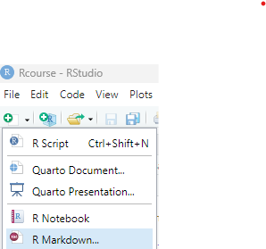

<style>
h1, h2, h3, h4, h5, h6 {
  direction: rtl;
}
p {
  direction: rtl;
}

.text-block1 {
  direction: rtl;       /* Set text direction to right-to-left */
  text-align: right;
  background-color: #f0f0f0; /* Light grey background */
  padding: 10px;
  border-radius: 5px;
  border: 1px solid #ddd; /* Light border */
  margin: 10px 0; /* Space around the block */
}
</style>


```{r setup, include=FALSE}
library(learnr)
library(dplyr)
library(gradethis)

knitr::opts_chunk$set(error = TRUE, warning = TRUE) 

{
exercises_df = data.frame(
  exercises = c("rdocumentation",
                "separate",
                "warnings"),
  
  hebrew = c("תיעוד נלווה",
             "שימוש בAI: בירור לגבי פונקציות",
             "שימוש בAI: פתרון תקלות")
)


check_hash_code   = function(hash){
    exercises = exercises_df$exercises
    response_table = learnrhash::decode_obj(hash)
    if (length(response_table)==0){return("Invalid hash code")}
    correct = response_table %>% filter(label %in% exercises, correct) %>% pull(label)
    incorrect = setdiff(exercises, correct)
    if (length(incorrect) == 0){return("Great work! Hash code is valid")}
    else{
      hebrew = exercises_df  %>% filter(exercises %in% incorrect) %>%pull(hebrew)
      print("The following exercises are missing or incorrect:")
      print(hebrew)
    }

} 
}# hash checker

```

```{r prepare-df1}
set.seed(111)
df1 = data.frame(subject = rep(1:5,each = 4),
                 trial   = rep(1:4,5),
                 score   = round(rep(1:4,5) + rnorm(20, 20,5)) %>% as.character())

```

```{r prepare-df2}

df = data.frame(session = c("s01_t1","s01_t2","s01_t3","s02_t1","s02_t2"),
                score = c(45,65,57,71,52))

```

## מבוא

ביחידה זו נלמד על מקורות מידע שימושיים לכתיבת קוד בR ופתרון תקלות.

אנחנו נתייחס לשלוש סוגי מקורות מומלצים:

**1)** תיעוד נלווה של פונקציות\
**2)** בלוגים ופורומים אינטרנטיים\
**3)** בינה מלאכותי

בנוסף, נלמד גם על דגשים חשובים לגבי ניהול קבצי קוד, כהכנה לתרגיל המסכם של הסמסטר (יחידה 8).

## תיעוד נלווה

המשאב הראשון והוותיק ביותר שעומד לרשותנו הינו התיעוד הנלווה של פונקציות
(Documentation). לכל חבילה בR מוצמד תיעוד מתאים - המפרט עבור כל פונקציה
את מטרתה, את הנתונים השונים שהיא יכולה או צריכה לקבל כדי לפעול באופן
תקין ומספר דוגמאות שימוש.

ניתן לגשת לתיעוד זה בשני דרכים:

### באמצעות הפקד `?`

כשנריץ סימן שאלה מלווה בשמה של פונקציה - יפתח עבורנו חלון העזרה "help"
המובנה בתוך Rstudio ובתוכה יופיע התיעוד הרלוונטי לפונקציה.

למשל - במידה ונרצה לברר איך משתמשים בפונקציה `round` נריץ את השורה הבאה:

```{r , eval = FALSE}
?round
```

הריצו את שורת הקוד בRstudio ועיינו בתיעוד הנלווה.

תוכלו לראות שהתיעוד מציג את אופן השימוש בפונקציה: היא מקבלת כאיבר ראשון
את X - שהוא האובייקט עליו נרצה להפעיל את הפונקציה, וכאיבר שני את מספר
הספרות אחרי הנקוב העשרונית אליהם נרצה לעגל (digits). במקרה זה התיעוד
כולל גם פירוט על מספר פונקציות דומות.

### Rdocumentation

התיעוד שמוצג בחלון העזרה מופיע גם באתר האינטרנט
[Rdocumentation](https://www.rdocumentation.org/ "קישור לאתר").

המידע באתר אינו שונה מחלון העזרה, אבל ההצגה שלו על פני דף שלם בדרך כלל
נוחה יותר מאשר התצוגה בחלונית.

בשני המקרים - המידע שמסופק הוא מאוד טכני ולא תמיד קל להבנה. הוא שימושי
בעיקר כדי להיזכר בנתונים שפונקציה אמורה לקבל וכדי לראות דוגמאות שימוש
בסיסיות.

`תרגיל:` חפשו ברשת או בחלונית העזרה את התיעוד הנלווה של הפונקציה
`substr`, המשמשת לשליפה של חלק מתוך מילה / משתנה תווי (character).

היעזרו בפונקציה זו על מנת לשלוף את שלושת התווים הראשונים בקוד המזהה של
הנבדקים ושמרו אותם בעמודה חדשה בשם "short_ID":

```{r rdocumentation, exercise=TRUE, exercise.eval = FALSE, exercise.setup = "prepare-df1"}

df = data.frame(ID = c("001p","002f","003f","004f","005p","006f"),
                score = c(45,65,57,71,52,43))

df = df %>% mutate(short_ID = substr(___________))

print(df$short_ID)

```

```{r rdocumentation-check}

df = data.frame(ID = c("001p","002f","003f","004f","005p","006f"),
                score = c(45,65,57,71,52,43))
  
  
grade_result(
  pass_if(~identical(.result,substr(df$ID,1,3) )),
         
  correct="יפה מאוד!", 
  incorrect = "נסו שוב"
)
```

## בלוגים ופורומים אינטרנטיים

משאב נוסף, שהינו מעט יותר ידידותי למשתמש, כולל מידע שהועלה על ידי
משתמשים לרשת.

בחלק מהמקרים מדובר בפורומים בהם אנשים העלו בעיות שהם נתקלו בהם וקיבלו
תשובות העשויות לעזור לנו בבעיות איתן אנחנו מתמודדים ובחלקם מדובר בבלוגים
מסודרים, בהם אנשים מעלים מדריכים מפורטים לגבי אופן השימוש בפונקציות
מוסימות ודרכים בהם אפשר לבצע ניתוחים מורכבים. הפירוט כאן לרוב יהיה עשיר
יותר, לפעמים בליווי דוגמאות או סרטונים רלוונטיים.

בנוסף, ישנם סיכומים מסודרים לפונקציות מחבילות שונות ואופן השימוש בהן שהועלו לרשת כקבצי PDF שנועדו לאפשר חיפוש מהיר ונוח של מידע.

את רוב הרשומות והשאלות בפורומים אפשר למצוא באמצעות חיפוש ברשת של הבעיה
איתה אתם מתמודדים, כך שאין חשיבות אמיתית להיכרות עם הבלוגים השונים מראש
אבל נמליץ כאן בכל זאת על בלוג אחד וכמה דפי מידע העשויים להיות שימושיים:

::: text-block1
[The R Graph Gallery](https://r-graph-gallery.com/ "קישור לאתר")- בלוג
המפרט על אופן היצירה של סוגים שונים של תרשימים, רובם באמצעות `ggplot`
ומספר חבילות המאפשרות לייצר תרשימים אינטראקטיביים.


**דפי מידע:**

   [פונקציות בסיסיות](https://iqss.github.io/dss-workshops/R/Rintro/base-r-cheat-sheet.pdf)
  
   [עריכת נתונים עם החבילות dplyr שילמדו ביחידה 5](https://nyu-cdsc.github.io/learningr/assets/data-transformation.pdf)
    
   [תרשימים בggplot](https://posit.co/wp-content/uploads/2022/10/data-visualization-1.pdf)
    
   
:::

## שימוש בבינה מלאכותית

### מבוא

עד לאחרונה, הדרך העיקרית לפתרון תקלות ובירור לגבי פונקציות שונות היה בעזרת תיעוד נלווה ופורומים – שאמנם עזרו אבל היו מאוד מוגבלים בשימושיות שלהם.
 
מנועי בינה מלאכותית מאפשרים לנו תמיכה רחבה בהרבה, מצד אחד, אבל התבססות יתרה עליהם עלולה להוביל לתקלות וטעויות בקוד שיהיה קשה מאוד לתקן.
  
בפרק הבא נעבור על מספר שימושים מומלצים.


### בירור לגבי פונקציות

השימוש הפשוט ביותר בבינה מלאכותית, בו הוא גם בדרך כלל מצטיין, כולל התייעצות לגבי פונקציות ואופן השימוש בהן.

רוב מנועי הבינה המלאכותית יודעים למצוא פונקציה על סמך תיאור של מה שהיא מבצעת ולהסביר את האופנים השונים בהם ניתן להשתמש בה.

::: text-block1
גם כאן יכולות להיות טעויות והתוכנה לפעמים תמציא פונקציות או תשתמש
בהן בצורה לא נכונה, אבל ברוב המקרים הפשוטים היא מספקת מענה מוצלח מאוד.
בכל אופן - נוכל לבדוק את התשובות שלה באופן מיידי, בין אם באמצעות הרצת
הפונקציה או באמצעות עיון בתיעוד הנלווה של הפונקציה.
:::

`תרגיל` : בררו איזו פונקציה יכולה לשמש אותנו כדי להפריד עמודה לשניים.

בטבלה הבאה (df, שטעונה בלומדה) ישנה עמודה בשם "session" המכילה מידע גם על מספר הנבדק וגם על מספר הסבב של אותו הנבדק. הפרידו אותה לעמודות
"subject"ולעמודה "trial" כך שכל עמודה תכיל את התוכן המתאים.

למשל - בשורה הראשונה, בה מופיע הערך "s01_t1" בעמודה  "session" נרצה שתחת העמודה "subject" יופיע "s01" ותחת העמודה
"trial" יופיע "t1".

הבהרה: כדי לפתור את התרגיל עליכם להבין בעצמכם את המאפיינים של הפונקציה שהתבקשתם למצוא ולנסח בעצמכם את הפנייה לבינה המלאכותית.
בקשו ממנוע הבינה המלאכותית להסביר לכם אודות השימוש בפונקציה, ויישמו אותה בעצמכם.

```{r separate, exercise = TRUE, exercise.setup = "prepare-df2"}

print(df)

df = df %>% ________________
  
print(df)

```

```{r separate-check}

grade_this({
  
  target = data.frame(
    session = c("s01_t1","s01_t2","s01_t3","s02_t1","s02_t2"),
    score = c(45,65,57,71,52)
  ) %>%
    separate(session, into = c("subject","trial"))
  
  wrong_order = data.frame(
    session = c("s01_t1","s01_t2","s01_t3","s02_t1","s02_t2"),
    score = c(45,65,57,71,52)
  ) %>%
    separate(session, into = c("trial","subject"))
  
  user_df = user_object_get("df")
  
  same_content = isTRUE(all.equal(user_df, target, check.attributes = FALSE))
  same_names = names(target) == names(user_df)
  
  
  if (same_content & same_names) {
    
    pass("עבודה מצוינת!")
    
  } else if (same_content & !same_names) {
    
    fail("נסו שוב. שמות העמודות אינן תואמות את ההוראות")
    
  } else {
    
    fail("נסו שוב.")
    
  }
})
```

### פתרון תקלות

שימוש חשוב נוסף בבינה מלאכותית נעזר בה כדי לפתור תקלות בקוד. כשהקוד שכתבנו מעלה הודאות שגיאה או מוציא פלט שלא ואם את מה שרצינו לייצר – נוכל לבקש ממנוע בינה מלאכותית לנסות ולהבין את מקור התקלה ולעזור לנו לפתור אותה.

בשימוש כזה חשוב לשים לב שאתם מציידים את מנוע הבינה המלאכותית במספיק פרטים כדי שהוא יוכל לזהות את התקלה. ברוב המקרים, כדאי לספק לו את  כל הפרטים האפשריים – הקוד בו השתמשתם, החלק בקוד שבו אראה התקלה, מה כוללים המשתנים שאתם משתמשים בהם בקוד ואת המלל של הודעת השגיאה שהופיעה בקונסול. 
מנועי הבינה המלאכותית בדרך כלל טובים במציאת שגיאות קטנות שאנחנו עשויים לפספס בעצמינו. עם זאת – הם לא תמיד יודעים לתקן תקלות מורכבות. במקרים כאלו נצטרך לעזור להם דרך זיהוי החלקים הבעייתיים בקוד ובקרה עצמאית על התקינות של הניתוח עד לחלק בו הוא מתחיל להשתבש.

`תרגיל` הריצו את קטע הקוד הבאה והיעזרו במנוע בינה מלאכותית לבחירתכם כדי להבין את מקור השגיאות. 
שימו לב - הקוד מכיל מספר שגיאות שונות. תקנו אותם כך שהקוד ירוץ בצורה חלקה וייצר פלט הגיוני.


```{r warnings, exercise = TRUE, exercise.setup = "prepare-df1"}
# df1:
# הטבלה מתארת את הציונים של נבדק בכמה חזרות שונות של אותה המטלה

# subject - המספר המזהה של הנבדק
# score  - ציון הנבדק
# trial   - מספר החזרה

df1 %>% head() %>% print() # הדפסת השורות הראשונות

df1_summary = df1 %>% 
  group_by(subject) %>%                      
  summarise(trial_amount = max(trial), # מספר החזרות שביצע
            mean_score = mean(score))       # הציון הממוצע 
               

mean_scores = df1_summery %>% pull(mean_score)

print(mean_scores)

```

```{r warnings-check}


grade_this({
  
  target  = df1 %>% 
    group_by(subject) %>%                      
    summarise(trial_amount = max(trial, na.rm = T), 
              mean_score = mean(as.numeric(score), na.rm = T))   %>%
    pull(mean_score)
  
  result = user_object_get("mean_scores")

   if (is.na(sum(result))){
     fail("האם הוקטור שהודפס נראה תקין?")
   } else if (identical(target, result)){
     pass("עבודה מצוינת!")
   }  else {
     fail("עדיין ישנה שגיאה בקוד")
   }
  
   }
  )
```

### יצירת קטעי קוד
סוג השימוש האחרון כולל לבקש מהבינה לבצע את כתיבת הקוד.

זה כלי מאוד יעיל, אבל יש איתו 3 בעיות עיקריות:

::: text-block1

**1) טעויות**
למרות השיפור העקבי ביכולות של הבינה המלאכותית, גם המודלים המובילים עושים לא מעט טעויות. זה קורה פחות בקטעי קוד קצרים ונהיה הרבה יותר נפוץ ברגע שמדובר בעיבודים ארוכים יותר.

מרגע שנעשית טעות כזו – קשה מאוד למצוא ולתקן אותה, שכן בדרך כלל מדובר באותן טעויות שקשה לבינה המלאכותית לזהות מלכתחילה.

**2) קצרים בתקשורת**

גם אם מנוע הבינה המלאכותית לא ביצע אף טעות – לא נדירים המקרים בהם הוא מבצע ניתוח ששונה באופן מהותי מזה שהמפעיל התכוון לערוך. זה יכול לנבוע מניסוח בעייתי של הבקשה, מבקשה שלא ירדה מספיק לפרטים של האופן בו הניתוח צריך להתבצע או מטעויות של מנוע הבינה המלאכותית ביישום הבקשה.

טעויות כאלו הן במובן מסוים בעייתיות הרבה יותר מטעויות בקוד – שכן הקוד יערוך ניתוח שנראה תקין ויפיק עבורכם תוצאה. התוצאה פשוט תהיה שגויה.

**3) יצירת תלות**

יש הרבה פונקציות, תיקונים וניתוחים בסייסים שהרבה יותר יעיל לכתוב בעצמכם מאשר להתייעץ באופן קבוע עם בינה מלאכותית.
אם לא תלמדו לערוך אותם בעצמכם תיווצר תלות שתעכב ותסרבל את העבודה שלכם. לכן, בשלב זה מומלץ להשתמש בבינה מלאכותית רק כמורה - שמסביר, מדגים ועוזר לכם למצוא את הטעויות שלכם ולתקן אותן - אבל לא מבצע את הניתוחים או התיקונים במקומכם.

בהמשך ייתכן שתוכלו להיעזר בו גם כדי לכתוב קטעי קוד קצרים – אבל גם אז, חשוב מאוד להקפיד שאתם מבינים מה עושה כל שורה וכל ניתוח. זה חשוב גם כדי למנוע טעויות, וגם כדי לוודא שהניתוח אכן תואם למה שאתם מתכוונים לערוך.

בנוסף לבדיקת הקוד, כדאי גם לבדוק את התוצר של כל ניתוח, כפי שהייתם עושים עם ניתוח שכתבתם בעצמכם.

בכל אופן – כהבהרה חשובה: בקורס הזה אנחנו מצפים שתכתבו את הקוד כולו בעצמכם ושתבינו מה כל שורה מבצעת.

:::


### קופיילוט {width="50" height="26"}

תצורה נוספת ושימושית במיוחד של בינה מלאכותית הינה Github Copilot. היישום
כולל תוסף לRstudio הזמין החל מהגרסאות האחרונות של התוכנה, ומציע השלמות
לקוד בזמן הכתיבה.

לתוסף יש גישה לקובץ שאתם עובדים עליו ולקבצים אחרים שכתבתם, ובאמצעותם הוא
מנסה לנבא את מטרת הקוד שאתם כותבים ולהשלים אותו בהתאם.

מאחר והתוסף לא דורש מאיתנו להעתיק את הקוד לממשק אחר ולנסח באופן מפורש את
השאלות שלנו הוא הרבה יותר מהיר ונח לשימוש.

נכון להיום, התוסף דורש מנוי בתשלום, אך הוא מוצע חינם לסטודנטים דרך תכנית
Github education.


## המלצות לניהול קוד


לקראת התרגיל המסכם, בו תדרשו לכתוב קובץ קוד המכיל עיבוד נתונים מלא, נעבור על כמה המלצות חשובות שיעזור לכם לנהל את הקוד בצורה מסודרת ונוחה לתחזוקה.

### כתיבה לפי רצף כרונולוגי

אחד היתרונות המרכזיים של ניתוח נתונים בR הוא שהוא מאפשר לנו לייצר ולשמור קבצי קוד שמבצעים ניתוחים מלאים, שלב אחר שלב.
כך, במידה ונרצה להעביר את אותו הניתוח מחדש (למשל - כאשר אספנו מדגם חדש של נבדקים) נוכל לעשות זאת בצורה מאוד פשוטה.

כדי שזה יתאפשר - נצטרך לייצר קובץ קוד המכיל את כל צעדי העיבוד השונים, לפי סדר הביצוע שלהם. כלומר - קודם נטען את הנתונים שלנו, אח"כ נעשה עליהם עיבודים בסיסיים (סינון, יצירת עמודות חדשות וכו') ואח"כ נבצע סיכומים ונייצר תרשימים מהטבלאות המעובדות שייצרנו.
אם הקוד שלנו לא יהיה מסודר בצורה כזו (למשל - אם ננסה לנתח טבלה שעוד לא טענו) אנחנו עלולים לקבל שגיאות כשננסה להריץ את הקוד מחדש. 

כדי לוודא שהקוד שכתבנו אכן שומר על עקביות כזו - מומלץ מדי פעם לנקות את סביבת העבודה ולהריץ את הקוד לפי הסדר בו הוא מופיע בקובץ. את ניקוי סביבת העבודה אפשר לעשות באמצעות כפתור המטאטא שנמצא בצד הימני של סרגל הכלים בחלונית Environment. 

לחלופין - אפשר לנקות את סביבת העבודה גם באמצעות הקוד הבא: `rm(list = ls())`

### הערות וקיפולי קוד
 
בנוסף, כדי לשמור על הקוד עצמו ברור ומסודר, חשוב לכתוב אותו בצורה שקלה להבנה:

**1) הערות:** ההמלצה הנפוצה היא להוסיף כמה שיותר הערות - כדי להסביר את
המטרה של כל שורת קוד וכל מקטע. זה אמנם ידרוש מכם עוד כמה שניות בזמן
הכתיבה אבל זה מאוד עוזר בהתמצאות בקוד אח"כ, ומסייע לסדר לעצמכם את מהלך
הניתוח.

**2) חלוקה לפרקים:** כלי שימושי נוסף כולל חלוקה של קובץ הקוד לפרקים, לפי
חלקי הניתוח השונים. ניתן לייצר כותרות לפרקים באמצעות הוספת ארבעה `#`
בסופה של הערה ולהסתיר את התוכן של הפרק על ידי לחיצה משמאל לכותרת
בRstudio. 

**3) קיפולי קוד:** דרך נוספת לצמצם קטעי קוד נעזרת בסוגריים מסולסלים -
`{}`. אם נקיף קטע קוד בסוגריים אלו נוכל לצמצם את קטע הקוד גם מבלי להגדיר
כותרות ופרקים חדשים. מומלץ להוסיף הערה אחרי הסוגר השני ולפרט בה מה הקוד
המקופל עושה, כדי שנוכל לעקוב אחרי מטרת הקוד מבלי לפתוח את הצמצום.

מומלץ להשתמש בשלושת השיטות כדי להבטיח שהקוד שלכם יהיה מסודר ונח לקריאה.

{width="100"}

העתיקו את הקוד הבא לRstudio ונסו בעצמכם (קיפולי קוד לא עובדים בלומדה).

```{r comments_example, eval = F}
# 'קטע הקוד הבא נועד כדי להדגים שימוש בהערות, ראשי פרקים וקיפולי קוד
#לחצו על החץ הקטן ליד מספר השורה כדי להסתיר את קטע הקוד הרלוונטי


#  יצירת נתוני דמה וטעינת חבילות #### 

{
  library(dplyr)
  library(ggplot2)
} # טעינת החבילות
{
  
  # נתונים עבור יצירת הנתונים
  slopes = c(0.5, 0.7, 0.3, 0.6, 0.8)
  intercepts = c(2, 3, 1, 2.5, 3.5)
  # שמות הנבדקים
  names = c("Yocheved","Alfred","Dilan","Shoshkeh", "Noam")
  
  social_sleep  = data.frame() # טבלה ריקה
  
  for (i in 1:5){   # לולאה שעוברת על כל נבדק ומייצרת עבורו נתוני דמה
    # שליפת הפרמטרים עבור הנבדק
    name = names[i]
    slope = slopes[i]
    intercept = intercepts[i]
    
    sleep = rnorm(30, 7, 1)                           # דגימה אקראית של שעות השינה
    social = slope*sleep + intercept + rnorm(30, 0, 1)# חישוב מידת החברתיות על סמך שעות השינה
    
    temp_df = data.frame(name = name,             # ארגון נתוני הנבדק בטבלה
                         day = 1:30,
                         sleep = round(sleep,1),
                         social = round(social))
    
    social_sleep = bind_rows(social_sleep, temp_df)# הוספת נתוני הנבדק לטבלת הנתונים
  }

} # יצירת טבלת הנתונים באמצעות לולאה

# פרק 2 - סיכום הנתונים ####

{
  social_sleep_summ = social_sleep %>%  # חישוב ממוצע חברותיות ושעות שינה לכל נבדק
    group_by(name) %>%
    summarise(mean_sleep = mean(sleep),
              mean_social = mean(social))
} # סיכום בסיסי לפי נבדק
{
  social_sleep_summ = social_sleep_summ %>%
    group_by()%>% # ביטול של החלוקה לפי נבדק
    mutate(z_sleep = (mean_sleep - mean(mean_sleep))/ sd(mean_sleep), # חישוב ציוני התקן
           z_social = (mean_social - mean(mean_social))/ sd(mean_social))
  
} # חישוב ציון התקן של הממוצעים

# פרק 3 - יצירת תרשים ####

{
  ggplot(social_sleep_summ, aes( x = z_sleep, y = z_social))+
    geom_point(aes(col = name))+ # הוספת נקודה לכל נבדק
    geom_text(aes(label = name, y = z_social + 0.2))+ # הוספת שם הנבדק מעל הנקודה
    theme_minimal()+
    theme(legend.position = "none") # הסרת המקרא
} # תרשים ראשון - פיזור ציוני התקן של הממוצעים

{
  ggplot(social_sleep, aes( x = sleep, y = social, col = day))+
    geom_point(alpha = 0.5)+
    geom_smooth(method = "lm")+
    facet_wrap(~name)
} # תרשים שני - פיזור התצפיות לכל נבדק
```


## העשרה: ייצוא תוצאות


השלב האחרון בתהליך עיבוד הנתונים (והנושא האחרון ביחידה זו) כולל את ייצוא התוצאות. לאחר שהפקנו את
התרשימים, ייצרנו את טבלאות הסיכום וביצענו את המבחנים הסטטיסטיים - נרצה
לייצא אותם לטובת דיווח או שיתוף.

אפשר לייצא את התוצאות באופן ידני - על ידי הרצת הקבצים והעתקת התוצאות
והתרשימים לקובץ חיצוני כלשהו אחד אחד, אבל נוכל לעשות זאת גם בצורה נוחה
יותר:

**1) באמצעות פקודות המייצאות את התוצאות:**

את התרשימים נוכל לשמור באמצעות פונקציות כמו `ggsave` המייצאות את
התרשימים כקובץ תמונה.

את התוצאות של הניתוחים הסטטיסטיים נוכל ייצא באמצעות פונקציות המאפשרות לייצר בטבלאות מסודרות עבור ניתוחים שונים. אנחנו לא נתמקד בהן בקורס הזה, אבל לטובת הסקרנים - הנה קישור לדוגמה: <https://rempsyc.remi-theriault.com/articles/t-test>

**2) באמצעות Rmarkdown:**

Rmarkdown הוא כלי המאפשר לנו לייצר מסמכים ודוחות ישירות מתוך R. הוא מכיל
קטעי קוד שמשובצים בתוך מסמך טקסט, ומאפשר לנו להציג את הקוד, הפלטים
והתרשימים שאנחנו מייצרים יחד באופן מסודר ובליווי הסברים מילוליים.


תוכלו לייצר קובץ כזה באמצעות תפריט יצירת קובץ חדש:

{width="200"}
  

למידע נוסף על Rmarkdown ואופן השימוש בו תוכלו להשתמש באחד המדריכים
הרבים שקיימים ברשת.  
לדוגמה:

[מדריך מסודר המלווה במספר דוגמאות](https://rmarkdown.rstudio.com/)

[קובץ PDF המסכם את הכלים הבסיסיים ליצירת קבצים
בRmarkdown](https://rmarkdown.rstudio.com/lesson-15.HTML)

[מדריך מקיף על השימוש בRmarkdown](https://bookdown.org/yihui/rmarkdown/)

[מדריך מקיף נוסף](https://r4ds.had.co.nz/r-markdown.html)


## משוב

בחלק זה נבקש את המשוב שלכם על הלומדה. אנא ענו בכנות וביסודיות, על מנת שנוכל להשתפר. התשובות ישמרו בצורה אנונימית ולא ישפיעו על בדיקת התרגיל עצמה.

שימו לב: ברוב השאלות אין אפשרות לשנות את התגובה לאחר לחיצה על כפתור ההגשה.

```{r survey_q1, echo = FALSE}
question(#"כמה קשה הייתה היחידה עבורך?",
          "מה הייתה רמת הקושי של הלומדה עבורך?",
         type="single",
         answer("קלה"        ,correct=TRUE,  message = "תגובתך: קלה"),
         answer("בינונית"    ,correct=TRUE,  message = "תגובתך: בינונית"),
         answer("מאתגרת"     ,correct=TRUE,  message = "תגובתך: מאתגרת"),
         answer("קשה"        ,correct=TRUE,  message = "תגובתך: קשה"),
         answer("קשה מאוד"   ,correct=TRUE,  message = "תגובתך: קשה מאוד"),
         correct = "",
         incorrect = "",
         allow_retry = TRUE
)
```

```{r survey_q2, echo = FALSE}
question(#"עד כמה את/ה מרגיש/ה שהבנת את החומר שנלמד ביחידה?",
        "עד כמה החומר הנלמד ביחידה הועבר בצורה ברורה לדעתך?",
         type="single",
         answer("במידה רבה"      , correct=TRUE,  message = "תגובתך: במידה רבה"),
         answer("במידה סבירה" ,    correct=TRUE,  message = "תגובתך: במידה סבירה"),
         answer("באופן חלקי"  ,    correct=TRUE,  message = "תגובתך: באופן חלקי"),
         answer("במידה מעטה"  ,correct=TRUE,  message = "תגובתך: במידה מעטה"),
         answer("במידה מעטה מאוד",correct=TRUE,  message = "תגובתך: במידה מעטה מאוד"),
         correct = "",
         incorrect = "",
         allow_retry = TRUE
)
```

```{r survey_q3, echo = FALSE}
question("כמה זמן לקח לך לפתור את הלומדה בערך?",
         type="single",
         answer("פחות משעה"      , correct=TRUE,  message = "תגובתך: פחות משעה"),
         answer("שעה" ,    correct=TRUE,  message = "תגובתך: שעה"),
         answer("שעתיים"  ,    correct=TRUE,  message = "תגובתך: שעתיים "),
         answer("שלוש שעות"  ,correct=TRUE,  message = "תגובתך:  שלוש שעות"),
         answer("ארבע שעות ומעלה",correct=TRUE,  message = "תגובתך:  ארבע שעות ומעלה "),
         correct = "",
         incorrect = "",
         allow_retry = TRUE)
```

```{r survey_q4, echo = FALSE}
question("אילו נושאים בלומדה היו קשים במיוחד עבורך?",type="learnr_checkbox",
         answer("תיעוד נלווה", correct=TRUE),
         answer("בלוגים ופורומים אינטרנטיים", correct=TRUE),
         answer("שימוש נכון בבינה מלאכותית", correct=TRUE),
      
         answer("אף נושא", correct=TRUE),
         
         correct = "תגובתך התקבלה",
         try_again = "תגובתך התקבלה",
         incorrect = "תגובתך התקבלה",
         allow_retry = TRUE
)
```

```{r survey_q5, echo = FALSE}
  question_text(    "מצאת טעות? ספר/י לנו עליה (יש להקפיד ולציין את שם הפרק)",
   # "הערות ספציפיות לגבי חלקי היחידה השונים",
    incorrect = "תגובתך התקבלה",
    correct = "תגובתך התקבלה",
    answer(text = "/'ק/'ק",correct = TRUE),
    rows = 10,
    trim = FALSE
  )
```

```{r survey_q6, echo = FALSE}
  question_text(
        "יש לך עוד משהו לספר לנו? נשמח לשמוע משוב מפורט, הצעות כלליות או ספציפיות לפרק מסוים לגבי יחידה זאת.",
   # "הערות כלליות לגבי היחידה",
    incorrect = "תגובתך התקבלה",
    correct = "תגובתך התקבלה",
    answer(text = "/'ק/'ק",correct = TRUE),
    rows = 10,
    trim = FALSE
  )
```


## הגשה

עברו על הקובץ וודאו שהגשתם את כל התרגילים ועניתם על כל השאלות

במידה וכל התשובות שלכם תקינות יש ללחוץ על הכפתור: Generate, להעתיק את
הטקסט שמופיע בחלון למטה ולהגישו במודל\
בהצלחה!

```{r context="server"}
learnrhash::encoder_logic()
```

```{r encode, echo=FALSE}
learnrhash::encoder_ui()
```


הדביקו את קוד הhash בתוך הגרשיים בפונקצייה הבאה כדי לוודא שעניתם על כל השאלות והתרגילים בלומדה.

```{r hash_check,  exercise = TRUE, exercise.eval = FALSE}

check_hash_code("")

```
