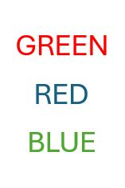

<style>
h1, h2, h3, h4, h5, h6 {
  direction: rtl;
}
p {
  direction: rtl;
}

.text-block1 {
  direction: rtl;       /* Set text direction to right-to-left */
  text-align: right;
  background-color: #f0f0f0; /* Light grey background */
  padding: 10px;
  border-radius: 5px;
  border: 1px solid #ddd; /* Light border */
  margin: 10px 0; /* Space around the block */
}
  
</style>


```{r setup, include=FALSE}
library(learnr)
library(gradethis)
library(Rcourse)

knitr::opts_chunk$set(error = TRUE, warning = FALSE) 
gradethis::gradethis_setup()


{
exercises_df = data.frame(
  exercises = c("correct_percent",
                "n_filtered",
                "are_there_NAs",
                "n_filtered_total",
                "stroop_mean",
                "correct_max_diff"),
  
  hebrew = c("אחוזי דיוק",
             "סינון ראשוני",
             "ערכים חסרים",
             "סינון סה\"כ",
             "חישוב ממוצעי זמני התגובה: ממוצע ההפרשים",
             "גודל אפקט סטרופ עבור הנבדק בעל אחוז הדיוק הקטן ביותר")
)


check_hash_code   = function(hash){
    exercises = exercises_df$exercises
    response_table = learnrhash::decode_obj(hash)
    if (length(response_table)==0){return("Invalid hash code")}
    correct = response_table %>% filter(label %in% exercises, correct) %>% pull(label)
    incorrect = setdiff(exercises, correct)
    if (length(incorrect) == 0){return("Great work! Hash code is valid")}
    else{
      hebrew = exercises_df  %>% filter(exercises %in% incorrect) %>%pull(hebrew)
      print("The following exercises are missing or incorrect:")
      print(hebrew)
    }

} 
}# hash checker

```

## מבוא

### תרגיל מסכם

היחידה שלפניכם כוללת תרגיל המסכם את רוב החומר שנלמד בסמסטר א'.
 
קובץ זה ילווה אתכם בניתוח ,שיכלול את כל השלבים בניתוח נתונים אמיתיים - החל מסינון ובקרת
איכות הנתונים ועד להפקת תרשימים עבור התוצאות. אפשר מוומלץ להיעזר בלומדות הקודמות ובסיכומים כדי לפתור את התרגיל.


{width="100"}


את התרגיל עצמו יש לפתור בRstudio. בסוף התרגיל תתבקשו להעלות למודל את קובץ הקוד שיצרתם.
הקפידו לשמור אותו נקי ומסודר ולהוסיף הערות המפרטות את מטרת כל אחד מהשלבים בקוד.

בנוסף, היחידה תכלול שאלות שנועדו לעזור לכם לוודא את הניתוחים שלכם במהלך הדרך. כמו ביחידות הקודמות, גם הפעם תתבקשו להגיש את קוד הHash שקיבלתם עם סיום היחידה. 


בהצלחה!


### תיאור הנתונים

בתרגיל ננתח נתונים ממטלת "סטרופ". במטלה זו נבדקים מתבקשים לציין את ה**צבע** של
מילים שונות המופיעות על המסך, תוך התעלמות מהתוכן שלהן. 
  
למשל, בגירויים הבאים הנבדק היה צריך להגיב "אדום", "כחול" ואז "ירוק"

{width="100"}

כשהמילה שמופיעה תואמת לצבע בו היא כתובה המטלה הינה קלה יחסית - ולכן מצופה מנבדקים להגיב באופן
תקין ובמהירות רבה יותר, אך כשיש חוסר תאימות בין הצבע לטקסט המטלה קשה
יותר וזמן התגובה צפוי להתארך.

ניתן להתנסות בגרסה אינטרנטית של המטלה [בקישור
זה](https://www.psytoolkit.org/experiment-library/experiment_stroop.html).

  
הנתונים איתם נעבוד נאספו במסגרת פרוייקט שכלל מספר מעבדות באוניברסיטאות שונות, במסגרתו סוללה של מטלות ושאלונים הועברה על ידי מספר אוניברסיטאות ומכללות שונות על מנת להבטיח את אמינות הנתונים שנאספו. בנוסף, [הנתונים פורסמו לקהל הרחב](https://osf.io/ct89g/?view_only=) על מנת לאפשר לחוקרים אחרים לבצע עליהם ניתוחים נוספים ולבדוק בעצמם את תקינות המבחנים הסטטיסטיים.

לטובת התרגיל נשתמש בתוצאות מטלת הסטרופ ו2 קבצי מידע אודות הנבדקים (הכוללים פירוט על גילאי הנבדקים והמוסד והתאריך בו כל נבדק ביצע את הניסוי). כל הקבצים נמצאים בתיקייה הרלוונטית באתר המודל.
 
 
## יבוא

הורידו מהמודל את הטבלה "stroop_data.csv" וייבאו אותה לסביבת העבודה שלכם.

הטבלה מכילה פרטים אודות כל סבב במטלה: על איזה נבדק מדובר (session_id),
מה היה מספר הסבב (trial), איזה גירוי הוצג (המילה שהוצגה + צבע הטקסט), מה
היתה התגובה של הנבדק ומה היה אורך זמן התגובה שלו (במילישניות).

האפקט העיקרי שמעניין אותנו במטלה זו הוא ההפרש בין זמן התגובה עבור סבבים בהם הייתה תאימות
בין הצבע והטקסט של הגירוי לבין שלבים בהם הצבע והטקסט לא תאמו זה לזה.

כדי שנוכל להפיק את מדד זה ולבצע את הסינונים הנדרשים נצטרך לייצר שתי עמודות נוספות מתוך
הנתונים הקיימים בטבלה:

   **1)** עמודת המתארת האם הנבדק צדק או טעה בסבב המדובר. עמודה זו תבחן האם התגובה של
הנבדק זהה ל**צבע** של הגירוי.

   **2)** עמודה שתקודד את התנאי אליו שייך כל סבב - האם קיימת התאמה בין צבע הגירוי לטקסט שמופיע בו.


## סיכום ראשוני

לאחר שיצרתם את שתי העמודות הנ"ל, צרו סיכום ראשוני של הנתונים.
מטרת סיכום זה היא לוודא את התקינות של הנתונים שלנו ולראות שהם מתאימים למבנה המטלה. אנחנו מצפים שכל נבדק יצפה בכל אחד מהגירויים האפשריים כמות זהה של פעמים, ולכן שליש מכל הסבבים צפויים להיות מהתנאי התואם.

עבור כל
נבדק, בדקו כמה סבבים הוא ביצע, כמה מתוכם היו מתנאי חוסר התאימות בין
הצבע לטקסט ומה אחוז הסבבים בהם הוא השיב תגובה נכונה (אחוז דיוק).


```{r correct_percent, echo = FALSE}

question_text( 
  "<div style='direction: rtl;'>
מה היה אחוז הדיוק של הנבדק השני (session_id = 668587)?

הזינו את התשובה כמספר בין 0 ל1,עם 2 ספרות אחרי הנקודה העשרונית (למשל 0.51 עבור 51%)
  </div>",
  answer("0.889", correct = TRUE),
  answer("0.89", correct = TRUE),
  answer("0.8889",correct=TRUE),
  answer("0.8888889",correct=TRUE),
  allow_retry = TRUE , 
         
  correct="תשובה נכונה", 
  incorrect = "נסו שוב"
)

```

```{r percent_congruent, echo = FALSE}

question( 
  "<div style='direction: rtl;'>
האם אחוז הסבבים בהם הייתה התאמה בין הצבע לטקסט תואם לציפיות שלנו?
  </div>",
  answer("כן", correct = TRUE),
  answer("לא"),
  allow_retry = TRUE , 
         
  correct="נכון מאוד", 
  incorrect = "נסו שוב"
)

```


## סינון נתונים

### ערכים קיצוניים

כדי להבין האם יש בנתונים שלנו תצפיות קיצוניות ניעזר בהצגת זמני התגובה
בהיסטוגרמה. צרו היסטוגרמה שכזהו באמצעות `ggplot`.

משהו נראה קצת מוזר?

הסיבה לכך היא שככל הנראה ישנן מספר תצפיות קיצוניות מאוד, שגורמות לתוכנה
להציג את זמני התגובה על ציר מאוד רחב - כשבפועל רוב זמני התגובה מרוכזים
בקצה השמאלי של הציר.

ציירו את ההיסטוגרמה שוב - אך הפעם הגבילו את ציר האיקס בין 0 ל5000.
בצעו זאת באמצעות קביעת גבולות לתרשים - ולא באמצעות סינון של הקובץ המקורי. 

  
על פי התוצאות המוצגות בטבלה, מהו לדעתכם הרף העליון הסביר לזמני התגובה?

  
לפני שנוכל להתקדם נצטרך לסנן את הנתונים כך שלא יכללו תוצאות קיצוניות ובלתי סבירות. תוצאות כאלו
יכולות לנבוע מכך שנבדק איבד ריכוז במטלה או לקח הפסקה קצרה ואינן משקפות
את זמן התגובה האמיתי של הנבדק. במידה ונשאיר את תצפיות אלו הן עלולות
להטות את התוצאות שלנו באופן משמעותי - ולכן חשוב שנסנן אותן לפני חישוב
הממוצעים.
  

סננו את הטבלה כך שתכיל רק זמני תגובה הקטנים מ3000 מילי שניות.ישנן מספר דרכים בהן יכולנו לקבוע את הערך הרף לחיתוך, אך כרגע נסתפק
בחתך אחיד זה כדי להקל על שחזור והשוואת תוצאות הניתוח. 
  

בניתוח אמיתי יכול להיות שהיינו מסננים גם תגובות עם זמן תגובה מהיר מדי (למשל - עם זמן תגובה 0), אבל לצורך התרגיל תשאירו אותם.

```{r n_filtered, echo = FALSE}

question_text( 
  "<div style='direction: rtl;'>
כמה תצפיות סיננתם?
  </div>",
  answer("629", correct = TRUE),
  allow_retry = TRUE, 

         
  correct="מעולה", 
  incorrect = "זו לא התוצאה שציפינו לקבל. וודאו שסיננתם לפי ההוראות"
)

```


  
### סינון סבבים עם תגובות שגויות
  
  
בנוסף, סננו מהטבלה גם את כל הסבבים בהם הנבדקים טעו בתגובותיהם. סבבים
כאלו מעידים על כך שהמטלה לא נעשתה כשורה ולכן לא נרצה לכלול את זמני
התגובה של סבבים אלו בממוצעים שנחשב.


```{r are_there_NAs, echo = FALSE}

question( 
  "<div style='direction: rtl;'>
בדקו - האם הקובץ מכיל ערכים חסרים?
  </div>",
  answer("כן"),
  answer("לא", correct = TRUE),
  allow_retry = TRUE,

         
  correct="נכון מאוד", 
  incorrect = "בדקו שוב"
)

```


## סינון נבדקים בעייתיים

הסינון האחרון שנערוך יכלול הסרה של כל הנתונים של נבדקים שצדקו בפחות מ50%
מהסבבים. אמנם הסיכוי לצדוק בניחוש אקראי הינו נמוך יותר במקרה זה (33%),
אך נוסיף לרף הדחייה שלנו מרווח נוסף עבור נבדקים שאמנם לאו דווקא ניחשו
בכל סבב אבל בהחלט נראה שלא ענו על המטלה בצורה טובה מספיק.

צרו רשימה של נבדקים עם אחוזי דיוק נמוכים והסירו את כל התצפיות שלהם
מהקובץ.

שימו לב: בשלב זה הקובץ אמור לכלול רק תגובות נכונות, עם זמן תגובה הקטן מ3000 מילישניות, שהגיעו מנבדקים שצדקו בלפחות 50% מהתגובות שלהם.


```{r n_filtered_total, echo = FALSE}

question_text( 
  "<div style='direction: rtl;'>
לאחר כל הסינונים, כמה תצפיות נותרו בקובץ?

התשובה צריכה להיות מנוסחת כספרות בלי פסיקים.  למשל:  13420 במקום 13,420.
  </div>",
  answer("201511", correct = TRUE),
 answer("207618", correct = FALSE, message = "האם סיננתם את התגובות השגויות?"),
 answer("202174", correct = FALSE, message = "האם סיננתם את הנבדקים הבעייתיים?"),
  allow_retry = TRUE,
         
  correct="נהדר", 
  incorrect = "זו לא התוצאה שציפינו לקבל. וודאו שסיננתם לפי ההוראות"
)

```


## חישוב ממוצעי זמני התגובה

עכשיו שסיננו את זמני התגובה ווידאנו שהנתונים תקינים - נוכל לחשב את זמן
התגובה הממוצע עבור כל נבדק בכל אחד מהתנאים. לצורך כך, קבצו את הטבלה המסוננת (לאחר שלושת צעדי הסינון) לפי זהות הנבדק והתנאי וסכמו את ממוצע זמן התגובה.


אנחנו מעוניינים לחשב עבור כל נבדק את ההפרש בין שני ממוצעים אלו. דרך אחת לעשות זאת תהיה להמיר את הטבלה לפורמט רחב - כך שנקבל טבלה עם שורה אחת עבור כל נבדק ו2 עמודות ממוצעים, אחת עבור ממוצע זמן התגובה בתנאי התואם ונוספת עבור הממוצע בתנאי הלא תואם.

לטבלה זו נוכל להוסיף עמודה המחשבת את הפרש ממוצעי זמן התגובה עבור כל נבדק (הממוצע בתנאי הלא תואם פחות הממוצע בתנאי התואם).

  
צרו תרשים הממחיש את פיזור ההפרשים שקיבלתם.
  
מהתרשמותכם - האם זה נראה שנבדקים נוטים להגיב לאט יותר באחד התנאים (כלומר- שההפרשים נוטים להיות ברובם חיוביים או שליליים)?


חשבו את ההפרש הממוצע על פני כל הנבדקים ואת סטיית התקן של ההפרשים


```{r stroop_mean, echo = FALSE}

question_text( 
  "<div style='direction: rtl;'>
מהו ממוצע ההפרשים שקיבלתם?
  </div>",
  answer("56.4", correct = TRUE),
  answer("56.37443", correct = TRUE),
  answer("56.3744", correct = TRUE),
  answer("56.374", correct = TRUE),
  answer("56.37", correct = TRUE),
  answer("56", correct = TRUE),
  answer("-56.4", correct = TRUE),
  answer("-56.37443", correct = TRUE),
  answer("-56.3744", correct = TRUE),
  answer("-56.374", correct = TRUE),
  answer("-56.37", correct = TRUE),
  answer("-56", correct = TRUE),
  allow_retry = TRUE ,
         
  correct="יפה!", 
  incorrect = "זו לא התוצאה שציפינו לקבל. כנראה שמשהו השתבש בדרך"
)

```


האפקט שמצאתם מכונה "אפקט סטרופ" - הנטייה של נבדקים לזמני תגובה ארוכים יותר בתנאי הלא תואם. 
הוא מדגים את העובדה לפיה בני אדם מעבדים טקסט באופן אוטומטי, גם כשהם מנסים להימנע מכך.
אחד השימושים האפשריים של האפקט הוא לבחון האם אדם מסוגל לקרוא בשפה מסויימת, גם אם הוא מנסה להסתיר את המידע על כך.


## קשר בין דיוק להפרש הממוצעים

לסיום, נרצה לבחון גם האם יש קשר בין אחוז הדיוק של הנבדקים לבין ההפרש בין ממוצעי זמן התגובה שלהם בין התנאים. 
  
במידה ונמצא שאפקט סטרופ גדול יותר מקושר לכמות גדולה יותר של טעויות זה עשוי לתמוך באפשרות לפיה ישנם נבדקים שמושפעים יותר מהטקסט - ולכן גם מבצעים יותר טעויות וגם נדרשים לזמן תגובה ארוך יותר כדי לענות נכון.

  

לצורך כך נצטרך לאחד את טבלת הסיכום הראשוני שייצרנו בתחילת הניתוח, המכילה את אחוז הדיוק של כל נבדק, עם טבלת הסיכום שיצרנו המכילה את ההפרש בממוצעי זמני התגובה.


שימו לב שבטבלת הסיכום הראשוני מופיעים גם נבדקים שהחלטנו להסיר מהנתונים שלנו. וודאו ש**לא** להוסיף את נבדקים אלו לטבלה המסכמת.


לאחר שאיחדתם את הטבלאות, צרו תרשים פיזור הממחיש את הקשר בין אחוז הטעויות של כל נבדק לבין ההפרש בין ממוצעי זמני התגובה שלו בין התנאים. הוסיפו לתרשים קו מגמה לינארי.

האם נראה שיש קשר בין אחוז הדיוק להפרש בין ממוצעי זמן התגובה?

 
בדקו מה היה ההפרש בין ממוצעי זמן התגובה של הנבדק שהראה את אחוז הדיוק הקטן ביותר.

ניתן לעשות זאת באמצעות חיתוך מתוך הטבלה המסכמת שיצרתם או באמצעות סידור הטבלה לפי עמודת אחוז הדיוק ובחינת ראש הטבלה.


```{r correct_max_diff, echo = FALSE}

question_text( 
  "<div style='direction: rtl;'>
 מה היה ההפרש בין ממוצעי זמן התגובה של הנבדק שהראה את אחוז הדיוק הקטן ביותר?

עגלו את הערך ל2 נקודות לאחר הנקודה העשרונית.
 </div>",
  answer("202.33", correct = TRUE),
  answer("-202.33", correct = TRUE),
  allow_retry = TRUE,

         
  correct="נכון מאוד", 
  incorrect = "נסו שוב"
)

```

 

## משוב

בחלק זה נבקש את המשוב שלכם על הלומדה. אנא ענו בכנות וביסודיות, על מנת שנוכל להשתפר. התשובות ישמרו בצורה אנונימית ולא ישפיעו על בדיקת התרגיל עצמה.

שימו לב: ברוב השאלות אין אפשרות לשנות את התגובה לאחר לחיצה על כפתור ההגשה.

```{r survey_q1, echo = FALSE}
question(#"כמה קשה הייתה היחידה עבורך?",
          "מה הייתה רמת הקושי של התרגיל עבורך?",
         type="single",
         answer("קלה"        ,correct=TRUE,  message = "תגובתך: קלה"),
         answer("בינונית"    ,correct=TRUE,  message = "תגובתך: בינונית"),
         answer("מאתגרת"     ,correct=TRUE,  message = "תגובתך: מאתגרת"),
         answer("קשה"        ,correct=TRUE,  message = "תגובתך: קשה"),
         answer("קשה מאוד"   ,correct=TRUE,  message = "תגובתך: קשה מאוד"),
         correct = "",
         incorrect = "",
         allow_retry = TRUE
)
```

```{r survey_q3, echo = FALSE}
question("כמה זמן לקח לך לפתור את התרגיל בערך?",
         type="single",
         answer("פחות משעה"      , correct=TRUE,  message = "תגובתך: פחות משעה"),
         answer("שעה" ,    correct=TRUE,  message = "תגובתך: שעה"),
         answer("שעתיים"  ,    correct=TRUE,  message = "תגובתך: שעתיים "),
         answer("שלוש שעות"  ,correct=TRUE,  message = "תגובתך:  שלוש שעות"),
         answer("ארבע שעות ומעלה",correct=TRUE,  message = "תגובתך:  ארבע שעות ומעלה "),
         correct = "",
         incorrect = "",
         allow_retry = TRUE)
```

```{r survey_q4, echo = FALSE}
question("אילו נושאים בלומדה היו קשים במיוחד עבורך?",type="learnr_checkbox",
         answer("יבוא קובץ הנתונים", correct=TRUE),
         answer("סיכום ראשוני", correct=TRUE),
         answer("סינון נתונים", correct=TRUE),
         answer("סינון נבדקים בעייתיים", correct=TRUE),
         answer("חישוב ממוצעי זמני התגובה", correct=TRUE),
         answer("קשר בין דיוק להפרש בין ממוצעי זמני התגובה", correct=TRUE),
    
   
         answer("אף נושא", correct=TRUE),
         
         correct = "תגובתך התקבלה",
         try_again = "תגובתך התקבלה",
         incorrect = "תגובתך התקבלה",
         allow_retry = TRUE
)
```

```{r survey_q5, echo = FALSE}
  question_text(    "מצאת טעות? ספר/י לנו עליה (יש להקפיד ולציין את שם הפרק)",
   # "הערות ספציפיות לגבי חלקי היחידה השונים",
    incorrect = "תגובתך התקבלה",
    correct = "תגובתך התקבלה",
    answer(text = "/'ק/'ק",correct = TRUE),
    rows = 10,
    trim = FALSE
  )
```

```{r survey_q6, echo = FALSE}
  question_text(
        "יש לך עוד משהו לספר לנו? נשמח לשמוע משוב מפורט, הצעות כלליות או ספציפיות לפרק מסוים לגבי יחידה זאת.",
   # "הערות כלליות לגבי היחידה",
    incorrect = "תגובתך התקבלה",
    correct = "תגובתך התקבלה",
    answer(text = "/'ק/'ק",correct = TRUE),
    rows = 10,
    trim = FALSE
  )
```


## הגשה

עברו על הקובץ וודאו שהגשתם את כל התרגילים ועניתם על כל השאלות

במידה וכל התשובות שלכם תקינות יש ללחוץ על הכפתור: Generate, להעתיק את
הטקסט שמופיע בחלון למטה ולהגישו במודל\
בהצלחה!

```{r context="server"}
learnrhash::encoder_logic()
```

```{r encode, echo=FALSE}
learnrhash::encoder_ui()
```


הדביקו את קוד הhash בתוך הגרשיים בפונקצייה הבאה כדי לוודא שעניתם על כל השאלות והתרגילים בלומדה.

```{r hash_check,  exercise = TRUE, exercise.eval = FALSE}
library(dplyr)
check_hash_code("")

```
