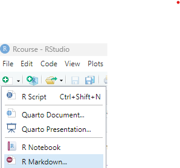

<style>
h1, h2, h3, h4, h5, h6 {
  direction: rtl;
}
p {
  direction: rtl;
}
.text-block1 {
  direction: rtl;       /* Set text direction to right-to-left */
  text-align: right;
  background-color: #e7f3fe; /* Light grey background */
  padding: 10px;
  border-radius: 5px;
  border: 1px solid #ddd; /* Light border */
  margin: 10px 0; /* Space around the block */
}


.extra_functions {
  direction: rtl;       /* Set text direction to right-to-left */
  text-align: right;
  background-color: #f0e6d3; /* Light grey background */
  padding: 10px;
  border-radius: 5px;
  border: 1px solid #9c8e73; /* Light border */
  margin: 10px 0; /* Space around the block */
}

</style>

```{r setup, include=FALSE}
library(learnr)
library(gradethis)
library(Rcourse)
library(ggplot2)
library(tidyverse)

knitr::opts_chunk$set(error = TRUE)
knitr::opts_chunk$set(warning = FALSE)

gradethis::gradethis_setup()


df = data.frame(subject = rep(c("Bruce","Jemima","Chanique","Marvin"),each = 10),
                score = rep(c(70,80,85,75),each = 10) + rnorm(40,0,5))

{
slopes = c(0.5, 0.7, 0.3, 0.6, 0.8)
intercepts = c(2, 3, 1, 2.5, 3.5)
names = c("Yocheved","Alfred","Dilan","Shoshkeh", "Noam")

social_sleep  = data.frame()

for (i in 1:5){
  name = names[i]
  slope = slopes[i]
  intercept = intercepts[i]
  
  sleep = rnorm(30, 7, 1)
  social = slope*sleep + intercept + rnorm(30, 0, 1)
  
  temp_df = data.frame(name = name,
                       day = 1:30,
                       sleep = sleep,
                       social = social)
  social_sleep = bind_rows(social_sleep, temp_df)
}

social_sleep  = social_sleep  %>% mutate(sleep = round(sleep,1),
                                         social = round(social))

social = social_sleep %>% select(-sleep)

}

{
exercises_df = data.frame(exercises = c("loops_ex1", "loops_ex2", "loops_q1", "loops_q2", "loops_ex3", "loops_q3",
                                        "functions_q1", "functions_exercise", "functions_q2", "no_return",
                                        "summary_q1", "summary_q2"),
                          hebrew = c("לולאות: יצירת לולאה", "לולאות: תרגיל נוסף","לולאות: שאלה 1", "לולאות: שאלה 2","לולאות: מתאם בין שינה וחברתיות","לולאות: הטלת קובייה",
                                     "פונקציות: שאלה 1", "פונקציות: כתיבת פונקציה", "פונקציות: שאלה 2", "פונקיות: תיקון פונקציה",
                                     "תרגיל מסכם: שאלה 1" , "תרגיל מסכם: שאלה 2"
                                     ))
  


check_hash_code   = function(hash){
    exercises = exercises_df$exercises
    response_table = learnrhash::decode_obj(hash)
    if (length(response_table)==0){return("Invalid hash code")}
    correct = response_table %>% filter(label %in% exercises, correct) %>% pull(label)
    incorrect = setdiff(exercises, correct)
    if (length(incorrect) == 0){return("Great work! Hash code is valid")}
    else{
      hebrew = exercises_df  %>% filter(exercises %in% incorrect) %>%pull(hebrew)
      print("The following exercises are missing or incorrect:")
      print(hebrew)
    }

} 
}# hash checker
```

```{r prepare-social_sleep}
set.seed = c(12345)
slopes = c(0.5, 0.7, 0.3, 0.6, 0.8)
intercepts = c(2, 3, 1, 2.5, 3.5)
names = c("Yocheved","Alfred","Dilan","Shoshkeh", "Noam")

social_sleep  = data.frame()

for (i in 1:5){
  name = names[i]
  slope = slopes[i]
  intercept = intercepts[i]
  
  sleep = rnorm(30, 7, 1)
  social = slope*sleep + intercept + rnorm(30, 0, 1)
  
  temp_df = data.frame(name = name,
                       day = 1:30,
                       sleep = sleep,
                       social = social)
  social_sleep = bind_rows(social_sleep, temp_df)
}

social_sleep  = social_sleep  %>% mutate(sleep = round(sleep,1),
                                         social = round(social))

social = social_sleep %>% select(-sleep)
```

```{r prepare-func1}
mystery_function <- function(celsius) {
    fahrenheit <- (celsius * 9/5) + 32
    return(fahrenheit)
}
```

```{r prepare-func2}
mystery_function_2 <- function(x, value) {
    n_below <- sum(x < value)
    n <- length(x)
    report = paste0(n_below / n * 100, "%")
    return(report)
}
```

## מבוא

ביחידה זו נלמד על לולאות קוד, פונקציות ועל שיטות לשמור קבצי קוד בצורה מסודרת וקלה לניהול.

## לולאות

עקרון מנחה חשוב בכתיבת קוד יעיל הוא הימנעות מחזרה על קוד מספר פעמים.

אם, למשל, אנחנו מעוניינים לעשות את אותה הבדיקה על ארבעה שאלונים שונים -
אנחנו נרצה להימנע מלכתוב את הקוד שמבצע את הבדיקה ארבע פעמים, כאשר ההבדל
היחיד בין החזרות הוא שם השאלון.

במקום זאת נוכל להשתמש בלולאה.

### הגדרת לולאה

לולאת קוד מוגדרת בצורה הבאה:

```{r loop_example,eval=FALSE}
for (object in vector){
  # Do stuff with each object
  
}
```

למשל:

```{r loop_example_2}
for (i in c("a","b","c")){
  print(i)
}
```

::: text-block1
הלולאה מורכבת משני חלקים:

**1. הגדרת הלולאה:** שורת הפתיחה של הלולאה (`for (i in c("a","b","c"))`)
מגדירה על אילו אובייקטים אנחנו רוצים שהלולאה תרוץ בכל אחד מהסבבים (או בלעז: איטרציות) שלה. במקרה שלנו מדובר
באיברים של הוקטור `c("a","b","c")`. הלולאה תרוץ על כל אחד מהאיברים, לפי
הסדר, ותייצג כל אחד מהם בתורו באמצעות `i`.

**2. הגדרת הלולאה עצמה:** חלק זה תחום בתוך הסוגריים המסולסלים `{}` שבאים
מיד אחרי הגדרת הלולאה וכולל את הקוד שיתבצע בכל סבב שלה.

בדוגמה שלנו החלק זה כולל את הקוד `print(i)`.
:::

במקרה הנ"ל התוכנה תיקח את האיבר הראשון של הוקטור `c("a","b","c")`, תציב
אותו בתור `i` ותבצע את הקוד שנמצא בתוך הסוגריים המסולסלים - תדפיס את
ערכו ("a").

לאחר השלמת הסבב הראשון, התוכנה תחזור לתחילת הלולאה, תציב בתור `i` את
האיבר השני בוקטור - האות "b", ותבצע את הלולאה שוב. הפעם היא תדפיס "b".

בסבב השלישי התוכנה תציב ב`i` את האיבר השלישי בוקטור - "c", ותדפיס "c".

לאחר שסיימה לעבור על כל הערכים בוקטור, הלולאה תסתיים והתוכנה תעבור לבצע
את קטע הקוד הבא שביקשנו ממנה להריץ.

`תרגיל`

צרו לולאה המדפיסה את המספרים בין 1 ל5, אחד בכל סבב.

```{r loops_ex1, exercise=TRUE, exercise.eval = FALSE}

 
```

```{r loops_ex1-solution}
for (i in 1:5){
  print(i)
}
 
```

```{r loops_ex1-check}
grade_this({
  # extract all printed text from the evaluation result
  printed_output <- paste0(
    vapply(.evaluate_result, function(x) {
      if (is.character(x)) x else ""
    }, character(1)),
    collapse = ""
  )
  
  expected <- "[1] 1\n[1] 2\n[1] 3\n[1] 4\n[1] 5\n"
  
  if (identical(printed_output, expected)) {
    pass("מעולה")
  } else {
    fail("נסו שוב")
  }
})
```


`תרגיל נוסף`

השלימו את הקוד בלולאה הבאה כך שידווח על הציונים של כל משתתף. בכל חזרה של
הלולאה אנחנו נרצה שהיא תיגש לשורה אחרת בטבלה שלנו (לפי מספר הסבב של הלולאה), תשלוף
את השם ואת הציון של הנבדק שאותה שורה מייצגת ותדפיס דיווח על הציון של
אותו הנבדק.

```{r loops_ex2, exercise=TRUE, exercise.eval = FALSE}

data = data.frame(name = c("David","Pnina","Yossi","Rina"),
                  score = c(80,90,70,85))

for (i in 1:nrow(data)){
  # get name
  name = __________
  
  # get score
  score = _________
  
  report = paste(name, "Scored",score,"points")
  print(report)
}
 
```

```{r loops_ex2-solution}

data = data.frame(name = c("David","Pnina","Yossi","Rina"),
                  score = c(80,90,70,85))

for (i in 1:nrow(data)){
  # get name
  name = data$name[i]
  
  # get score
  score = data$score[i]
  
  report = paste(name, "Scored",score,"points")
  print(report)
}
 
```

```{r loops_ex2-check}

grade_this({
  
printed_string = "[1] \"David Scored 80 points\"\n[1] \"Pnina Scored 90 points\"\n[1] \"Yossi Scored 70 points\"\n[1] \"Rina Scored 85 points\"\n"

  if (identical(.evaluate_result[[4]],
                printed_string)) {
    pass("מעולה")
  }
  fail("נסו שוב")
})

```

הלולאה תעבור על כל הערכים בוקטור `1:nrow(data)` (במקרה הזה, המספרים מ1
עד 4) ותשמור את הערך כ`i`. נשתמש בערך זה לשליפת השם והציון של הנבדק
בשורה המתאימה בכל סבב של הלולאה.

::: extra_functions
הפונקציות `paste` ו`paste0` משמשות כדי לחבר יחד מחרוזות.
בדוגמה הקודמת הפונקציה משלבת את שם הנבדק והציון שלו לכדי משפט קוהרנטי.

ההבדל בין הפונקציות הוא בכך ש`paste` מוסיפה רווחים בין המחרוזות שהיא
מחברת ואילו `paste0` לא מוסיפה רווחים
:::

### עריכת אובייקטים באמצעות לולאות

בדרך כלל נרצה שהלולאות יעשו יותר מאשר רק לשלוף ולהדפיס ערכים. נוכל להיעזר בהן כדי לייצר, לערוך ולייצא אובייקטים.

למשל, כך תראה לולאה המחשבת את סדרת פיבונאצ'י - סדרת מספרים בה כל מספר הוא סכומם של שני המספרים הקודמים.

כשנערוך את המשתנה n בשורת הקוד הראשונה נוכל לשלוט בכמות הפעמים שהלולאה תחזור על עצמה, ובהתאם את אורך הוקטור שנקבל. נסו בעצמכם.

```{r fibonacci,exercise=TRUE, exercise.eval = FALSE}
n = 10 # אורך הסדרה הרצויה

fibonacci = c(1,1) # נתחיל עם שני המספרים הראשונים בסדרה

#  נבצע מספר חזרות כאורך הסדרה הרצוי
#  מאחר והתחלנו עם וקטור באורך 2, נתחיל את הלולאה בערך 3
for (i in 3:n){ 
  # עבור כל מספר מ3 ועד לאורך הרצוי, נחשב:
  
  last = fibonacci[i-1]          # את הערך האחרון בוקטור עד כה
  before_last = fibonacci[i-2]   # את הערך שלפניו
  new_number = last + before_last # ונחשב בעזרתם את הערך הבא
  
  # נוסיף את הערך הבא לוקטור במיקום המתאים (אינדקס 3 בסבב הראשון, 4 בשני וכו')
  fibonacci[i] = new_number
}

# אחרי שסיימנו את הלולאה - נדפיס את הוקטור שקיבלנו
print(fibonacci) 
```


נוכל להיעזר בלולאות גם כדי לבצע ניתוחים על הנתונים שלנו, למשל:

```{r loop_example_3,eval=FALSE}
# נניח שקיימת טבלה טעונה בשם
# data
# המכילה ציונים עבור נבדקים שונים בשלושה שאלונים

Questionaires = c("anxiety","depression","stress")
 
for (q in Questionaires){
  fitlered_data = data %>% filter(Questionaire == q)    # filter data
  plot = ggplot(fitlered_data, aes(x = score)) +        # create plot
    geom_histogram()  
   
  filename = paste0(q, ".png")                          # create filename
  ggsave(filename, plot)                                # save plot as image
}
 
```


```{r loops_q1, echo = FALSE}
question("<div style='direction: rtl;'>
מה מבצעת הלולאה?
         </div>",
         
         answer("הלולאה מחשבת את הממוצע של ציוני המשתתפים בכל שאלון",
                message = "נסו שוב! שימו לב שהלולאה אינה מבצעת חישובים על הנתונים"),
         answer("הלולאה מייצרת תרשים המשווה בין הציון הממוצע בכל שאלון",
                message = "נסו שוב! שימו לב שהלולאה מייצרת תרשים נפרד בכל סבב"),
         answer("הלולאה מייצרת שלושה עותקים של אותו התרשים, המכיל את פיזור הציונים בשלושת השאלונים",
                message = "נסו שוב! שימו לב שבכל סבב של הלולאה התרשים שנוצר מתבסס על נתונים אחרים"),
         answer("הלולאה מייצרת תרשים נפרד עבור פיזור הציונים בכל שאלון ושומרת אותו כתמונה", correct = TRUE),
         allow_retry = TRUE,
         
         
  correct="תשובה נכונה. בכל סבב של הלולאה היא חותכת מתוך הטבלה את השורות הרלוונטיות לשאלון, מייצרת היסטוגרמה עבור ציוני שאלון זה, מייצרת את שם הקובץ על סמך שם השאלון ושומרת בשם זה את התרשים.", 
  incorrect = "נסו שוב"
)
```

שימו לב שאפשר להשתמש בכל שם שנרצה עבור האובייקט שמשתנה בכל סבב של
הלולאה. במקרה הנ"ל קראנו לו `q` והשתמשנו בו תחת שם זה לאורך הלולאה.


### שמירת תוצרי הלולאה

בדוגמה בה חישבנו את סדרת פיבונאצ'י נעזרנו בהשמה לוקטור במיקום `i` כדי לשמור את הערכים שחישבנו בכל סבב של הלולאה.

נוכל להיעזר בשיטה זו גם כדי לשמור תוצרים שחושבו מתוך הנתונים שלנו. למשל:


```{r loops_save_example_1,  exercise=TRUE, exercise.eval = FALSE}
# וקטור ריק
means = c()

subjects = df$subject %>% unique() # וקטור המכיל את שמות / מספרי הנבדקים
                                   # כשכל שם מופיע רק פעם אחת
for (i in 1:length(subjects)){
  subj_data = df %>% filter(subject == subjects[i]) # שליפת נתוני הנבדק
  subj_mean = subj_data %>%                         # חישוב הציון הממוצע
    pull(score) %>%
    mean() 
  
  means[i] =  subj_mean  # הוספת ממוצע הנבדק לוקטור התוצאות
}

print(means)
```

כאן, השורה `means[i] =  subj_mean` מבצעת את ההשמה ומוסיפה את הממוצע של הנבדק לוקטור `means`.


נוכל לעשות פעולה דומה באמצעות הפקודה `c()`.  
הפעם, אנחנו לא נעזרים בהשמה לאינדקס `i` אלא מצרפים את הוקטור שייצרנו עד כה יחד עם הערך החדש ובכך מייצרים וקטור הכולל גם אותו.


```{r loops_save_example_2,  exercise=TRUE, exercise.eval = FALSE}
# וקטור ריק
means = c()

subjects = df$subject %>% unique() # וקטור המכיל את שמות / מספרי הנבדקים
                                   # כשכל שם מופיע רק פעם אחת
for (subj in subjects){
  subj_data = df %>% filter(subject == subj) # שליפת נתוני הנבדק
  subj_mean = subj_data %>%                  # חישוב הציון הממוצע
    pull(score) %>%
    mean() 
  
  means = c(means, subj_mean)  # הוספת ממוצע הנבדק לוקטור התוצאות
}

print(means)
```


תהליך השמירה כאן מתבצע באמצעות כך שאנחנו מייצרים וקטור חדש המכיל גם את כל מה שהוקטור `means` מכיל וגם את התוצאה החדשה שלנו, ואז שומרים את הוקטור הזה במקום וקטור התוצאות הישן. אנחנו דורסים את הגרסה הישנה של הוקטור ומחליפים אותו בוקטור המעודכן. 

  
שיטה זו מאפשרת לנו להשתמש בלולאות שרצות על אובייקטים שאינם מבטאים את מספר החזרה של הלולאה (כמו בדוגמה של יצירת היסטוגרמה לכל שאלון). החיסרון כאן הוא שבמידה ולא הקפדנו לאתחל את הוקטור כוקטור ריק לפני כל פעם שאנחנו מריצים את הלולאה, הלולאה תמשיך להוסיף אליו עוד איברים.

כל עוד אפשר - השיטה המומלצת היא השמה לפי אינדקס.


במקרים בהם אנחנו רוצים לשמור מספר תוצאות בכל סבב  של הלולאה אנחנו יכולים לייצר מספר וקטורים ריקים שונים ולשמור בכל אחד תוצאה אחרת.

למשל וקטור נפרד לממוצעים, סטיות תקן, ערך מינמום וכו'.

לרוב, יהיה יותר נח לשמור את התוצאות יחד בטבלה - שאליה נוסיף שורה, או מספר שורות, בכל סבב של הלולאה (באופן דומה להוספת הערכים בסוף הוקטור בדוגמה הקודמת).
  

```{r loops_save_example_3,  exercise=TRUE, exercise.eval = FALSE}

results = data.frame()# טבלה ריקה

subjects = df$subject %>% unique() # וקטור המכיל את שמות / מספרי הנבדקים
                                   # כשכל שם מופיע רק פעם אחת
for (subj in subjects){
  subj_data = df %>% filter(subject == subj) # שליפת נתוני הנבדק
  subj_summary = subj_data %>%                  # חישוב מדדים שונים
    summarise(mean = mean(score),            # הסיכום ייצר טבלה עם שורה בודדת
              sd = sd(score),                # הכוללת את מספר הנבדק ועמודה עבור כל מדד
              n = n(),
              min = min(score),
              max = max(score))
  
  results = bind_rows(results, subj_summary)  # הוספת שורה לטבלה
}

print(results)
```

  
    
    

את טבלה זו יכולנו לייצר גם באמצעות שימוש בפונקציה `group_by`, אבל יהיו מקרים בהם ניהיה חייבים להיעזר בלולאות.

למשל:


```{r loops_save_example_4,eval=FALSE}

data_file_names = c("data_1", "data_2", "data_3")

df = data.frame()   # טבלה ריקה

for (file_name in data_file_names){
  temp_df = read.csv(paste0("folder/",file_name,".csv"))
  temp_df = temp_df %>%
    mutate(source = file_name)  # הוספת עמודה המציינת את מקור הנתונים
  
  df = bind_rows(df, temp_df)   # הפונקציה תצרף לטבלה שורות חדשות בכל סבב
}
```

```{r loops_q2, echo = FALSE}
question("<div style='direction: rtl;'>
מה מבצעת הלולאה בקטע הקוד האחרון?
</div>",
         
         answer("מחליפה את שמותיהם של שלוש טבלאות נתונים"),
         answer("מפצלת טבלה לשלוש טבלאות נפרדות"),
         answer("מייצרת שלושה טבלאות נפרדות, ושומרת אותן כשלושה קבצים נפרדים"),
         answer("טוענת טבלאות משלושה קבצים ומאחדת אותן לטבלה אחת", correct = TRUE),
         allow_retry = TRUE,
         
  correct="תשובה נכונה", 
  incorrect = "נסו שוב"
)
```

### תרגיל בניית לולאה

הנתונים בטבלה `social` מתארים את שעות השינה וציוני החברתיות עבור 5
נבדקים בכל יום במשך חודש.

הצצה לשורות הראשונות בטבלה:

```{r, echo = F}
head(social, 4)
```

`תרגיל` חשבו את ממוצע החברתיות עבור כל נבדק באמצעות לולאה.


```{r loops_ex3, exercise=TRUE, exercise.eval = FALSE}

subjects = c("Yocheved","Alfred","Dilan","Shoshkeh", "Noam")

# וקטור ריק שיכיל את הממוצעים
social_means = c()

# בנו את הלולאה כאן
for (){
}


# יצירת תרשים על סמך התוצאות
ggplot(data.frame( name = subjects,
                   social_mean = social_means))+
  geom_col(aes(x = name, y = social_means), fill = "#418267")+
  ylab("Mean rating")+
  theme_minimal()

```

```{r loops_ex3-solution}

subjects = c("Yocheved","Alfred","Dilan","Shoshkeh", "Noam")

social_means = c()

# בנו את הלולאה כאן
for (i in 1:length(subjects)){
  subj = subjects[i]
  subj_data = social %>% filter(name == subj)
  subj_mean = mean(subj_data$social)
  
  social_means[i] = subj_mean 
}


# יצירת תרשים על סמך התוצאות
ggplot(data.frame( name = subjects,
                   social_mean = social_means))+
  geom_col(aes(x = name, y = social_means), fill = "#418267")+
  ylab("Mean rating")+
  theme_minimal()
```

```{r loops_ex3-check}

grade_this({
if (identical(user_object_get("social_means"),
              solution_object_get("social_means"))){
     pass("עבודה מצוינת!")
   } else {
     fail("ישנה טעות בקוד. נסו שוב")
   }
})

```

### לולאות בתוך לולאות

את התרגיל הקודם יכולנו לפתור גם באמצעות הכלים שלמדו בסמסטר בקודם -
באמצעות הפונקציות `group_by` ו `summarise`. לעומת זאת, לולאות מאפשרות
לנו גם לבצע ניתוחים נוספים, שאינם אפשריים (או אינם נוחים) בכלים שלמדנו
קודם.

למשל, יכול להיות שנתעניין בהפרשי החברתיות בין כל צמד משתתפים.

כדי לחשב הפרש שכזה נצטרך להשוות בין כל צמד משתתפים. נוכל לעשות זאת באמצעות לולאה שנמצאת בתוך לולאה נוספת:

הלולאה הראשונה תבחר נבדק אחד, והשנייה תערוך השוואה של נבדק זה אל מול כל
שאר הנבדקים אחד אחד. כשהלולאה השנייה תסיים - הלולאה הראשונה תעבור לנבדק הבא והשנייה תשווה את כל הנבדקים אליו וכן הלאה.

```{r nested_loops_example, exercise=TRUE, exercise.eval = FALSE, exercise.setup = "prepare-social_sleep", exercise.lines = 36}

subjects = c("Yocheved","Alfred","Dilan","Shoshkeh", "Noam")

df = data.frame(subj1 = c(), # טבלה ריקה 
                subj2 = c(),
                mean_diff = c())

for (subj1 in subjects){
  for (subj2 in subjects){
  
      subj1_social = social %>% 
        filter(name == subj1) %>%
        pull(social) %>%
        mean()                         # ממוצע דירוגי החברתיות של נבדק אחד
      
      subj2_social = social %>%
        filter(name == subj2) %>%
        pull(social) %>%
        mean()                         # ממוצע דירוגי החברתיות של נבדק נוסף
      
      mean_diff = subj1_social - subj2_social # נחשב את הפרשי החברתיות
      
      new_row = data.frame(subj1 = subj1, 
                           subj2 = subj2,          # נסדר את שמות הנבדקים שביניהם חישבנו את ההפרש
                           mean_diff = mean_diff)  # ואת ההפרש עצמו בתור שורה בטבלה
      
      df = bind_rows(df, new_row)         # נצרף את השורה שיצרנו לטבלה הכללית
  }
}

print(head(df))   # נדפיס את השורות הראשונות של הטבלה שיצרנו

```

### שימוש בלולאות לטובת סימולציות

שימוש חשוב נוסף של לולאות מאפשר לנו לייצר הדמיה (או בלעז: סימולציה) של
תהליכים המכילים אקראיות. במקרים כאלו נרצה לחזור שוב ושוב על התהליך כדי
לגבש הבנה טובה יותר של התפלגות התוצאות שאנחנו יכולים לקבל.

למשל, נוכל לבצע סימולציה כדי לבדוק את התפלגות הערכים הצפויים עבור סכומם
של שתי הטלות קובייה.

```{r simulation_cube}
results = c()
n_iterations = 10000

for (i in 1:n_iterations){             # נחזור על התהליך 1000 פעם
  result1 = sample(x = 1:6, size = 1)  # הטלה ראשונה: נדגום אקראית מספר מ1 עד 6
  result2 = sample(x = 1:6, size = 1)  # הטלה שנייה: נדגום מספר נוסף
                                       # נלמד עוד על השימוש בפונקציה זו ביחידה הבאה
  
  sum_of_both = result1 + result2      # נחשב את סכום 2 ההטלות
  
  results[i] = sum_of_both             # נוסיף את הסכום שקיבלנו לוקטור
}

results_sum = data.frame(value = results) %>%   # נעביר את התוצאות לוקטור
  group_by(value) %>%                           # ונסכם את כמות ואחוז הפעמים שקיבלנו כל תוצאה
  summarise(n = n(),
            percent =n/n_iterations)


ggplot(results_sum, aes( x = factor(value),   # נמחיש את התוצאות: הגדרת צירים
                         y = percent))+  
  geom_col(fill = "lightblue")+               # הוספת עמודות
  labs(x = "Sum", y = "Percent")+
                                              # שינוי הפורמט בו מוצגים האחוזים
  scale_y_continuous(labels = function(x) paste0(round(x*100),"%"))+
  theme_minimal()

```

ענו על השאלה הבאה על סמך תוצאות הסימולציה:

```{r loops_q3, echo = FALSE}

question(
  "<div style='direction: rtl;'>
  מה הסיכוי (בקירוב) להטיל שתי קוביות שסכום תוצאות ההטלה שלהן הוא 3?
  </div>",
  answer("25%"),
  answer("15%"),
  answer("10%"),
  answer("5%", correct = TRUE),
  allow_retry = TRUE,
  
  correct="מעולה!", 
  incorrect = "נסו שוב"
)

```

ביחידה הבאה נלמד בצורה מעמיקה יותר על סימולציות, השימושים השונים בהן
ואיך עורכים אותן.

## פונקציות

דרך נוספת בה אנחנו יכולים לעשות שימוש חוזר באותו הקוד כוללת הגדרה של
פונקציות.

מבחינה רעיונית, שיטה זו דומה מאוד לשימוש בלולאות, אבל במקום להריץ את
הקוד שבלולאה מספר פעמים ברצף אנחנו "אורזים" אותו לשימוש עתידי - כך שנוכל
להשתמש בו בצורה נוחה מתי שיהיה לנו צורך בכך במקום לכתוב מחדש את כל קטע
הקוד.

הגדרה של פונקציה תיראה כך:

```{r functions_example}
my_function = function(a,b){
  # do stuff
  c = a+b
  
  return (c)
}

#שימוש בפונקציה
result = my_function(a = 1, b = 2)

```

בניגוד ללולאות, פונקציות מכילות 2 חלקים נוספים:

**1) הגדרת הארגומנטים שהפונקציה מקבלת:** בדוגמה הנ"ל הפונקציה מצפה לקבל
מאיתנו 2 ערכים, אותם היא מכנה `a` ו`b`.

**2) הגדרת הערכים שהפונקציה מחזירה:** הפקודה `return`בסוך הפונקציה קובעת את התוצר שנקבל כשנשתמש
בפונקציה. בדוגמה הנ"ל הפונקציה מחזירה את האובייקט `c` המכיל את הסכום של שני המספרים שהפונקציה קיבלה
מאיתנו.

  שימו לב: אובייקטים שנייצר בתוך פונקציה לא יישמרו. התוצר היחיד שנקבל מהפונקציה הוא האובייקט שהפונקציה מחזירה. 


בRstudio, כשנריץ את שורות הקוד שמגדירות את הפונקציה נוכל לראות אותה מתווספת לחלונית הEnvironment. מרגע זה ועד שננקה את סביבת העבודה שלנו - נוכל להשתמש בפונקציה.  

### דוגמא

לפניכם קוד המגדיר פונקציה. נסו להבין את מטרתה.

```{r functions_example_2}
mystery_function <- function(celsius) {
    fahrenheit <- (celsius * 9/5) + 32
    return(fahrenheit)
}
```

```{r guess_function_1,exercise=TRUE, exercise.eval = FALSE, exercise.setup = "prepare-func1" }

mystery_function( celsius = 200)

mystery_function( celsius = c(150, 175, 200, 225, 250))

```

```{r functions_q1, echo = FALSE}

question(
  "<div style='direction: rtl;'>
  מה מטרתה של הפונקציה?
  </div>",
  answer("המרה של טמפרטורה ממעלות פרנהייט למעלות צלזיוס"),
  answer("המרה של טמפרטורה ממעלות צלזיוס למעלות פרנהייט", correct = TRUE),
  answer("המרת נתוני טמפרטורה מטבלה לוקטור"),
  answer("שמירת נתוני הטמפרטורה כטבלה"),
  allow_retry = TRUE,
  
  correct="מעולה!", 
  incorrect = "נסו שוב"
)

```

שימו לב: הפונקציה הנ"ל יכלה לקבל בתור הארגומנט `celsius` אובייקטים שהינם מספר בודד או וקטור של מספרים. אם היינו מנסים להשתמש בה עם ערכים שאינם מספריים היינו מקבלים הודעת שגיאה.


### תרגיל כתיבת פונקציה

כתבו פונקציה המקבלת וקטור של מספרים ומחזירה אותו בתור ציוני תקן.

כדי לעשות זאת הפונקציה תצטרך לחשב את הממוצע וסטיית התקן של הוקטור שהיא קיבלה, ואז להשתמש בערכים אלו כדי לחשב את ציוני התקן

לנוחותכם, ציוני תקן מחושבים כך: $Z(x) = (x-\mu_{group})/\sigma_{group}$
  

```{r functions_exercise,exercise=TRUE, exercise.eval = FALSE }
Z_score_function = # כתבו את הפונקציה כאן


  
# אל תשכחו להחזיר את וקטור ציוני התקן באמצעות
# return
# בסוף הפונקציה
  
  
# השאירו את שורות הקוד הבאות כפי שהן
# השורות מיישמות את הפונקציה על וקטור ומדפיסות את הוקטור שהתקבל 
test_vector = 1:10
z_test_vector = Z_score_function(test_vector)
print(z_test_vector)
  
```

```{r functions_exercise-solution}
Z_score_function = function(vec){
  z = (vec - mean(vec)) / sd(vec)
  
  return (z)
}
  
  
# השאירו את שורת הקוד הבאה כפי שהיא
# השורה מיישמת את הפונקציה על וקטור ומדפיסה את התוכן שלו 
test_vector = 1:10
z_test_vector = Z_score_function(test_vector)
print(z_test_vector)
```

```{r functions_exercise-check}
grade_this({
if (identical(user_object_get("z_test_vector"),
                 solution_object_get("z_test_vector"))){
     pass("עבודה מצוינת!")
   } else {
     fail("ישנה טעות בקוד. נסו שוב")
   }
  
})
```

### דוגמה נוספת

התבוננו בדוגמה הבאה ונסו להבין את ייעודה של הפונקציה:

```{r functions_example_3}
mystery_function_2 <- function(x, value) {
    n_below <- sum(x < value)
    n <- length(x)
    report = paste0(n_below / n * 100, "%")
    return(report)
}

```

```{r guess_function_2,exercise=TRUE, exercise.eval = FALSE, exercise.setup = "prepare-func2" }

mystery_function_2( x = 1:10, value = 5)
```

```{r functions_q2, echo = FALSE}

question(
  "<div style='direction: rtl;'>
  מה הפונקציה מבצעת?
  </div>",
  answer("חישוב הממוצע של וקטור"),
  answer("סינון ערכים הקטנים מערך נתון מתוך וקטור מספרי"),
  answer("חישוב אחוז הערכים הקטן מערך נתון בוקטור מספרי", correct = TRUE),
  answer("המרת וקטור עם נתוני שכיחות לאחוזים"),
  allow_retry = TRUE,
  
  correct="מעולה!", 
  incorrect = "נסו שוב"
)

```

`תרגיל`

הקוד הבא אמור לייצר פונקציה שמקבלת וקטור מספרי ומחזירה וקטור מספרי
המוגבל לטווח מסויים, כשהערכים שהיו מחוץ לטווח מוחלפים בערכים חסרים.

כרגע, הקוד מדפיס ערך חסר.

זהו את הבעיה ותקנו אותה, כך שהקוד ימלא את הייעוד שלו.


```{r no_return, exercise=TRUE, exercise.eval = FALSE}
limit_range <- function(vec, limits){
  # הפונקציה מקבלת וקטור מספרי
  # ווקטור נוסף המכיל 2 ערכים המציינים את קצוות הטווח הרצוי
  
  # הפונקציה מייצרת ומחזירה וקטור שבו הערכים שהיו מחוץ לטווח מוחלפים בערכים חסרים
  
    out_of_limits = vec < limits[1] | vec > limits[2]
    vec[out_of_limits] = NA
}

test_vector = 1:10
test_limits = c(3,7)
print(limit_range(vec = test_vector, limits = test_limits))

```

```{r no_return-hint-1}
האם הפונקציה מחזירה ערך כלשהו?
```

```{r no_return-hint-2}
כדי להחזיר ערך, הפונקציה צריכה לכלול את הפקודה 
return(object_to_be_returned)
```

```{r no_return-check}
grade_this({
  
  vec = 2:30
  limits = c(10,20)
  
  f = user_object_get("limit_range")
  test = f(vec, limits)
  
  out_of_limits = vec < limits[1] | vec > limits[2]
  vec[out_of_limits] = NA
  
if (identical(test, vec)){
     pass("עבודה מצוינת!")
   } else {
     fail("ישנה טעות בקוד. נסו שוב")
   }
  
})

```

## ניהול קבצי קוד


חלק זה של הלומדה לא נועד ללמד חומר חדש, אלא לציין מספר דגשים ולהכיר לכם מיומניות שמאפשרים ניהול יעיל של קבצי קוד.
במהלכו נתייחס לדרכים לשמור על קוד מסודר וקריא, על האפשרות לפצל את הקוד למספר קבצים נפרדים ועל הדרכים בהן נוכל לשמור את תוצרי הניתוח ולדווח על תוצאותיו. 


### הערות וקיפולי קוד

כמה כלים פשוטים לניהול קוד ברור ומסודר:

**1) הערות:** ההמלצה הנפוצה היא להוסיף כמה שיותר הערות - כדי להסביר את
המטרה של כל שורת קוד וכל מקטע. זה אמנם ידרוש מכם עוד כמה שניות בזמן
הכתיבה אבל זה מאוד עוזר בהתמצאות בקוד אח"כ, ומייסע לסדר לעצמכם את מהלך
הניתוח.

**2) חלוקה לפרקים:** כלי שימושי נוסף כולל חלוקה של קובץ הקוד לפרקים, לפי
חלקי הניתוח השונים. ניתן לייצר כותרות לפרקים באמצעות הוספת ארבעה `#`
בסופה של הערה ולהסתיר את התוכן של הפרק על ידי לחיצה משמאל לכותרת
בRstudio. בנוסף נוכל לנווט בין הכותרות השונות באמצעות כפתור שמופיע בצד
השמאלי של תחתית חלון הקוד או באמצעות חלונית הניווט, אותה ניתן לפתוח
באמצעות כפתור ה"Outline" שבפינה הימנית העליונה של המסך.

**3) קיפולי קוד:** דרך נוספת לצמצם קטעי קוד נעזרת בסוגריים מסולסלים -
`{}`. אם נקיף קטע קוד בסוגריים אלו נוכל לצמצם את קטע הקוד גם מבלי להגדיר
כותרות ופרקים חדשים. מומלץ להוסיף הערה אחרי הסוגר השני ולפרט בה מה הקוד
המקופל עושה, כדי שנוכל לעקוב אחרי מטרת הקוד מבלי לבטל את הצמצום.

מומלץ להשתמש בשלושת השיטות כדי להבטיח שהקוד שלכם יהיה מסודר ונח לקריאה.


{width="100"}

העתיקו את הקוד הבא לRstudio ונסו בעצמכם (קיפולי קוד לא עובדים בלומדה).

```{r comments_example, eval = F}
# 'קטע הקוד הבא נועד כדי להדגים שימוש בהערות, ראשי פרקים וקיפולי קוד
#לחצו על החץ הקטן ליד מספר השורה כדי להסתיר את קטע הקוד הרלוונטי


#  יצירת נתוני דמה וטעינת חבילות #### 

{
  library(dplyr)
  library(ggplot2)
} # טעינת החבילות
{
  
  # נתונים עבור יצירת הנתונים
  slopes = c(0.5, 0.7, 0.3, 0.6, 0.8)
  intercepts = c(2, 3, 1, 2.5, 3.5)
  # שמות הנבדקים
  names = c("Yocheved","Alfred","Dilan","Shoshkeh", "Noam")
  
  social_sleep  = data.frame() # טבלה ריקה
  
  for (i in 1:5){   # לולאה שעוברת על כל נבדק ומייצרת עבורו נתוני דמה
    # שליפת הפרמטרים עבור הנבדק
    name = names[i]
    slope = slopes[i]
    intercept = intercepts[i]
    
    sleep = rnorm(30, 7, 1)                           # דגימה אקראית של שעות השינה
    social = slope*sleep + intercept + rnorm(30, 0, 1)# חישוב מידת החברתיות על סמך שעות השינה
    
    temp_df = data.frame(name = name,             # ארגון נתוני הנבדק בטבלה
                         day = 1:30,
                         sleep = round(sleep,1),
                         social = round(social))
    
    social_sleep = bind_rows(social_sleep, temp_df)# הוספת נתוני הנבדק לטבלת הנתונים
  }

} # יצירת טבלת הנתונים באמצעות לולאה

# פרק 2 - סיכום הנתונים ####

{
  social_sleep_summ = social_sleep %>%  # חישוב ממוצע חברותיות ושעות שינה לכל נבדק
    group_by(name) %>%
    summarise(mean_sleep = mean(sleep),
              mean_social = mean(social))
} # סיכום בסיסי לפי נבדק
{
  social_sleep_summ = social_sleep_summ %>%
    group_by()%>% # ביטול של החלוקה לפי נבדק
    mutate(z_sleep = (mean_sleep - mean(mean_sleep))/ sd(mean_sleep), # חישוב ציוני התקן
           z_social = (mean_social - mean(mean_social))/ sd(mean_social))
  
} # חישוב ציון התקן של הממוצעים

# פרק 3 - יצירת תרשים ####

{
  ggplot(social_sleep_summ, aes( x = z_sleep, y = z_social))+
    geom_point(aes(col = name))+ # הוספת נקודה לכל נבדק
    geom_text(aes(label = name, y = z_social + 0.2))+ # הוספת שם הנבדק מעל הנקודה
    theme_minimal()+
    theme(legend.position = "none") # הסרת המקרא
} # תרשים ראשון - פיזור ציוני התקן של הממוצעים

{
  ggplot(social_sleep, aes( x = sleep, y = social, col = day))+
    geom_point(alpha = 0.5)+
    geom_smooth(method = "lm")+
    facet_wrap(~name)
} # תרשים שני - פיזור התצפיות לכל נבדק
```

### שימוש במספר קבצי קוד נפרדים

אמצעי שימושי נוסף כולל חלוקה של הקוד למספר קבצים.

בדרך כלל נייחד קובץ נפרד לכל חלק של הניתוח:
  
**1) טעינת הנתונים ועריכתם:** טעינת טבלאות הנתונים הגולמיות, חישוב
משתנים חשובים וסינון של תצפיות בעייתיות. בסוף הקובץ נשמור את הטבלה / טבלאות הערוכות, שישמשו אותנו להפקת תרשימים וביצוע מבחנים סטטיסטיים. 
  
**3) הניתוח עצמו**: ביצוע מבחנים סטטיסטיים ויצירת תרשימים
 
שיטה זו תאפשר לנו להפריד בין השלב הטכני של סידור ועריכת הנתונים לבין הניתוח עצמו ותחסוך לנו את הצורך להריץ מחדש את שלבי הסינון והעריכה בכל פעם מחדש.

היא גם תעזור לנו להמנע מקבצים ארוכים ומסורבלים.


### ניקוי סביבת העבודה ושמירת אובייקטים

 
כדי לשמור על סביבת העבודה שלנו נקייה נוכל להשתמש בפקודה
`rm(list = ls())`. פקודה זו תמחק את כל האובייקטים שנמצאים בסביבת העבודה
שלנו, ותשאיר אותה ריקה ונקייה.


נכלול את שורת קוד זו בתחילת קבצי הR שלנו כדי לשמור על סביבת העבודה שלנו
נקייה מאובייקטים שנוצרו לפני הרצת הקובץ.


לחלופין, ניתן לבצע את הפעולה הזו ידנית באמצעות כפתור המטאטא שבסרגל הכלים
שבראש חלונית סביבת העבודה (Environment).

## ייצוא תוצאות


השלב האחרון בתהליך עיבוד הנתונים (והנושא האחרון ביחידה זו) כולל את ייצוא התוצאות. לאחר שהפקנו את
התרשימים, ייצרנו את טבלאות הסיכום וביצענו את המבחנים הסטטיסטיים - נרצה
לייצא אותם לטובת דיווח או שיתוף.

אפשר לייצא את התוצאות באופן ידני - על ידי הרצת הקבצים והעתקת התוצאות
והתרשימים לקובץ חיצוני כלשהו אחד אחד, אבל נוכל לעשות זאת גם בצורה נוחה
יותר:

**1) באמצעות פקודות המייצאות את התוצאות:**

את התרשימים נוכל לשמור באמצעות פונקציות כמו `ggsave` המייצאות את
התרשימים כקובץ תמונה.

את התוצאות של הניתוחים הסטטיסטיים נוכל ייצא באמצעות פונקציות המאפשרות לייצר בטבלאות מסודרות עבור ניתוחים שונים. אנחנו לא נתמקד בהן בקורס הזה, אבל לטובת הסקרנים - הנה קישור לדוגמה: <https://rempsyc.remi-theriault.com/articles/t-test>

**2) באמצעות Rmarkdown:**

Rmarkdown הוא כלי המאפשר לנו לייצר מסמכים ודוחות ישירות מתוך R. הוא מכיל
קטעי קוד שמשובצים בתוך מסמך טקסט, ומאפשר לנו להציג את הקוד, הפלטים
והתרשימים שאנחנו מייצרים יחד באופן מסודר ובליווי הסברים מילוליים.


תוכלו לייצר קובץ כזה באמצעות תפריט יצירת קובץ חדש:

{width="200"}
  
  
גם בו לא נתמקד בקורס, אבל נתנסה בו בתרגיל של יחידה זו.


למידע נוסף על Rmarkdown ואופן השימוש בו תוכלו להשתמש באחד המדריכים
הרבים שקיימים ברשת.  
לדוגמה:

[מדריך מסודר המלווה במספר דוגמאות](https://rmarkdown.rstudio.com/)

[קובץ PDF המסכם את הכלים הבסיסיים ליצירת קבצים
בRmarkdown](https://rmarkdown.rstudio.com/lesson-15.HTML)

[מדריך מקיף על השימוש בRmarkdown](https://bookdown.org/yihui/rmarkdown/)

[מדריך מקיף נוסף](https://r4ds.had.co.nz/r-markdown.html)

## תרגיל

{width="100"}
  
כדי לתרגל את הנושאים שנלמדו ביחידה זו נבצע ניתוח הכולל שימוש בלולאות קוד
ופונקציות. ניתוח זה לא יהיה מורכב, אך כדי לתרגל ניהול ניתוחים
מורכבים יותר נבצע אותו באמצעות מספר קבצים נפרדים, כפי שלמדנו ביחידה.

הורידו מהמודל את שני קבצי הקוד ואת קובץ הנתונים שבתיקיית "יחידה
9". ושמרו אותם בתיקיית העבודה שלכם.

הוראות לתרגיל לפי קבצים:
 
  
**"main_analysis_9.R":**

יבאו את קובץ הנתונים.

הנתונים מתארים את ציוניהם של נבדקים ב5 מימדי אישיות מקובלים (Big 5: E, A, O, C, N), בנוסף לכמות הילדים שהיו להוריהם (birthn) ולמיקום שלהם בסדר הילודה (birthpos: 1 מתאר אח בכור, 2 מתאר אח שני וכו').

אנחנו נבצע שתי פעולות על הטבלה כדי להכין את הנתונים לניתוח:

**1)** סינון תצפיות קיצוניות:
    
עבור כל אחד מ5 מדדי הביג 5 - החליפו בערכים חסרים את כל התצפיות שגדולות או קטנות מממוצע המדד ביותר מ2.5 סטיות תקן.

כיוון שתחזרו על פעולה דומה עבור כל מדד, מומלץ להיעזר בכתיבת פונקציה לטובת שלב זה.

לאחר שהמרתם את התצפיות הקיצוניות בערכים חסרים - וודאו שהפעולה הניבה תוצאות תקינות. בדקו שהפונקציה או השיטה שהשתמשתם בה אכן מסננת תצפיות קיצוניות (למשל, באמצעות שימוש בה על הוקטור `c(1:10,1000)`, בו הערך האחרון אמור להיות מזוהה כתצפית קיצונית), וודאו שהטבלה שקיבלתם אכן מכילה ערכים חסרים (התצפית החסרה הראשונה בטבלה אמורה להיות ציון המצפוניות של נבדק 1345). 


**2)** העברה לפורמט ארוך:
  
היעזרו בפונקציה `gather` שנלמדה בסמסטר הקודם כדי לקבץ את חמשת עמודות מדדי הbig 5 יחד.
  
 הטבלה הסופית אמורה להכיל את העמודות הבאות:
   
  `id`: מספר הנבדק  
  `birthpos`: מיקום בסדר ילודה  
  `birthn`: מספר האחים במשפחה  
  `measure`: המדד הרלוונטי מתוך הbig 5  
  `score`: הציון הממוצע במדד הרלוונטי מתוך הbig 5  

הקפידו ששמות העמודות יהיו זהים לתיאור הנ"ל ושמרו את הטבלה כקובץ csv באמצעות הפונקציה הבאה:

`write.csv(object_name, "file_name.csv")`

התאימו את שם האובייקט והקובץ לפי השם בו הטבלה שמורה בסביבת העבודה שלכם בR ושם הקובץ שתרצו לשמור בו את הטבלה.


וודאו שאכן נוצר קובץ csv בתיקיית העבודה שלכם ושהוא מכיל את חמשת העמודות הנ"ל.

  
**"report_results_9.Rmd":**

קובץ זה שונה מקבצי הקוד שאנחנו מכירים מR. זהו קובץ Rmarkdown והוא משמש להפקה של דוחות ומסמכים.

פתחו את הקובץ ומצאו את גוש הקוד עם ההערה "# ייבוא כאן את קובץ הcsv שיצרתם"
  
הוסיפו שם שורת קוד שתייבא את קובץ הRDS שייצרתם באמצעות הפקודה `read_csv`.שמרו את הטבלה המיובאת בשם "long_data".

וודאו ששורת הקוד שהוספתם אכן מצליחה לייבא את הקובץ. במידה והייבוא לא יצליח - נקבל הודעת שגיאה כשננסה להפיק את הדוח. 

אין צורך באף עריכה נוספת.


שימו לב: בשביל ההפקה תדרשו להתקין 2 חבילות נוספות (אחת שמאפשרת את הפקת קבצי Rmarkdown ונוספת שנמצאת בשימוש בקובץ הנ"ל). תוכלו לעשות זאת באמצעות הרצת שורת הקוד הבאה בקונסול:
  
`install.packages(c("rmarkdown","DT"))`

ייתכן ותפתח חלונית השואלת האם ברצונכם לאתחל את R לפני התקנת החבילות. השיבו ב"כן".
  
  
לאחר שהתקנתם את החבילות, הפיקו את הקובץ באמצעות לחיצה על כפתור ה"Knit" המופיע במרכז סרגל הכלים.
  
בדקו את הקובץ שנוצר (הוא יימצא בתיקיית העבודה שלכם ויקרא "report_results_9.html") והעלו אותו, יחד עם שני קבצי הקוד, לתיבת ההגשה של יחידה זו.


עיינו בקובץ הדיווח שנוצר וענו על השאלות הבאות על פי המידע המופיע בו:

```{r summary_q1, echo = FALSE}

question_text(
  "<div style='direction: rtl;'>
  כמה תצפיות קיצוניות זוהו במדד הנעימות (Agreeableness)?
  </div>",
  answer("10", correct = TRUE),
  allow_retry = TRUE,
  
  correct="מעולה!", 
  incorrect = "נסו שוב"
)

```

```{r summary_q2, echo = FALSE}

question_text(
  "<div style='direction: rtl;'>
  מהו ציון הנעימות (Agreeableness) הממוצע עבור אחים בכורים?
  ניתן לברר מידע זה מהטבלה המופיעה בקובץ הדיווח.
  
  עגלו ל2 מקומות לאחר הנקודה העשרונית.
  </div>",
  answer("3.95", correct = TRUE),
  answer("3.94", correct = TRUE),
  allow_retry = TRUE,
  
  correct="מעולה!", 
  incorrect = "נסו שוב"
)

```


בהצלחה!


## משוב 

בחלק זה נבקש את המשוב שלכם על הלומדה. אנא ענו בכנות וביסודיות, על מנת שנוכל להשתפר. התשובות ישמרו בצורה אנונימית ולא ישפיעו על בדיקת התרגיל עצמה.

שימו לב: ברוב השאלות אין אפשרות לשנות את התגובה לאחר לחיצה על כפתור ההגשה

```{r survey_q1, echo = FALSE}

#נשמח לשמוע מכם משוב קצר על הלומדה. 
#המשוב הינו רשות ויעובד בצורה אנונימית.

question(#"כמה קשה הייתה היחידה עבורך?",
          "מה הייתה רמת הקושי של הלומדה עבורך?",
         type="single",
         answer("קלה"        ,correct=TRUE,  message = "תגובתך: קלה"),
         answer("בינונית"    ,correct=TRUE,  message = "תגובתך: בינונית"),
         answer("מאתגרת"     ,correct=TRUE,  message = "תגובתך: מאתגרת"),
         answer("קשה"        ,correct=TRUE,  message = "תגובתך: קשה"),
         answer("קשה מאוד"   ,correct=TRUE,  message = "תגובתך: קשה מאוד"),
         correct = "",
         incorrect = "",
         allow_retry = TRUE
)
```

```{r survey_q2, echo = FALSE}
question(#"עד כמה את/ה מרגיש/ה שהבנת את החומר שנלמד ביחידה?",
        "עד כמה החומר הנלמד ביחידה הועבר בצורה ברורה לדעתך?",
         type="single",
         answer("במידה רבה"      , correct=TRUE,  message = "תגובתך: במידה רבה"),
         answer("במידה סבירה" ,    correct=TRUE,  message = "תגובתך: במידה סבירה"),
         answer("באופן חלקי"  ,    correct=TRUE,  message = "תגובתך: באופן חלקי"),
         answer("במידה מעטה"  ,correct=TRUE,  message = "תגובתך: במידה מעטה"),
         answer("במידה מעטה מאוד",correct=TRUE,  message = "תגובתך: במידה מעטה מאוד"),
         correct = "",
         incorrect = "",
         allow_retry = TRUE
)
```

```{r survey_q3, echo = FALSE}
question("כמה זמן לקח לך לפתור את הלומדה בערך?",
         type="single",
         answer("פחות משעה"      , correct=TRUE,  message = "תגובתך: פחות משעה"),
         answer("שעה" ,    correct=TRUE,  message = "תגובתך: שעה"),
         answer("שעתיים"  ,    correct=TRUE,  message = "תגובתך: שעתיים "),
         answer("שלוש שעות"  ,correct=TRUE,  message = "תגובתך:  שלוש שעות"),
         answer("ארבע שעות ומעלה",correct=TRUE,  message = "תגובתך:  ארבע שעות ומעלה "),
         correct = "",
         incorrect = "",
         allow_retry = TRUE)
```

```{r survey_q4, echo = FALSE}
question(" אילו נושאים בלומדה היו קשים במיוחד עבורך?",
         type="learnr_checkbox",
         answer("לולאות קוד", correct=TRUE),
         answer("פונקציות", correct=TRUE),
         answer("ניהול קבצי קוד", correct=TRUE),
         answer("תרגיל מסכם", correct=TRUE),
         answer("אף נושא", correct=TRUE),
         
         correct = "תגובתך התקבלה",
         try_again = "תגובתך התקבלה",
         incorrect = "תגובתך התקבלה",
         allow_retry = TRUE
)
```

```{r survey_q5, echo = FALSE}
  question_text(    "מצאת טעות? ספר/י לנו עליה (יש להקפיד ולציין את שם הפרק)",
   # "הערות ספציפיות לגבי חלקי היחידה השונים",
    incorrect = "תגובתך התקבלה",
    correct = "תגובתך התקבלה",
    answer(text = "/'ק/'ק",correct = TRUE),
    rows = 10,
    trim = FALSE
  )
```

```{r survey_q6, echo = FALSE}
  question_text(
        "יש לך עוד משהו לספר לנו? נשמח לשמוע משוב מפורט, הצעות כלליות או ספציפיות לפרק מסוים לגבי יחידה זאת.",
   # "הערות כלליות לגבי היחידה",
    incorrect = "תגובתך התקבלה",
    correct = "תגובתך התקבלה",
    answer(text = "/'ק/'ק",correct = TRUE),
    rows = 10,
    trim = FALSE
  )
```


## הגשה

עברו על הקובץ וודאו שהגשתם את כל התרגילים ועניתם על כל השאלות

במידה וכל התשובות שלכם תקינות יש ללחוץ על הכפתור: Generate, להעתיק את
הטקסט שמופיע בחלון למטה ולהגישו במודל\
בהצלחה!

```{r context="server"}
learnrhash::encoder_logic()
```

```{r encode, echo=FALSE}
learnrhash::encoder_ui()
```


הדביקו את קוד הhash בתוך הגרשיים בפונקצייה הבאה כדי לוודא שעניתם על כל השאלות והתרגילים בלומדה.

```{r hash_check,  exercise = TRUE, exercise.eval = FALSE}

check_hash_code("")

```

