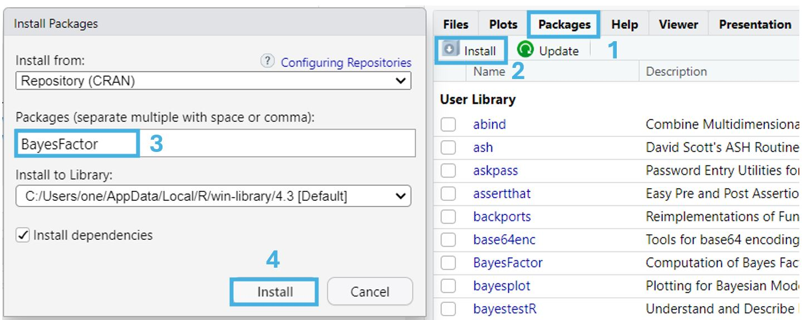
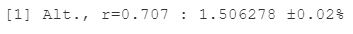

<style>
h1, h2, h3, h4, h5, h6 {
  direction: rtl;
}
p {
  direction: rtl;
}
.text-block1 {
  direction: rtl;       /* Set text direction to right-to-left */
  text-align: right;
  background-color: #e7f3fe; /* Light grey background */
  padding: 10px;
  border-radius: 5px;
  border: 1px solid #ddd; /* Light border */
  margin: 10px 0; /* Space around the block */
}
</style>


```{r setup, include=FALSE}
library(learnr)
library(gradethis)
library(Rcourse)
library(ggplot2)
library(tidyverse)
library(BayesFactor)
library(pracma)

knitr::opts_chunk$set(error = TRUE)
knitr::opts_chunk$set(warning = FALSE, message = F)
gradethis::gradethis_setup()


set.seed(123456)
sleep_df = data.frame(sleep = rnorm(100, 6.5, 2))

bus_waiting_times = rnorm(20, 17, 3)

sample1 = rnorm(50,5,1)
sample2 = rnorm(50,4,1)

df_samples = data.frame(group = rep(c(1,2), each = 50),
                        value = c(sample1,sample2))

set.seed(123456)
tomatoes = rnorm(40, 4.5,0.8)

love = rnorm(100,7,0.5)
eurovision = data.frame(love = love,
                        watch = exp(rnorm(100,4,1.5) + love) %>% sqrt())


{
exercises_df = data.frame(exercises = c("NHST_Q", "BF_to_prob_q","BF1_q", "one_sided_Q", "corr_one_sided_Q"),
                          hebrew = c("פירוש תוצאות מבחן t", "עדכון הסתברויות על סמך BF", "שעות שינה באוניברסיטה אמריקאית",
                                     "כמות ממוצעת של פרוסות עגבנייה",
                                     "תרגיל מסכם"))


check_hash_code   = function(hash){
    exercises = exercises_df$exercises
    response_table = learnrhash::decode_obj(hash)
    if (length(response_table)==0){return("Invalid hash code")}
    correct = response_table %>% filter(label %in% exercises, correct) %>% pull(label)
    incorrect = setdiff(exercises, correct)
    if (length(incorrect) == 0){return("Great work! Hash code is valid")}
    else{
      hebrew = exercises_df  %>% filter(exercises %in% incorrect) %>%pull(hebrew)
      print("The following exercises are missing or incorrect:")
      print(hebrew)
    }

} 
}# hash checker

```

```{r prepare-america_sleep_df}
set.seed(123456)
america_sleep_df = data.frame(subject = 1:70,
                              sleep = rnorm(70, mean = 7, sd = 0.5) %>% round(1))


```


```{r prepare-tomatoes}
set.seed(123456)
tomatoes = rnorm(40, 4.5,0.8)
```

```{r prepare-attention_task}
set.seed(1234567)
mean_RT = exp(rnorm(50, log(2000), 0.5))
attention_task = data.frame(id = 1:50,
                            mean_RT = mean_RT,
                            accuracy = 1/(1+exp(- rnorm(50,1,1) )))


1/correlationBF(attention_task$mean_RT, attention_task$accuracy,  nullInterval=c(0,1), r = 0.333)

```


## מבוא

ביחידה זו נלמד להשתמש בפונקציות מהחבילה `BayesFactor` על מנת לבצע ניתוחים בייסיאניים.

החבילה מאפשרת לבצע מגוון ניתוחים המקבילים למבחנים הסטטיסטיים הרגילים. אני נתמקד בשתי משפחות של ניתוחים: מבחני t ומתאמים.


חבילה זו אינה מותקנת בR כברירת מחדל, ולכן נצטרך להתקין אותה על ידי הרצת שורת הקוד הבאה:

```{r install, eval=FALSE}
install.packages("BayesFactor")
```

לחלופין, נוכל להתקין את החבילה גם דרך חלונית התקנת החבילות, המופיע בחלק הימני התחתון של Rstudio.ההתקנה נעשית באופן הבא:

{width="600"}

לאחר שהתקנו אותה, נייבא אותה באמצעות הפקודה:

```{r load}
library(BayesFactor)
```

ונוכל להשתמש בפונקציות הכלולות בה.


## Bayes factor


נניח שאנחנו מעוניינים לבחון האם תוחלת השעות שסטודנטים ישנים במהלך השבוע שונה מ7 שעות.

אספנו מדגם של 100 סטודנטים ומדדנו את מספר השעות שהם ישנים ביום אקראי במהלך השבוע. להלן היסטוגרמה של המדגם שקיבלנו:

```{r, echo = F}
ggplot(sleep_df, aes(x = sleep))+
  geom_histogram(fill = "lightblue")+                    # plot histogram
  geom_vline(xintercept = 7, col = "red", linetype = 2)+ # add vertical line at sleep = 7
  annotate("text", x = 7.5, y = 10, label = "7 hours", col = "red")+ # add text
  labs(title = "Hours of sleep ", x = "Hours", y = "Frequency")+ # organize labels
  theme_minimal() # change theme
```

אם היינו רוצים לבחון את שאלה זו באמצעות מבחן t היינו יכולים לעשות זאת באמצעות מבחן t לתוחלת בודדת, באופן הבא:

```{r}
t.test(sleep_df$sleep, mu = 7)
```


```{r NHST_Q, echo = FALSE}

question(
  "<div style='direction: rtl;'>
 מה המסקנה מניתוח זה, ביחס להשערת האפס לפיה תוחלת שעות השינה של סטודנטים אינה שונה מ7 שעות?
 
 הניחו אלפא = 0.05
  </div>",
  answer("ניתן לדחות את השערת האפס ", correct = T),
  answer("לא ניתן לדחות את השערת האפס"),
  answer("ניתן לקבל את השערת האפס"),
  answer("לא ניתן לקבל את השערת האפס"),
  allow_retry = TRUE,
  
  correct="נכון מאוד. 
 המשמעות של תוצאה זו היא שמאוד לא סביר לדגום את המדגם שקיבלנו אם ממוצע שעות השינה האמיתי אכן היה 7 שעות.", 
  incorrect = "נסו שוב"
)

```

כעת נחזור על הניתוח באמצעות מבחן בייסיאני. הפעם אנחנו לא מעוניינים לבדוק מה הסיכוי לקבל את התוצאות האלו בהינתן השערת האפס - אלא לבחון את היחס בין סיכוי זה לסיכוי לדגום את המדגם שקיבלנו תחת השערה אלטרנטיבית כלשהי.

הפקודה שעורכת את מבחן זה נקראת `ttestBF` והשימוש בה נראה כך:

```{r}
ttestBF(x = sleep_df$sleep, mu = 7, r = 0.707)
```

המסקנה שאנחנו יכולים להסיק מתוצאות אלו היא שההשערה האלטרנטיבית שלנו סבירה פי 1.506 מאשר השערת האפס. 

המסקנה נובעת משורת הפלט השנייה:
{width="300"}

אנחנו נסביר בהמשך הלומדה את משמעות שאר הנתונים המופיעים בפלט, אך נתחיל בלהתמקד בערך `r=0.707`.


## ההשערה האלטרנטיבית


הערך `r=0.707` קובע לאיזו השערה אלטרנטיבית אנחנו משווים את השערת האפס שלנו.

באופן יותר ספציפי, המשתנה r, שנקרא סקאלה (scale) מתאר את מידת הפיזור של התפלגות גדלי האפקט (Cohen's d) תחת ההשערה האלטרנטיבית שלנו.


בדוגמה שלנו, שנוגעת לשעות השינה של סטודנטים, השערת האפס היא שתוחלת שעות השינה שלהם היא 7 שעות, או במונחים של גודל אפקט: שערך הCohen's d עבור ההפרש של התוחלת מ7 הוא 0.

כזכור - Cohen's d הוא מדד לגודל אפקט המודד את הסטייה של התוחלת האמיתית מהשערת האפס ביחידות של סטיות תקן, ולכן גודל אפקט של 0 משמעו שהתוחלת זהה לזו שמצויינת על ידי השערת האפס.

ההשערה האלטרנטיבית שלנו תהיה שגודל האפקט הוא לא בהכרח 0, ושההסתברות לכל גודל אפקט מתוארת על ידי ההתפלגות הבאה:


```{r, echo = F}
sd_est = sd(sleep_df$sleep)

mu = 7

# Define a sequence of x values
x_vals <- seq(-10, 10, length.out = 1000)

# Define a data frame with multiple r values
r= 0.707
data <- data.frame(
  ES = x_vals,
  sleep = x_vals * sd_est + mu,
  density = dcauchy(x_vals, scale = r)
)


ggplot(data, aes(x = ES, y = density, color = factor(r), fill = factor(r))) +
  geom_area(alpha = 0.5, col = NA ) +  # Line for each density curve
  labs(
    title = "Cauchy Distributions for Effect Sizes",
    x = "Effect Size",
    y = "Density",
    fill = "r = "
  ) +
  lims(x = c(-5,5))+
  scale_fill_manual(values = c("lightblue"))+ # second color of default
  theme_minimal()

```

כלומר - גודל האפקט יכול להיות 0, אבל יכול להיות גם 1, -2, 3.5 וכו'.

ההתפלגות בה השתמשנו כדי להגדיר את ההשערה האלטרנטיבית נקראת התפלגות קושי (Cauchy distribution). זו התפלגות t עם דרגת חופש אחת ולכן היא סימטרית ונראת קצת כמו התפלגות נורמלית - אבל בניגוד להתפלגות נורמלית היא מייחסת הסתברות גבוהה יותר לערכים קיצוניים. לא ניכנס כאן לסיבות שהתפלגות זו נבחרה או לדקויות שמאפיינות אותה, אך מקובל להשתמש בה כדי לייצג את ההשערה האלטרנטיבית במבחנים בייסיאניים המקבילים למבחני t.

בדומה להתפלגות נורמלית התפלגות קושי מוגדרת על ידי שני פרמטרים - מיקום (location) הקובע את מיקום מרכז ההתפלגות וסקאלה (scale) הקובע את רוחב ההתפלגות. במקרה שלנו המיקום תמיד יהיה 0 והסקאלה שנבחרה הפעם, ומיוצגת על ידי האות r, היא 0.707.

ערכי r שונים יבטאו השערות אלטרנטיביות שונות: ככל שהערך גבוה יותר ההשערה היא שיתכן וגודל האפקט מאוד גדול, ואילו ערכים נמוכים יותר יביעו השערה אלטרנטיבית לפיה גודל האפקט הוא ככל הנראה קטן יותר.

המאפיינים של ההתפלגות גורמים לכך שחצי מההתפלגות תמיד תהיה מוגבלת בין r לr- ולכן המשמעות של ערך סקאלה השווה ל1, למשל, היא שאנחנו משערים שיש 50% שגודל האפקט הוא בין 1 ל1-. 

הערך שמהווה את ברירת המחדל עבור r הוא $\sqrt2/2 = 0.707$, שכן ערך זה מניח גדלי אפקט בינוניים. בפועל, אנחנו נתאים את ערך הסקאלה להשערות שלנו לגבי האפקטים הצפויים, אך גם לקח נגיע בהמשך הלומדה.

### אופן חישוב ערך הBF

כדי להמחיש את המשמעות של התפלגות זו נמיר את גדלי האפקט לערכים גולמיים המבטאים את **תוחלת** שעות השינה תחת H1, על סמך האומד לסטיית התקן שקיבלנו מנתוני המדגם: 

```{r, echo=FALSE}

# Create the plot
ggplot(data, aes(x = sleep, y = density, color = factor(r), fill = factor(r))) +
  geom_area(alpha = 0.5, col = NA ) +  # Line for each density curve
 # geom_jitter(data =df, aes(x = x, y = 0.2), width = 0, height = 0.2)+
  geom_vline(xintercept = 7, linetype = 2, color = "black")+
  annotate(x = 9, y = 0.5, label = "7 hours", col = "black", geom= "text")+
  labs(
    title = "Cauchy Distributions for Mean Hours of Sleep",
    x = "Mean hours of sleep",
    y = "Density",
    fill = "r = "
  ) +
  lims(x = c(0,20))+
  scale_fill_manual(values = c("lightblue"))+ # second color of default
  theme_minimal()

```


כלומר - בעוד השערת האפס מניחה שהתוחלת הינה 7, ההשערה האלטרנטיבית מציעה טווח רחב של תוחלות אפשריות.

נוכל להיעזר במידע שבתרשים הנ"ל כדי לייצר תרשים נוסף - המציג את התפלגות הדגימה תחת כל השערה. תחת השערת האפס התפלגות זו זהה להתפלגות הדגימה של הממוצע שפגשנו במבחני t: התפלגות נורמלית עם תוחלת 7 (בהתאם להשערת האפס) וטעות תקן שנקבעת על סמך האומד לסטיית התקן וגודל המדגם.

עבור H1 התפלגות הדגימה תהיה שילוב של התפלגויות נורמליות שונות, כולן עם אותה טעות תקן - אך עם תוחלות שונות - בהתאם להתפלגות הקושי שראינו לעיל. 

כך יראו ההתפלגויות:


```{r, echo=FALSE}

x_vals <- seq(-10, 10, length.out = 1000)

se_est = sd(sleep_df$sleep) / sqrt(length(sleep_df$sleep))
mn = mean(sleep_df$sleep)

compute_H1 <- function(x, prior_scale = 0.707, integration_range = 10, grid_points = 500) {
  
  
  ES_range <- seq(-integration_range, integration_range, length.out = grid_points)
  ES_density <- dcauchy(ES_range, location = 0, scale = prior_scale)
  
  # Compute the integrated density for each value of x
  H1_density <- sapply(x, function(xi) {
    # xi : constant value
    # mu : vector of possible ESs
    sum( dnorm(xi, mean = ES_range, sd = 1) * ES_density ) # the sd is 1 because we are working on the ES scale
  })
  
  # Normalize the result
  H1_density <- H1_density / trapz(x, H1_density)
  
  return(H1_density)
}


data <- data.frame(
  x = x_vals,
  sleep = x_vals * se_est + mu,
  H0 = dnorm(x_vals, mean = 0, sd = 1),
  H1 = compute_H1(x_vals, prior_scale = 0.707)) %>% 
  mutate(
    H0 = H0 / trapz(x_vals, H0),
    H1 = H1 / trapz(x_vals, H1),
    BF = H1 / H0 
  )


ggplot(data, aes(x = sleep)) +
  geom_area(aes(y = H0, fill = "H0"), alpha = 0.3) +
  geom_area(aes(y = H1, fill = "H1"), alpha = 0.7) +
  annotate("segment",x = mn, xend = mn, y = 0, yend = 0.38,linetype = "dashed") +
  annotate(x = mn, y = 0.4, label = "Sample mean", col = "black", geom= "text")+
  labs(
    title = "H0 and H1 Distributions",
    x = "Mean hours of sleep",
    y = "Density",
    fill = "Hypothesis"
  ) +
  scale_fill_manual(values = c( "black","lightblue"))+ # second color of default
  theme_minimal()

```

כעת נוכל לקחת את ערך הממוצע שקיבלנו במדגם שלנו ולבחון את ההסתברות לקבל ממוצע שכזה תחת כל אחת מההשערות.

ערך הBF מהווה את היחס בין הסתברויות אלו.

 
 

### חזרה לתוצאות המבחן

נחזור כעת לתוצאות הניתוח הבייסיאני:


```{r}
# Bayesian t-test
bf = ttestBF(x = sleep_df$sleep, mu = 7, r = 0.707)

print(bf)
```

במקרה שלנו, התוצאות מראות שהנתונים סבירים יותר תחת ההשערה האלטרנטיבית (לפיה גודל האפקט אינו 0, אלא מתפלג לפי קושי עם סקאלה של 0.707) פי 1.5 מאשר תחת השערת האפס. כלומר, יש סיכוי יותר גבוה לקבל את הנתונים שקיבלנו אם גודל האפקט הוא לא 0 (ומתפלג לפי התפלגות הקושי שציינו) מאשר אם הוא כן.

התוספת `±0.02%` מציינת את רמת הדיוק של ההערכה זו.

השורה הבאה מציינת את השערת האפס מולה השוואנו את ההשערה האלטרנטיבית שלנו. במקרה זה - השערה לפיה התוחלת הינה 7.

השורה האחרונה בפלט מתארת את סוג המבחן שנעשה - מבחן BF לתוחלת מדגם בודד מסוג JZS (ראשי תיבות של שמותיהם של החוקרים שהציעו את שיטה זו - Jeffreys, Zellner, וSiow).
  
    

**מה נעשה עם התוצאה שקיבלנו?**

כדי להחליט שאנחנו מקבלים את ההשערה האלטרנטיבית על פני השערת האפס לא מספיק להראות שהיא סבירה יותר - אלא צריך לעבור רף כלשהו של סבירות שנקבע מראש, בדומה לערך האלפא בבדיקת השערות רגילה

נהוג להשתמש ברף של פי 3, כך שאם הBF שקיבלנו גדול מערך זה נוכל לקבל את ההשערה האלטרנטיבית ואם לא, למשל אם קיבלנו BF של 1.5, נוכל להגיד שההשערה האלטרנטיבית אמנם נראית טיפה יותר סבירה בהינתן הנתונים שלנו, אבל התוצאות לא חזקות מספיק כדי שנוכל להסיק מהן מסקנות חד משמעיות.
  

  
כדי להבין יותר לעמוק את התוצאות נוכל להמיר אותן חזרה ל**הסתברויות** לכך שכל אחת מההשערות נכונה באמצעות הנוסחה הבאה:

$$\
P(H_1 \mid D) = \frac{\text{BF}_{10} \cdot P(H_1)}{\text{BF}_{10} \cdot P(H_1) + P(H_0)}
\ $$

$P(H_1 \mid D)$ : ההסתברות ש$H_1$ נכונה בהינתן הנתונים שלנו

$\text{BF}_{10}$ : ערך הבייס פקטור המביע את התיעדוף של $H_1$ על פני $H_0$

$P(H_1)$ : האמונה הקודמת שלנו לגבי ההסתברות ש$H_1$ נכונה

$P(H_0)$ : האמונה המוקדמת שלנו לגבי הסיכוי ש$H_0$ נכונה
  

  
  

כבמקרה שלנו - אם ייחסנו לשתי ההשערות הסתברות זהה להיות נכונות לפני שאספנו את הנתונים שלנו (50% - 50%), ההסתברות ש$H_1$ תהיה נכונה בהינתן הנתונים תהיה:

$$\
P(H_1 \mid D) = \frac{1.5 \cdot 0.5}{1.5 \cdot 0.5 + 0.5} = \frac{0.75}{0.75 + 0.5} = 0.6
\ $$

ובהתאמה - הסיכוי ש$H_0$ נכונה תהיה $P(H_0 \mid D) = 1 - P(H_1 \mid D) = 0.4$
  
    
  
ייצרנו עבורכם פונקציה המבצעת את החישוב וקוד המציג את התוצאות כתרשים:

```{r BF_to_prob, exercise=TRUE, exercise.eval = FALSE}
# פונקציה המחשבת הסתברויות מתוך ערך בייספקטור
BF_to_prob = function(BF, prior_H1){
  prior_H0 = 1 - prior_H1  # חישוב ההסתברות שהשערת האפס נכונה
  
  p_H1_given_D = (BF * prior_H1) / (BF * prior_H1 + prior_H0) # עדכון ההסתברות לטובת ההשערה האלטרנטיבית 
  p_H0_given_D = 1 - p_H1_given_D                             # עדכון הסתברות לטובת השערת האפס
  
  df = data.frame(H        = c("H1","H0"), 
                  prior    = c(prior_H1,prior_H0),
                  posterior= c(p_H1_given_D, p_H0_given_D))
  return(df)
}


###############################################
## ערכו את השורה הבאה על מנת לשנות את החישוב ##
###############################################

BF_to_prob(BF = 1.5, prior_H1 = 0.5)


```


ניתן לראות שהתוצאות משחזרות את החישוב שהצגנו.   
כלומר - לאחר העדכון אנחנו נאמין שיש 60% שההשערה האלטרנטיבית נכונה.


`תרגיל`  
הניחו כי אחרי שעדכנו את ההסתברויות בעד H1 וH0 אספנו מדגם נוסף. 

הפעם ערך הBF שקיבלנו הוא 2.67.

חשבו מה הסיכוי שH1 נכונה **אחרי** שלקחנו בחשבון את התוצאות מ**2 המדגמים**.

לצורך החישוב תצטרכו להתייחס לסיכוי המעודכן (60% לטובת H1) בתור האמונה המקדימה שלכם ולעדכן את ההסתברות שוב על סמך ערך הBF החדש.

תוכלו להיעזר בפונקציה הנ"ל לטובת החישוב, או לערוך אותו באופן עצמאי.

הזינו את התשובה כמספר בין 0 ל1 ועגלו ל2 מיקומים אחרי הנקודה העשרונית.

```{r BF_to_prob_q, echo = FALSE}

question_text(
  "<div style='direction: rtl;'>
  מה ההסתברות המעודכנת שH1 נכונה?
  </div>",
  answer("0.81", correct = TRUE),
  answer("0.80", correct = TRUE),
  answer("0.8", correct = TRUE),
  allow_retry = TRUE,
  
  correct="מעולה!", 
  incorrect = "נסו שוב"
)

```


## קבלת השערת האפס

היתרון העיקרי של שימוש בBF לעומת סטטיסטיקה פריקווינטיסטית (מבחנים הנשענים על חישוב p value) הוא בכך שBF מאפשר לנו לאשש את השערת האפס. 

בניגוד למבחנים פריקווינטיסטיים, בהם נוכל רק לדחות או לא לדחות את השערה האפס - במבחנים בייסיאנים אנחנו יכולים גם לדחות את ההשערה האלטרנטיבית ולקבל את השערת האפס.

תוצאה שכזו תתבטא בBF שקטן מ1. למשל - BF של 0.2 מורה על כך שההשערה האלטרנטיבית סבירה **פחות** פי חמש מהשערת האפס.

  
נוכל להתאים את הפלט של המבחן לבדיקה זו באופן הבא:

```{r}

bf = ttestBF(x = sleep_df$sleep, mu = 7, r = 0.707)

print(1/bf)
```

פעולה זו (`1/bf`) לא משנה את התוכן של הניתוח - אבל מציגה אותו בצורה ההפוכה: פי כמה השערת האפס סבירה יותר מההשערה האלטרנטיבית.

במקרה הזה היא סבירה פי 0.66, כלומר - סבירה פחות, אבל יש מקרים בהם נקבל נתונים שתומכים בהשערת האפס ומובילים אותנו לקבל אותה. 
  
הרף לקבלת השערת האפס הוא זהה - סבירות של פי 3 לפחות.


`תרגיל`

חוקר אחר אסף מדגם של סטודנטים מאוניברסיטה בארה"ב כדי לבחון האם הם ישנים בממוצע מספר שעות השונה מ7. חשבו את הBF עבור השערה הזו (קבעו את r=0.707) ודווחו את המסקנות שלכם מהניתוח.
  
נתוני המדגם של החוקר מופיעים בטבלה הנקראת `america_sleep_df`.

  
```{r BF_sleep, exercise=TRUE, exercise.eval = FALSE, exercise.setup = "prepare-america_sleep_df", rows = 10}

print(head(america_sleep_df))

 
```


```{r BF1_q, echo = FALSE}

question(
  "<div style='direction: rtl;'>
  מה המסקנה העולה מהניתוח לגבי תוחלת שעות השינה באוניברסיטה האמריקאית?
  </div>",
  answer("רוב הסיכויים שהתוחלת גדולה מ7"),
  answer("רוב הסיכויים שהתוחלת שונה מ7"),
  answer("לא ניתן לקבוע שהתוחלת שונה מ7"),
  answer("רוב הסיכויים שהתוחלת הינה 7", correct = TRUE),
  allow_retry = TRUE,
  
  correct="מעולה! אם נדייק טיפה יותר: המסקנה היא שיותר סביר שהתוחלת היא 7 מאשר שהיא לא, תחת ההשערה האלנטרנטיבית ששימשה אותנו בבדיקה זו", 
  incorrect = "נסו שוב"
)

```


## חשיבות ערך הסקאלה

בכל ניתוח בייסיאני שנריץ, נתחיל בבחירת ערך סקאלה המתאים לאפקטים שאנחנו מצפים למצוא.
  
נוכל להשתמש בערך ברירת המחדל (0.707), אבל רצוי להתאים את הערך לציפיות שלנו בכל ניתוח.

למשל - ייתכן שאנחנו משערים שגודל האפקט באוכלוסייה הוא קטן. בהתאם, נוכל לקבוע את ערך הסקאלה כקטן יותר מ0.707 - למשל ב0.5.

התרשים שלפניכם מציג את המשמעות של שינוי ערך זה עבור התפלגות גדלי האפקט המשוערים תחת H1:

```{r, echo = F}

# Define a sequence of x values
x_vals <- seq(-5, 5, length.out = 1000)

# Define a data frame with multiple r values
r_values = c(0.3,0.5,0.707,1)
data <- data.frame()

for (r in r_values){
  data = bind_rows(data,
                   data.frame(
                     r =r,
                     ES = x_vals,
                     density = dcauchy(x_vals, location = 0, scale = r)))
}

data = data %>%
  group_by(r) %>%
  mutate(r = factor(r),
        # density = density /sum(density)
  )

# Create the plot
ggplot(data, aes(x = ES, y = density, col = r)) +
  geom_line() +  
  labs(
    title = "Cauchy Distributions for Different r Values",
    x = "Effect Size",
    y = "Density",
    fill = "r = "
  ) +
  theme_minimal()


```

בהתאם, שינוי ערך הסקאלה ישפיע גם על תוצאות הניתוח.

נוכל להמחיש זאת באמצעות חיבור של תוצאות הניתוח עבור מספר מבחני BF שונים באמצעות הפקודה `c()`. פקודה זו בדרך כלל משמשת ליצירת וקטורים, אך כשמשתמים בה על אובייקטים המתקבלים מניתוחי BF היא מחברת אותם יחד לפלט אחד:

```{r}
bf1 = ttestBF(x = sleep_df$sleep, mu = 7, r = 0.707)
bf2 = ttestBF(x = sleep_df$sleep, mu = 7, r = 0.5)
bf3 = ttestBF(x = sleep_df$sleep, mu = 7, r = 0.3)

bf = c(bf1,bf2,bf3)

print(bf)
```

במקרה שלנו - הפלט מראה שככל שההשערה האלטרנטיבית שלנו מניחה גדלי אפקט קטנים יותר , כך הסיכויים שלה אל מול השערת האפס משתפרים.


## מבחני טי נוספים


### מבחן חד זנבי


נניח שאנחנו מעוניינים לבחון האם זמן ההמתנה הממוצע לקו 517 בתחנת הר הצופים הוא **יותר** מ15 דקות.

המבחן המתאים יהיה חד זנבי ולכן  מבחן הt ישמש אותנו לבחינת השערה כזו יראה כך:

```{r}

t.test(bus_waiting_times, mu = 15, alternative = "greater")

```


בניתוח BF נתאים את הפקודה למבחן חד זנבי באמצעות התוספת הבאה:
```{r}
ttestBF(x = bus_waiting_times, mu = 15, nullInterval=c(0,Inf))

```

התוספת `nullInterval=c(0,Inf)` מנחה את הפונקציה לחלק את ההתפלגות של H1 לשני טווחים -טווח אחד שתחום בין שני הערכים שציינו בפקודה (במקרה שלנו: `c(0,Inf)`  כלומר - כל הערכים בין אפס לאינסוף) וטווח נוסף המכיל את כל הערכים שלא כלולים בטווח הראשון (במקרה שלנו : כל הערכים הקטנים מ0).

הפונקציה תשווה את שתי ההתפלגויות של H1 שהתקבלו מהחלוקה הזו ותחשב את הBF של כל אחד מהם מול H0.

בתוצאות שאנחנו קיבלנו אפשר לראות שסביר פי 16.4 שזמן ההמתנה גבוה מ15 דקות מאשר שהוא שווה ל15 דקות, ואילו מאוד לא סביר שזמן ההמתנה קטן מ15 דקות.
  
    
  
`תרגיל`  

הוקטור `tomatoes` מכיל את ממוצע כמות פרוסות העגבנייה בסנדוויצ'ים שנדגמו בימים שונים מבית קפה מסוים.
  
  
בדקו באמצעות BF האם תוחלת כמות פרוסות העגבנייה קטן מ5 באופן מובהק סטטיסטית.
השאירו את פרמטר הסקאלה בערך ברירת המחדל (`r=0.707`).
  
```{r}
ggplot(data.frame(tomatoes = tomatoes), aes(x = tomatoes))+
  geom_histogram(fill = "#c43325")+
  theme_minimal()
```


```{r tomatoes_data, exercise=TRUE, exercise.eval = FALSE, exercise.setup = "prepare-tomatoes"}
print(tomatoes)

# חשבו את ערך הבייספקטור עבור השאלה הנ"ל


```

```{r tomatoes_data-hint}
רמז: כדי להתאים את המבחן לכיוון ההשערה יש להשתמש ב 

nullInterval=c(-Inf,0)   
```


```{r one_sided_Q, echo = FALSE}

question_text(
  "<div style='direction: rtl;'>
 פי כמה יותר סביר שתוחלת כמות הפרוסות קטן מ5, ביחס להשערת האפס לפיה התוחלת היא 5(יש לעגל לשתי ספרות אחרי הנקודה)?
  </div>",
  answer("4.7716", correct = T),
 answer("4.771", correct = T),
 answer("4.772", correct = T),
 answer("4.77", correct = T),
 answer("4.7", correct = T),
 answer("4.8", correct = T),
 answer("2.412648", correct = F, message = "האם ביצעתם מבחן חד זנבי?"),
 answer("2.41264", correct = F, message = "האם ביצעתם מבחן חד זנבי?"),
 answer("2.41265", correct = F, message = "האם ביצעתם מבחן חד זנבי?"),
 answer("2.4126", correct = F, message = "האם ביצעתם מבחן חד זנבי?"),
 answer("2.412", correct = F, message = "האם ביצעתם מבחן חד זנבי?"),
 answer("2.41", correct = F, message = "האם ביצעתם מבחן חד זנבי?"),
 answer("2.4", correct = F, message = "האם ביצעתם מבחן חד זנבי?"),
 answer("0.05369606", correct = F, message = "שימו לב שההשערה היא על כך שתוחלת כמות הפרוסות תהיה *קטנה* מ5"),
 answer("0.053", correct = F, message = "שימו לב שההשערה היא על כך שתוחלת כמות הפרוסות תהיה *קטנה* מ5"),
 answer("0.05", correct = F, message = "שימו לב שההשערה היא על כך שתוחלת כמות הפרוסות תהיה *קטנה* מ5"),
  allow_retry = TRUE,
  
  correct="נהדר!", 
  incorrect = "נסו שוב"
)

```


### הפרש מדגמים בלתי תלויים

המעבר מחישוב BF למדגם יחיד לחישוב עבור מדגמים בלתי תלויים או מזווגים הוא מאוד פשוט.

עד כה הזנו לפונקציה את המדגם שלנו באמצעות הארגומנט `x`. כשנרצה לבצע מבחן עבור הפרשי שני מדגמים נזין את המדגם השני בתור הארגומנט `y`.

למשל:

```{r}
ttestBF(x = sample1, y = sample2)
```

כלומר - הסבירות שגודל האפקט עבור הפרש התוחלות שונה מאפס (ומתפלג לפי התפלגות קושי עם סקלה של 0.707) גדולה פי 45 מאשר שגודל האפקט הינו אפס.


  
כמו בפונקציה עבור מבחני t ניתן להזין את הנתונים גם באמצעות פורמולה:


```{r}
# סידרנו את אותם הנתונים מההדגמה הקודמת בתוך טבלה
# המכילה עמודה אחת לערכים ועמודה נוספת לקבוצה אליה כל דגימה שייכת
ttestBF(formula = value ~ group, data = df_samples)
```

### מבחן למדגמים מזווגים

המעבר ממבחן למדגמים בלתי תלויים למדגמים מזווגים נעשה באופן זהה לפונקציות עבור מבחני t:

```{r}
ttestBF(x = sample1, y = sample2, paired = TRUE)
```

כאן גילינו שההשערה האלטרנטיבית שלנו, לפיה תוחלת ההפרשים בין זוגות התצפיות שונה מאפס סבירה פי 12.6 מהאפשרות לפיה אין הבדל בין תוחלות המדגמים.

## מתאמים

השימוש בפונקציות האחרות שכלולות בחבילת BayesFactor הוא די דומה, אבל עם שינוי קל שנוגע להשערה האלטרנטיבית. בעוד גודל האפקט של מבחן t יכול להיות כל מספר שהוא, גודל האפקט עבור מתאם מוגבל בין הערכים 1 ו 1-.

בהתאם לכך, ההתפלגות של גדלי האפקט תחת ההשערה האלטרנטיבית וערכי הסקאלה יהיו שונים.

במתאמים, ברירת המחדל עבור ערך הסקאלה (שממלא תפקיד אחר, שכן כבר לא מדובר בהתפלגות קושי) היא $1/3$ והתפלגות גדלי האפקט תחת ערכי סקאלה שונים נראית כך:

```{r, echo = F}
x =seq(0,1,0.01)
rs = c(1/ sqrt(27), 1/3, 1/sqrt(3))

beta = data.frame()

for(r in rs){
  temp = data.frame(x = x,
                    r_pearson = x*2-1,
                    r = r %>% round(2),
                    d = dbeta(x, 1/r, 1/r))%>%
  mutate(d = d/ sum(d))
  
  beta = bind_rows(beta,temp)
}


ggplot(beta,aes(x = r_pearson, y = d, col = factor(r)))+
  geom_line()+
  theme_minimal()+
  labs(x = "Pearson correlation coeficient (r pearson)",
         y = "Density",
         col = "Scale")

```

כשהשערת האפס היא שגודל האפקט הינו 0 - משמע, שהמתאם בין המשתנים אפסי.

### בדיקת מובהקות מתאמים

לצורך המחשה, נשתמש בנתונים מפוברקים אודות הקשר בין מידת החיבה של אנשים כלפי תחרות האורוויזיון וכמות הדקות שהקדישו לצפייה בתכנים הקשורים לתחרות ביום של הגמר. 


```{r}
ggplot(eurovision, aes(x = love, y = watch))+
  geom_point()+
  geom_smooth(method = "lm")+
  theme_minimal()
```


כדי לבחון את מובהקות המתאם בין שני המשתנים נוכל לבצע מבחן לבחינת מובהקות מתאם:

```{r}
cor.test(eurovision$love, eurovision$watch)
```

נראה שהקשר בין המשתנים הוא לא מבוטל ($r_p = 0.3$) ושונה מ0 באופן מובהק סטטטיסטית ($p=0.0018$).

נחזור על המבחן באמצעות הפונקציה `correlationBF`:

```{r}
correlationBF(eurovision$love, eurovision$watch)
```

התוצאות מדווחות לנו שההשערה לפיה ערך הסקאלה של ההתפלגות המתארת את גדלי האפקט היא $1/3$ סבירה יותר מההשערה לפיה המתאם הינו 0 פי 8.6. שימו לב שהערך של `r` בפלט אינו מתייחס למקדם המתאם ($r_{pearson}$) אלא לערך שקובע את מידת הפיזור של ההשערה האלטרנטיבית.


גם במקרה הזה נוכל לשנות את ערך הסקאלה כדי לבטא השערות המניחות גודל אפקט קטן או גדול יותר ו/או לערוך מבחנים חד זנביים באותו האופן בדיוק כפי שעשינו במבחני t.  
ההבדל היחיד הוא שבמבחן חד זנבי עבור מתאמים נצטרך לעדכן את הטווח של הביטוי `nullInterval=c(0,Inf)` כך שבמקום הערך אינסוף (`Inf`) יופיע הערך 1, שכן במקרה זה גודל האפקט אינו יכול להיות גדול מ1 או קטן מ1-.


### תרגיל


ברשותכם טבלה בשם "attention_task" המכילה נתוני מהירות תגובה ממוצעת ואחוזי דיוק במטלת קשב עבור 50 נבדקים.
  
כחלק מהניתוח שלכם אתם מעוניינים להראות שמהירות התגובה **לא** הייתה במתאם **שלילי** עם אחוז הדיוק של הנבדקים (מי שענה מהר יותר - לא דייק פחות), שכן אתם רוצים לטעון שהמהירות היא מאפיין של יכולות הקשב של הנבדק ואינה מבטאת רק את מידת הפזיזות שלהם.   

בדקו השערה זו באמצעות חישוב BF עם סקאלה של `r=0.333` ודווחו את מסקנותיכם.


```{r corr_Q_exercise, exercise=TRUE, exercise.eval = FALSE, exercise.setup = "prepare-attention_task"}
head(attention_task)


```

```{r corr_Q_exercise-hint}
ערכו מבחן חד זנבי המשווה בין ההסתברות שהמתאם שלילי לכך שהוא אפסי.

היעזרו ב:
nullInterval = c(-1,0)
```

```{r corr_one_sided_Q, echo = FALSE}

question_text(
  "<div style='direction: rtl;'>
 פי כמה יותר סביר שהמתאם הוא 0 מאשר שהוא שלילי?
 
 עגלו את תשובתכם ל2 מקומות אחרי הנקודה העשרונית
  </div>",
  answer("3.35", correct = T),
 answer("3.13", correct = F, message = "האם ביצעתם מבחן חד זנבי?"),
 
 answer("3", correct = F, message = "יש לפרט שני מקומות אחרי הנקודה העשרונית "),
 answer("3.1", correct = F, message = "יש לפרט שני מקומות אחרי הנקודה העשרונית "),
 answer("3.3", correct = F, message = "יש לפרט שני מקומות אחרי הנקודה העשרונית "),
 answer("3.4", correct = F, message = "יש לפרט שני מקומות אחרי הנקודה העשרונית "),

 answer("0.29", correct = F, message = "שימו לב - השאלה שואלת על ההעדפה לH0, ולא לH1"),
 answer("0.30", correct = F, message = "שימו לב - השאלה שואלת על ההעדפה לH0, ולא לH1"),
 answer("0.31", correct = F, message = "שימו לב - השאלה שואלת על ההעדפה לH0, ולא לH1"),
 answer("0.32", correct = F, message = "שימו לב - השאלה שואלת על ההעדפה לH0, ולא לH1"),


  allow_retry = TRUE,
  
  correct="נהדר!", 
  incorrect = "נסו שוב"
)

```


## משוב

בחלק זה נבקש את המשוב שלכם על הלומדה. אנא ענו בכנות וביסודיות, על מנת שנוכל להשתפר. התשובות ישמרו בצורה אנונימית ולא ישפיעו על בדיקת התרגיל עצמה.

שימו לב: ברוב השאלות אין אפשרות לשנות את התגובה לאחר לחיצה על כפתור ההגשה

```{r survey_q1, echo = FALSE}
question(#"כמה קשה הייתה היחידה עבורך?",
          "מה הייתה רמת הקושי של הלומדה עבורך?",
         type="single",
         answer("קלה"        ,correct=TRUE,  message = "תגובתך: קלה"),
         answer("בינונית"    ,correct=TRUE,  message = "תגובתך: בינונית"),
         answer("מאתגרת"     ,correct=TRUE,  message = "תגובתך: מאתגרת"),
         answer("קשה"        ,correct=TRUE,  message = "תגובתך: קשה"),
         answer("קשה מאוד"   ,correct=TRUE,  message = "תגובתך: קשה מאוד"),
         correct = "",
         incorrect = "",
         allow_retry = TRUE
)
```

```{r survey_q2, echo = FALSE}
question(#"עד כמה את/ה מרגיש/ה שהבנת את החומר שנלמד ביחידה?",
        "עד כמה החומר הנלמד ביחידה הועבר בצורה ברורה לדעתך?",
         type="single",
         answer("במידה רבה"      , correct=TRUE,  message = "תגובתך: במידה רבה"),
         answer("במידה סבירה" ,    correct=TRUE,  message = "תגובתך: במידה סבירה"),
         answer("באופן חלקי"  ,    correct=TRUE,  message = "תגובתך: באופן חלקי"),
         answer("במידה מעטה"  ,correct=TRUE,  message = "תגובתך: במידה מעטה"),
         answer("במידה מעטה מאוד",correct=TRUE,  message = "תגובתך: במידה מעטה מאוד"),
         correct = "",
         incorrect = "",
         allow_retry = TRUE
)
```

```{r survey_q3, echo = FALSE}
question("כמה זמן לקח לך לפתור את הלומדה בערך?",
         type="single",
         answer("פחות משעה"      , correct=TRUE,  message = "תגובתך: פחות משעה"),
         answer("שעה" ,    correct=TRUE,  message = "תגובתך: שעה"),
         answer("שעתיים"  ,    correct=TRUE,  message = "תגובתך: שעתיים "),
         answer("שלוש שעות"  ,correct=TRUE,  message = "תגובתך:  שלוש שעות"),
         answer("ארבע שעות ומעלה",correct=TRUE,  message = "תגובתך:  ארבע שעות ומעלה "),
         correct = "",
         incorrect = "",
         allow_retry = TRUE)
```

```{r survey_q4, echo = FALSE}
question("אילו נושאים בלומדה היו קשים במיוחד עבורך?",type="learnr_checkbox",
         answer("מבוא לבייספקטור", correct=TRUE),
         answer("משמעות ההשערה האלטרנטיבית", correct=TRUE),
         answer("קבלת השערת האפס", correct=TRUE),
         answer("מבחן חד זנבי", correct=TRUE),
         answer("מבחנים טי להפרש תוחלות שני מדגמים)", correct=TRUE),
         answer("בייספקטור עבור מובהקות מתאמים", correct=TRUE),
         answer("אף נושא", correct=TRUE),
         
         correct = "תגובתך התקבלה",
         try_again = "תגובתך התקבלה",
         incorrect = "תגובתך התקבלה",
         allow_retry = TRUE
)
```


```{r survey_q5, echo = FALSE}
  question_text(    "מצאת טעות? ספר/י לנו עליה (יש להקפיד ולציין את שם הפרק)",
   # "הערות ספציפיות לגבי חלקי היחידה השונים",
    incorrect = "תגובתך התקבלה",
    correct = "תגובתך התקבלה",
    answer(text = "/'ק/'ק",correct = TRUE),
    rows = 10,
    trim = FALSE
  )
```

```{r survey_q6, echo = FALSE}
  question_text(
        "יש לך עוד משהו לספר לנו? נשמח לשמוע משוב מפורט, הצעות כלליות או ספציפיות לפרק מסוים לגבי יחידה זאת.",
   # "הערות כלליות לגבי היחידה",
    incorrect = "תגובתך התקבלה",
    correct = "תגובתך התקבלה",
    answer(text = "/'ק/'ק",correct = TRUE),
    rows = 10,
    trim = FALSE
  )
```


## הגשה
  עברו על הקובץ וודאו שהגשתם את כל התרגילים ועניתם על כל השאלות
  
  במידה וכל התשובות שלכם תקינות יש ללחוץ על הכפתור:  Generate, להעתיק את הטקסט שמופיע בחלון למטה ולהגישו במודל  
  בהצלחה!

```{r context="server"}
learnrhash::encoder_logic()
```

```{r encode, echo=FALSE}
learnrhash::encoder_ui()
```


הדביקו את קוד הhash בתוך הגרשיים בפונקצייה הבאה כדי לוודא שעניתם על כל השאלות והתרגילים בלומדה.

```{r hash_check,  exercise = TRUE, exercise.eval = FALSE}

check_hash_code("")

```

